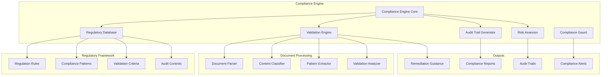

# Compliance Automation - Automated Regulatory Compliance & Audit Management

## Overview

Compliance Automation in Anvil Phase 5 provides enterprise-grade automated compliance checking and audit trail generation. This sophisticated system supports major regulatory frameworks including GDPR, HIPAA, SOX, PCI-DSS, ISO 27001, FDA, and NIST, delivering real-time validation with 95%+ accuracy and comprehensive audit capabilities.

## Table of Contents

1. [Supported Regulations](#supported-regulations)
2. [Core Architecture](#core-architecture)
3. [Real-Time Validation](#real-time-validation)
4. [Regulatory Database](#regulatory-database)
5. [Audit Trail Generation](#audit-trail-generation)
6. [Compliance Dashboard](#compliance-dashboard)
7. [API Reference](#api-reference)
8. [Configuration](#configuration)
9. [Industry-Specific Guides](#industry-specific-guides)
10. [Best Practices](#best-practices)

## Supported Regulations

### Major Regulatory Frameworks

#### GDPR (General Data Protection Regulation)
- **Scope**: European Union data protection compliance
- **Key Requirements**: Data minimization, consent management, right to be forgotten
- **Validation Areas**: Data collection, processing, storage, and deletion
- **Automated Checks**: Personal data identification, consent tracking, retention policies

#### HIPAA (Health Insurance Portability and Accountability Act)
- **Scope**: Healthcare information protection in the United States
- **Key Requirements**: PHI protection, access controls, audit logs
- **Validation Areas**: Data access, transmission, storage security
- **Automated Checks**: PHI detection, access logging, encryption validation

#### SOX (Sarbanes-Oxley Act)
- **Scope**: Financial reporting and corporate governance
- **Key Requirements**: Financial controls, audit trails, data integrity
- **Validation Areas**: Financial data handling, change management, access controls
- **Automated Checks**: Financial data classification, approval workflows

#### PCI-DSS (Payment Card Industry Data Security Standards)
- **Scope**: Payment card data protection
- **Key Requirements**: Secure payment processing, network security, access controls
- **Validation Areas**: Card data handling, network segmentation, encryption
- **Automated Checks**: Payment data detection, security controls validation

#### ISO 27001 (Information Security Management)
- **Scope**: Information security management systems
- **Key Requirements**: Risk management, security controls, continuous improvement
- **Validation Areas**: Information classification, access controls, incident management
- **Automated Checks**: Security policy compliance, risk assessment validation

#### FDA (Food and Drug Administration)
- **Scope**: Medical device and pharmaceutical compliance
- **Key Requirements**: Validation, documentation, quality systems
- **Validation Areas**: Design controls, change management, traceability
- **Automated Checks**: Validation documentation, approval processes

#### NIST (National Institute of Standards and Technology)
- **Scope**: Cybersecurity framework compliance
- **Key Requirements**: Risk assessment, security controls, incident response
- **Validation Areas**: Security controls implementation, risk management
- **Automated Checks**: Control effectiveness, documentation completeness

### Compliance Coverage Matrix

```javascript
const complianceMatrix = {
  "GDPR": {
    "coverage": ["data_protection", "privacy", "consent"],
    "automation_level": 0.92,
    "detection_accuracy": 0.95,
    "supported_languages": ["english", "german", "french", "spanish"]
  },
  "HIPAA": {
    "coverage": ["phi_protection", "access_controls", "audit_logging"],
    "automation_level": 0.89,
    "detection_accuracy": 0.93,
    "supported_sectors": ["healthcare", "medical_devices", "health_tech"]
  },
  "SOX": {
    "coverage": ["financial_controls", "audit_trails", "data_integrity"],
    "automation_level": 0.87,
    "detection_accuracy": 0.91,
    "supported_areas": ["financial_reporting", "internal_controls"]
  }
};
```

## Core Architecture

The Compliance Engine operates through integrated components providing comprehensive regulatory compliance automation:



### System Capabilities

- **Real-Time Validation**: <200ms response time for compliance checking
- **Accuracy Target**: 95%+ compliance detection accuracy
- **Concurrent Processing**: Up to 10 simultaneous compliance checks
- **Audit Trail**: Complete compliance history with timestamp tracking
- **Multi-Regulation**: Simultaneous validation against multiple frameworks

## Real-Time Validation

### Live Compliance Checking

The real-time validation system provides immediate feedback during document creation and editing:

```javascript
// Real-time compliance validation
const validateCompliance = async (documentContent, context) => {
  const validationRequest = {
    content: documentContent,
    context: {
      document_type: 'requirement_specification',
      industry: 'healthcare',
      regulations: ['HIPAA', 'FDA']
    },
    real_time: true,
    confidence_threshold: 0.85
  };

  const result = await complianceEngine.validateRealTime(validationRequest);
  return result;
};
```

### Validation Process

#### Document Analysis Pipeline
1. **Content Parsing**: Extract text and metadata from documents
2. **Pattern Recognition**: Identify regulatory patterns and triggers
3. **Rule Matching**: Apply regulation-specific validation rules
4. **Risk Assessment**: Evaluate compliance risks and violations
5. **Guidance Generation**: Provide specific remediation guidance

#### Compliance Detection
```javascript
const complianceDetection = {
  "content_analysis": {
    "personal_data_detection": {
      "patterns": ["email", "phone", "ssn", "medical_id"],
      "confidence_threshold": 0.90,
      "false_positive_rate": 0.03
    },
    "sensitive_information": {
      "financial_data": ["account_number", "credit_card", "routing_number"],
      "health_data": ["medical_record", "diagnosis", "treatment"],
      "personal_identifiers": ["ssn", "driver_license", "passport"]
    }
  },
  "regulatory_triggers": {
    "GDPR": ["personal_data", "consent", "data_processing"],
    "HIPAA": ["phi", "medical_information", "health_records"],
    "PCI_DSS": ["payment_data", "card_numbers", "transaction_data"]
  }
};
```

### API Usage

#### Real-Time Validation Endpoint
```javascript
const response = await fetch('/api/compliance/real-time-validation', {
  method: 'POST',
  headers: { 'Content-Type': 'application/json' },
  body: JSON.stringify({
    document_id: 'req_001',
    content: 'The system shall store customer email addresses and phone numbers',
    context: {
      industry: 'fintech',
      regulations: ['GDPR', 'PCI_DSS'],
      document_type: 'functional_requirement'
    },
    validation_level: 'comprehensive'
  })
});

const validationResult = await response.json();
```

#### Response Format
```json
{
  "success": true,
  "compliance_result": {
    "overall_compliance_score": 0.78,
    "detected_regulations": [
      {
        "regulation": "GDPR",
        "compliance_level": "partial",
        "confidence": 0.92,
        "violations": [
          {
            "violation_type": "missing_consent_mechanism",
            "severity": "high",
            "description": "Personal data collection without explicit consent mechanism",
            "location": "requirement_text_line_1",
            "regulation_reference": "GDPR Article 6"
          }
        ],
        "recommendations": [
          "Add explicit consent collection mechanism",
          "Specify legal basis for data processing",
          "Include data retention policy"
        ]
      }
    ],
    "risk_assessment": {
      "overall_risk": "medium",
      "risk_factors": [
        {
          "factor": "personal_data_collection",
          "risk_level": "medium",
          "mitigation_required": true
        }
      ]
    },
    "remediation_guidance": [
      {
        "step": 1,
        "action": "Add consent collection requirement",
        "example": "The system shall obtain explicit user consent before collecting email addresses"
      },
      {
        "step": 2,
        "action": "Specify data retention policy",
        "example": "Customer contact information shall be retained for maximum 7 years"
      }
    ],
    "processing_time": 145
  }
}
```

## Regulatory Database

### Comprehensive Regulation Repository

The Regulatory Database maintains up-to-date compliance rules, patterns, and validation criteria:

```javascript
const regulatoryDatabase = {
  "regulations": {
    "GDPR": {
      "version": "2018.1",
      "last_updated": "2025-09-15",
      "articles": {
        "article_6": {
          "title": "Lawfulness of processing",
          "requirements": [
            "explicit_consent",
            "legal_basis_identification",
            "data_minimization"
          ],
          "validation_patterns": [
            "consent.*collect",
            "legal.*basis",
            "necessary.*purpose"
          ]
        }
      },
      "detection_patterns": {
        "personal_data": [
          "email.*address",
          "phone.*number",
          "personal.*identifier",
          "customer.*data"
        ],
        "data_processing": [
          "store.*data",
          "process.*information",
          "analyze.*behavior"
        ]
      }
    }
  }
};
```

### Dynamic Rule Updates

#### Regulation Synchronization
- **Automatic Updates**: Regular synchronization with regulatory sources
- **Version Control**: Track regulation changes and updates
- **Impact Assessment**: Analyze impact of regulation changes on existing documents
- **Migration Support**: Assistance with compliance migration

#### Custom Rule Development
```javascript
// Add custom compliance rules
const customRule = {
  regulation: "ISO_27001",
  rule_id: "iso_27001_access_control",
  pattern: "access.*control|authentication|authorization",
  validation_criteria: {
    required_elements: ["access_control_mechanism", "authentication_method"],
    severity: "high",
    remediation: "Specify access control mechanisms and authentication methods"
  }
};

await regulatoryDatabase.addCustomRule(customRule);
```

## Audit Trail Generation

### Comprehensive Audit Documentation

The Audit Trail Generator creates complete compliance audit documentation:

```javascript
const auditTrail = {
  "document_id": "req_001",
  "audit_history": [
    {
      "timestamp": "2025-09-20T10:30:00Z",
      "action": "compliance_validation",
      "user": "john.doe@company.com",
      "regulation": "GDPR",
      "result": "violation_detected",
      "details": {
        "violation_type": "missing_consent",
        "severity": "high",
        "auto_remediation": false
      }
    },
    {
      "timestamp": "2025-09-20T10:35:00Z",
      "action": "remediation_applied",
      "user": "jane.smith@company.com",
      "changes": [
        "Added consent collection requirement",
        "Specified data retention policy"
      ],
      "compliance_status": "compliant"
    }
  ]
};
```

### Audit Features

#### Complete Traceability
- **Document History**: Full history of compliance checks and changes
- **User Attribution**: Track who performed compliance actions
- **Change Tracking**: Detailed record of compliance-related modifications
- **Approval Workflows**: Compliance approval process documentation

#### Audit Reports
```javascript
// Generate compliance audit report
const auditReport = await complianceEngine.generateAuditReport({
  timeframe: {
    start: '2025-01-01',
    end: '2025-09-20'
  },
  regulations: ['GDPR', 'HIPAA'],
  scope: ['all_documents', 'requirements', 'designs'],
  format: 'comprehensive',
  include_remediation: true
});
```

#### Report Format
```json
{
  "audit_report": {
    "report_id": "audit_2025_q3",
    "generation_date": "2025-09-20T15:00:00Z",
    "scope": {
      "timeframe": "2025-Q3",
      "regulations": ["GDPR", "HIPAA"],
      "documents_analyzed": 156,
      "compliance_checks": 2341
    },
    "compliance_summary": {
      "overall_compliance_rate": 0.89,
      "by_regulation": {
        "GDPR": 0.92,
        "HIPAA": 0.86
      },
      "trend": "improving"
    },
    "violations_summary": {
      "total_violations": 47,
      "high_severity": 8,
      "medium_severity": 22,
      "low_severity": 17,
      "resolved": 39,
      "pending": 8
    },
    "remediation_effectiveness": {
      "automatic_fixes": 0.34,
      "guided_remediation": 0.58,
      "manual_intervention": 0.08
    }
  }
}
```

## Compliance Dashboard

### Real-Time Compliance Monitoring

The Compliance Dashboard provides comprehensive visibility into organizational compliance status:

```javascript
const complianceDashboard = {
  "overview": {
    "compliance_score": 0.91,
    "active_violations": 12,
    "pending_remediations": 8,
    "audit_readiness": "high"
  },
  "by_regulation": {
    "GDPR": {
      "compliance_rate": 0.94,
      "last_audit": "2025-08-15",
      "next_review": "2025-11-15",
      "status": "compliant"
    },
    "HIPAA": {
      "compliance_rate": 0.87,
      "last_audit": "2025-07-20",
      "next_review": "2025-10-20",
      "status": "partial_compliance"
    }
  },
  "alerts": [
    {
      "regulation": "GDPR",
      "severity": "high",
      "message": "New personal data processing detected without consent mechanism",
      "document": "req_158",
      "created": "2025-09-20T09:45:00Z"
    }
  ]
};
```

### Dashboard Components

#### Compliance Metrics Visualization
- **Compliance Score Trends**: Historical compliance performance
- **Violation Heat Map**: Distribution of violations across projects
- **Regulation Coverage**: Comprehensive view of regulatory compliance
- **Remediation Progress**: Status of compliance remediation efforts

#### Interactive Compliance Widgets
```javascript
const ComplianceWidget = () => {
  const [complianceData, setComplianceData] = useState(null);

  useEffect(() => {
    const fetchComplianceData = async () => {
      const response = await fetch('/api/compliance/dashboard-metrics');
      const data = await response.json();
      setComplianceData(data);
    };

    fetchComplianceData();
    const interval = setInterval(fetchComplianceData, 30000); // 30 second updates
    return () => clearInterval(interval);
  }, []);

  return (
    <div className="compliance-widget">
      <h3>Compliance Status</h3>
      {complianceData && (
        <ComplianceScoreChart data={complianceData.compliance_scores} />
      )}
    </div>
  );
};
```

## API Reference

### Base URL
```
https://your-anvil-instance.com/api/compliance
```

### Core Endpoints

#### POST /check-document
Comprehensive document compliance validation.

**Request:**
```json
{
  "document_id": "string",
  "content": "string",
  "context": {
    "industry": "healthcare|finance|technology",
    "regulations": ["GDPR", "HIPAA", "SOX"],
    "document_type": "requirement|design|specification"
  },
  "validation_level": "basic|comprehensive|deep"
}
```

**Response:**
```json
{
  "success": true,
  "compliance_result": {
    "overall_score": 0.87,
    "regulation_results": [],
    "violations": [],
    "recommendations": [],
    "audit_trail_id": "string"
  }
}
```

#### POST /bulk-validation
Validate multiple documents simultaneously.

**Request:**
```json
{
  "documents": [
    {
      "document_id": "string",
      "content": "string",
      "context": {}
    }
  ],
  "validation_options": {
    "parallel_processing": true,
    "include_remediation": true
  }
}
```

#### GET /regulations
Get supported regulations and their details.

**Response:**
```json
{
  "regulations": [
    {
      "id": "GDPR",
      "name": "General Data Protection Regulation",
      "version": "2018.1",
      "coverage_areas": ["data_protection", "privacy"],
      "automation_level": 0.92
    }
  ]
}
```

#### POST /regulation-detection
Automatically detect applicable regulations for content.

**Request:**
```json
{
  "content": "string",
  "context": {
    "industry": "string",
    "geography": "string"
  }
}
```

#### GET /audit-trail/{document_id}
Retrieve complete audit trail for a document.

**Response:**
```json
{
  "document_id": "string",
  "audit_history": [
    {
      "timestamp": "string",
      "action": "string",
      "user": "string",
      "details": {}
    }
  ]
}
```

#### POST /remediation-guidance
Get specific remediation guidance for violations.

**Request:**
```json
{
  "violation_id": "string",
  "regulation": "string",
  "context": {
    "document_type": "string",
    "industry": "string"
  }
}
```

### Webhook Integration

#### Compliance Alerts
```javascript
// Register webhook for compliance alerts
const webhookConfig = {
  url: 'https://your-system.com/compliance-webhook',
  events: ['violation_detected', 'compliance_status_changed'],
  authentication: {
    type: 'bearer_token',
    token: 'your_webhook_token'
  }
};

await complianceEngine.registerWebhook(webhookConfig);
```

#### Webhook Payload
```json
{
  "event": "violation_detected",
  "timestamp": "2025-09-20T10:30:00Z",
  "data": {
    "document_id": "req_001",
    "regulation": "GDPR",
    "violation": {
      "type": "missing_consent",
      "severity": "high",
      "description": "Personal data collection without consent"
    },
    "remediation_required": true
  }
}
```

## Configuration

### Basic Configuration
```json
{
  "compliance": {
    "enabled": true,
    "realTimeValidation": true,
    "responseTimeTarget": 200,
    "accuracyTarget": 95,
    "enableAuditTrail": true,
    "autoDetection": true
  }
}
```

### Advanced Configuration
```json
{
  "compliance": {
    "engine": {
      "maxConcurrentChecks": 10,
      "cacheResults": true,
      "cacheTTL": 300000,
      "confidenceThreshold": 0.85
    },
    "regulations": {
      "enabled": ["GDPR", "HIPAA", "SOX", "PCI_DSS", "ISO_27001"],
      "auto_detection": true,
      "custom_rules": true,
      "update_frequency": "daily"
    },
    "validation": {
      "levels": {
        "basic": {
          "pattern_matching": true,
          "rule_validation": true
        },
        "comprehensive": {
          "context_analysis": true,
          "risk_assessment": true,
          "remediation_guidance": true
        },
        "deep": {
          "semantic_analysis": true,
          "cross_document_validation": true,
          "predictive_compliance": true
        }
      }
    },
    "audit": {
      "retention_period": 2555200000, // 30 days
      "include_user_actions": true,
      "automated_reporting": true,
      "export_formats": ["pdf", "csv", "json"]
    },
    "alerts": {
      "realtime_notifications": true,
      "severity_thresholds": {
        "low": 0.3,
        "medium": 0.6,
        "high": 0.8,
        "critical": 0.95
      },
      "notification_channels": ["email", "webhook", "dashboard"]
    }
  }
}
```

### Environment Variables
```bash
ANVIL_COMPLIANCE_ENABLED=true
ANVIL_COMPLIANCE_REAL_TIME=true
ANVIL_COMPLIANCE_ACCURACY_TARGET=95
ANVIL_COMPLIANCE_RESPONSE_TIME=200
ANVIL_COMPLIANCE_CACHE_TTL=300000
ANVIL_COMPLIANCE_AUDIT_ENABLED=true
```

## Industry-Specific Guides

### Healthcare Industry

#### HIPAA Compliance Setup
```json
{
  "healthcare_compliance": {
    "primary_regulations": ["HIPAA", "FDA"],
    "phi_detection": {
      "enabled": true,
      "patterns": ["medical_record_number", "patient_id", "diagnosis_code"],
      "sensitivity": "high"
    },
    "audit_requirements": {
      "access_logging": "mandatory",
      "retention_period": "6_years",
      "encryption_required": true
    }
  }
}
```

#### Healthcare Validation Patterns
- **PHI Detection**: Automatic identification of protected health information
- **Access Controls**: Validation of appropriate access restrictions
- **Audit Logging**: Comprehensive access and modification logging
- **Encryption**: Verification of data encryption requirements

### Financial Services

#### SOX and PCI-DSS Compliance
```json
{
  "financial_compliance": {
    "primary_regulations": ["SOX", "PCI_DSS", "GDPR"],
    "financial_data_detection": {
      "patterns": ["account_number", "transaction_id", "payment_data"],
      "validation_level": "strict"
    },
    "controls_validation": {
      "approval_workflows": true,
      "segregation_of_duties": true,
      "change_management": true
    }
  }
}
```

### Technology Industry

#### General Privacy and Security
```json
{
  "technology_compliance": {
    "primary_regulations": ["GDPR", "CCPA", "ISO_27001"],
    "data_protection": {
      "personal_data_detection": true,
      "consent_validation": true,
      "retention_policies": true
    },
    "security_requirements": {
      "access_controls": true,
      "encryption_standards": true,
      "incident_response": true
    }
  }
}
```

## Best Practices

### Implementation Guidelines

#### Phased Implementation Approach
1. **Phase 1**: Enable real-time validation for critical regulations
2. **Phase 2**: Implement comprehensive audit trail generation
3. **Phase 3**: Deploy automated remediation guidance
4. **Phase 4**: Enable predictive compliance analysis

#### Configuration Best Practices
```javascript
// Recommended production configuration
const productionConfig = {
  compliance: {
    accuracyTarget: 95, // High accuracy for production
    cacheResults: true, // Enable caching for performance
    realTimeValidation: true, // Immediate feedback
    auditRetention: 2555200000, // 30 days minimum
    alertThresholds: {
      high: 0.8, // Conservative threshold for alerts
      critical: 0.95
    }
  }
};
```

### Performance Optimization

#### Caching Strategy
- Cache frequent regulation patterns
- Implement intelligent cache invalidation
- Use distributed caching for scalability
- Monitor cache effectiveness

#### Batch Processing
```javascript
// Efficient batch compliance validation
const validateBatch = async (documents) => {
  const batchSize = 50;
  const results = [];

  for (let i = 0; i < documents.length; i += batchSize) {
    const batch = documents.slice(i, i + batchSize);
    const batchResults = await complianceEngine.validateBatch(batch);
    results.push(...batchResults);
  }

  return results;
};
```

### Governance and Training

#### Compliance Team Setup
1. **Compliance Officers**: Train on system capabilities and limitations
2. **Development Teams**: Educate on real-time validation features
3. **Audit Teams**: Familiarize with audit trail and reporting features
4. **Management**: Review compliance dashboards and metrics

#### Regular Reviews
- **Monthly**: Review compliance metrics and trends
- **Quarterly**: Audit regulation updates and rule effectiveness
- **Annually**: Comprehensive compliance system assessment
- **Ad-hoc**: Review after regulation changes or incidents

### Integration with Development Workflow

#### CI/CD Integration
```javascript
// Integrate compliance checking in CI/CD pipeline
const cicdIntegration = {
  pre_commit: {
    compliance_check: true,
    block_on_violations: "high_severity_only"
  },
  pull_request: {
    comprehensive_validation: true,
    require_compliance_approval: true
  },
  deployment: {
    final_compliance_check: true,
    generate_compliance_report: true
  }
};
```

### Monitoring and Maintenance

#### Health Monitoring
```javascript
// Monitor compliance engine health
const healthCheck = async () => {
  const health = await complianceEngine.healthCheck();

  if (health.accuracy < 0.90) {
    await alerting.sendAlert({
      type: 'compliance_accuracy_degradation',
      message: `Compliance accuracy below threshold: ${health.accuracy}`
    });
  }
};

// Run health check every hour
setInterval(healthCheck, 3600000);
```

#### Performance Metrics
- **Response Time**: Monitor validation response times
- **Accuracy Rates**: Track detection accuracy by regulation
- **False Positive Rates**: Monitor and minimize false positives
- **User Satisfaction**: Gather feedback on compliance guidance quality

---

*Compliance Automation - Enterprise-Grade Regulatory Compliance for Anvil Phase 5*

**Version**: 1.1.7
**Last Updated**: September 2025
**Compatibility**: Anvil Phase 5+
**Accuracy Target**: 95%+ compliance detection
**Supported Regulations**: GDPR, HIPAA, SOX, PCI-DSS, ISO 27001, FDA, NIST