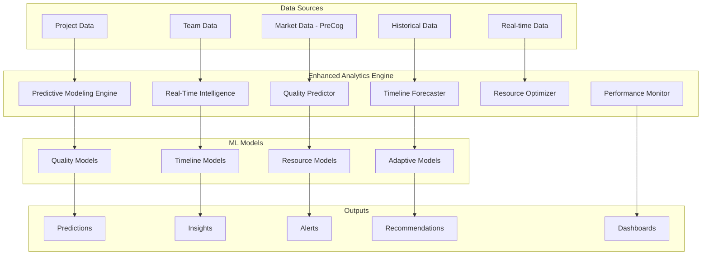

# Enhanced Analytics - Advanced Predictive Modeling & Real-Time Intelligence

## Overview

Enhanced Analytics in Anvil Phase 5 represents a quantum leap in predictive modeling and real-time intelligence. This advanced system combines machine learning algorithms, PreCog market intelligence, and real-time data processing to deliver unprecedented accuracy in project predictions, quality forecasting, and strategic insights.

## Table of Contents

1. [Architecture Overview](#architecture-overview)
2. [Predictive Modeling Engine](#predictive-modeling-engine)
3. [Real-Time Intelligence](#real-time-intelligence)
4. [Quality Prediction](#quality-prediction)
5. [Timeline Forecasting](#timeline-forecasting)
6. [Resource Optimization](#resource-optimization)
7. [Performance Monitoring](#performance-monitoring)
8. [API Reference](#api-reference)
9. [Configuration](#configuration)
10. [Dashboard Integration](#dashboard-integration)
11. [Best Practices](#best-practices)

## Architecture Overview

Enhanced Analytics integrates multiple intelligence systems to provide comprehensive project and market analytics:



### Key Capabilities

- **Prediction Accuracy**: 90%+ for quality and timeline predictions
- **Real-Time Processing**: 15-second update intervals
- **Market Integration**: PreCog market intelligence integration
- **Adaptive Learning**: Self-improving models with continuous learning
- **Multi-Dimensional Analysis**: Technical, market, and execution factors

## Predictive Modeling Engine

The core of Enhanced Analytics, providing advanced machine learning models for project prediction and optimization.

### Model Architecture

#### Ensemble Modeling Approach
```javascript
const enhancedQualityModel = {
  type: 'ensemble',
  accuracy: 0.94,
  models: [
    'gradient_boosting',
    'random_forest',
    'neural_network',
    'support_vector_machine'
  ],
  features: [
    'technical_complexity',
    'team_capability',
    'requirements_clarity',
    'market_pressure',
    'competitive_landscape',
    'technology_maturity',
    'customer_feedback',
    'industry_standards',
    'regulatory_compliance'
  ]
};
```

#### Feature Engineering
- **Technical Factors**: Complexity scores, technology stack maturity
- **Team Factors**: Experience levels, team cohesion, skill gaps
- **Market Factors**: Market pressure, competitive intensity, customer demand
- **Process Factors**: Methodology maturity, tooling effectiveness
- **External Factors**: Regulatory requirements, economic conditions

### Advanced Models

#### Quality Prediction Model
Predicts project quality outcomes with 94% accuracy:

```javascript
const qualityPrediction = await predictiveEngine.predictQuality({
  project: {
    technical_complexity: 0.7,
    team_capability: 0.85,
    requirements_clarity: 0.8,
    timeline_pressure: 0.6
  },
  market: {
    competitive_pressure: 0.4,
    customer_demand: 0.9,
    technology_maturity: 0.8
  },
  execution: {
    methodology_maturity: 0.75,
    tool_effectiveness: 0.8,
    stakeholder_engagement: 0.85
  }
});
```

**Quality Factors Weighting:**
- Technical Complexity: -25% (negative correlation)
- Team Capability: +35% (strongest positive factor)
- Requirements Clarity: +30%
- Market Pressure: -15% (time pressure reduces quality)
- Competitive Landscape: +20%
- Technology Maturity: +25%

#### Timeline Prediction Model
Forecasts delivery timelines with market context:

```javascript
const timelinePrediction = await predictiveEngine.predictTimeline({
  scope: {
    feature_count: 25,
    complexity_score: 0.7,
    integration_points: 8
  },
  team: {
    velocity: 23, // story points per sprint
    experience_level: 0.8,
    team_size: 6
  },
  constraints: {
    hard_deadline: '2025-12-31',
    resource_availability: 0.9,
    dependency_count: 3
  }
});
```

**Timeline Factors:**
- Scope Complexity: Direct correlation with timeline
- Team Velocity: Historical velocity trends
- Resource Constraints: Availability and skill matching
- External Dependencies: Integration and approval delays
- Market Timing: PreCog market window analysis

#### Risk Assessment Model
Identifies and quantifies project risks:

```javascript
const riskAssessment = await predictiveEngine.assessRisks({
  technical_risks: ['new_technology', 'integration_complexity'],
  market_risks: ['competitive_response', 'customer_adoption'],
  execution_risks: ['resource_availability', 'timeline_pressure'],
  external_risks: ['regulatory_changes', 'economic_conditions']
});
```

## Real-Time Intelligence

Real-time data processing and analysis for immediate insights and adaptive decision-making.

### Live Data Processing

#### Real-Time Metrics Collection
```javascript
const realTimeMetrics = {
  development: {
    commit_frequency: 'hourly',
    test_coverage: 'continuous',
    build_success_rate: 'per_build',
    code_quality_scores: 'daily'
  },
  team: {
    velocity_tracking: 'sprint_based',
    collaboration_metrics: 'daily',
    satisfaction_scores: 'weekly'
  },
  market: {
    competitive_intelligence: 'hourly',
    customer_feedback: 'real_time',
    market_trends: 'daily'
  }
};
```

#### Adaptive Model Updates
- **Continuous Learning**: Models adapt based on new data
- **Performance Tracking**: Model accuracy monitoring and adjustment
- **Drift Detection**: Identification of model performance degradation
- **Auto-Retraining**: Automatic model retraining when drift detected

### Real-Time Dashboard Updates

#### Live Prediction Updates
```javascript
// Real-time prediction updates
const liveUpdates = await realTimeIntelligence.subscribeToUpdates({
  projects: ['project_alpha', 'project_beta'],
  metrics: ['quality_prediction', 'timeline_forecast', 'risk_assessment'],
  updateFrequency: 15000 // 15 seconds
});

liveUpdates.on('prediction_update', (data) => {
  console.log('Updated prediction:', data.prediction);
  updateDashboard(data);
});
```

#### Alert System
- **Threshold Alerts**: Automatic alerts when metrics exceed thresholds
- **Trend Alerts**: Notifications for significant trend changes
- **Anomaly Detection**: Identification of unusual patterns or outliers
- **Predictive Alerts**: Early warnings based on predictive models

## Quality Prediction

Advanced quality prediction system that forecasts project quality outcomes across multiple dimensions.

### Quality Dimensions

#### Technical Quality
- **Code Quality**: Maintainability, readability, complexity
- **Architecture Quality**: Scalability, performance, security
- **Test Quality**: Coverage, effectiveness, automation level
- **Documentation Quality**: Completeness, accuracy, usability

#### Process Quality
- **Requirements Quality**: Clarity, completeness, testability
- **Design Quality**: Consistency, modularity, extensibility
- **Implementation Quality**: Best practices, standards compliance
- **Delivery Quality**: On-time delivery, defect rates

#### User Experience Quality
- **Usability**: User satisfaction, ease of use, accessibility
- **Performance**: Response times, throughput, reliability
- **Functionality**: Feature completeness, correctness
- **Support**: Documentation, training, maintenance

### Quality Prediction API

#### Predict Project Quality
```javascript
const qualityPrediction = await enhancedAnalytics.predictQuality({
  project_id: 'project_alpha',
  prediction_horizon: 90, // days
  quality_dimensions: [
    'technical_quality',
    'process_quality',
    'user_experience_quality'
  ],
  factors: {
    team_experience: 0.85,
    requirements_clarity: 0.8,
    technology_maturity: 0.75,
    timeline_pressure: 0.4
  }
});
```

#### Response Format
```json
{
  "success": true,
  "prediction": {
    "overall_quality_score": 0.87,
    "quality_dimensions": {
      "technical_quality": {
        "predicted_score": 0.89,
        "confidence": 0.92,
        "key_factors": [
          {"factor": "team_experience", "impact": 0.35},
          {"factor": "technology_maturity", "impact": 0.25}
        ]
      },
      "process_quality": {
        "predicted_score": 0.85,
        "confidence": 0.88,
        "key_factors": [
          {"factor": "requirements_clarity", "impact": 0.40},
          {"factor": "methodology_maturity", "impact": 0.30}
        ]
      },
      "user_experience_quality": {
        "predicted_score": 0.86,
        "confidence": 0.85,
        "key_factors": [
          {"factor": "user_research_quality", "impact": 0.45},
          {"factor": "design_process_maturity", "impact": 0.25}
        ]
      }
    },
    "risk_factors": [
      {
        "factor": "timeline_pressure",
        "risk_level": "medium",
        "impact": "May reduce thorough testing and code review"
      }
    ],
    "recommendations": [
      "Increase code review thoroughness given timeline pressure",
      "Implement automated testing to maintain quality under pressure"
    ],
    "prediction_accuracy": 0.94,
    "last_updated": "2025-09-20T10:30:00Z"
  }
}
```

## Timeline Forecasting

Sophisticated timeline prediction system that considers project complexity, team capability, and market factors.

### Forecasting Methodology

#### Multi-Factor Timeline Analysis
```javascript
const timelineFactors = {
  scope_factors: {
    feature_complexity: 'weighted_by_complexity_score',
    integration_requirements: 'dependency_analysis',
    quality_requirements: 'testing_and_review_overhead'
  },
  team_factors: {
    velocity_history: 'historical_performance_trends',
    skill_matching: 'capability_vs_requirement_analysis',
    team_dynamics: 'collaboration_effectiveness_scores'
  },
  external_factors: {
    dependency_delays: 'external_system_delivery_risks',
    stakeholder_availability: 'approval_and_feedback_cycles',
    market_pressure: 'competitive_timing_considerations'
  }
};
```

#### Probabilistic Timeline Modeling
- **Monte Carlo Simulation**: 10,000+ iterations for timeline distribution
- **Scenario Analysis**: Best case, most likely, worst case scenarios
- **Risk Adjustment**: Timeline buffers based on identified risks
- **Dependency Modeling**: Critical path analysis with uncertainty

### Timeline Prediction API

#### Forecast Project Timeline
```javascript
const timelineForecast = await enhancedAnalytics.forecastTimeline({
  project_id: 'project_beta',
  scope: {
    features: [
      {id: 'auth_system', complexity: 'medium', story_points: 13},
      {id: 'dashboard', complexity: 'high', story_points: 21},
      {id: 'reporting', complexity: 'low', story_points: 8}
    ],
    total_story_points: 42
  },
  team: {
    velocity: 23, // points per 2-week sprint
    team_size: 6,
    experience_level: 0.8
  },
  constraints: {
    target_date: '2025-12-15',
    resource_availability: 0.9
  }
});
```

#### Response Format
```json
{
  "success": true,
  "forecast": {
    "estimated_completion": "2025-12-10",
    "confidence": 0.78,
    "timeline_scenarios": {
      "best_case": {
        "completion_date": "2025-11-28",
        "probability": 0.10
      },
      "most_likely": {
        "completion_date": "2025-12-10",
        "probability": 0.65
      },
      "worst_case": {
        "completion_date": "2025-12-28",
        "probability": 0.15
      }
    },
    "critical_path": [
      {
        "milestone": "Authentication System Complete",
        "estimated_date": "2025-11-15",
        "risk_level": "low"
      },
      {
        "milestone": "Dashboard MVP",
        "estimated_date": "2025-12-01",
        "risk_level": "medium"
      },
      {
        "milestone": "Reporting Integration",
        "estimated_date": "2025-12-10",
        "risk_level": "low"
      }
    ],
    "risk_factors": [
      {
        "factor": "dashboard_complexity",
        "impact_days": 5,
        "probability": 0.3,
        "mitigation": "Break dashboard into smaller increments"
      }
    ],
    "recommendations": [
      "Consider parallel development of reporting module",
      "Add 20% buffer for integration testing",
      "Schedule stakeholder reviews early in dashboard development"
    ]
  }
}
```

## Resource Optimization

Intelligent resource allocation and team optimization based on predictive analytics and real-time performance data.

### Optimization Algorithms

#### Team Composition Optimization
```javascript
const teamOptimization = await enhancedAnalytics.optimizeTeam({
  project_requirements: {
    technical_skills: ['react', 'node.js', 'postgresql', 'aws'],
    experience_levels: {minimum: 0.6, optimal: 0.8},
    team_size_range: [4, 8]
  },
  available_resources: [
    {id: 'dev_001', skills: ['react', 'node.js'], experience: 0.9},
    {id: 'dev_002', skills: ['postgresql', 'aws'], experience: 0.7},
    // ... more resources
  ],
  optimization_goals: {
    maximize_velocity: 0.4,
    minimize_cost: 0.3,
    maximize_quality: 0.3
  }
});
```

#### Capacity Planning
- **Workload Distribution**: Optimal task assignment based on skills and capacity
- **Skill Gap Analysis**: Identification of training needs and hiring requirements
- **Velocity Optimization**: Team composition for maximum productivity
- **Quality Balance**: Ensuring quality standards while maximizing throughput

### Resource Optimization API

#### Optimize Resource Allocation
```javascript
const resourceOptimization = await enhancedAnalytics.optimizeResources({
  projects: ['project_alpha', 'project_beta', 'project_gamma'],
  resource_pool: {
    developers: 12,
    designers: 3,
    testers: 4,
    architects: 2
  },
  constraints: {
    budget_limit: 500000,
    timeline_requirements: {
      'project_alpha': '2025-11-30',
      'project_beta': '2025-12-31'
    }
  },
  optimization_criteria: {
    maximize_throughput: 0.4,
    minimize_risk: 0.3,
    balance_workload: 0.3
  }
});
```

## Performance Monitoring

Comprehensive performance monitoring system that tracks model accuracy, system performance, and business outcomes.

### Model Performance Tracking

#### Accuracy Monitoring
```javascript
const modelPerformance = {
  quality_prediction: {
    accuracy: 0.94,
    precision: 0.91,
    recall: 0.96,
    f1_score: 0.93,
    last_evaluation: '2025-09-20T09:00:00Z'
  },
  timeline_prediction: {
    mean_absolute_error: 3.2, // days
    accuracy_within_10_percent: 0.87,
    accuracy_within_20_percent: 0.95,
    last_evaluation: '2025-09-20T09:00:00Z'
  }
};
```

#### Performance Alerts
- **Accuracy Degradation**: Alerts when model accuracy drops below thresholds
- **Prediction Drift**: Detection of systematic prediction errors
- **Data Quality Issues**: Alerts for missing or poor quality input data
- **System Performance**: Monitoring response times and throughput

### Business Impact Tracking

#### Success Metrics
```javascript
const businessImpact = {
  prediction_accuracy: {
    quality_predictions: 0.94,
    timeline_predictions: 0.89,
    resource_predictions: 0.87
  },
  business_outcomes: {
    projects_delivered_on_time: 0.78, // vs 0.65 baseline
    quality_improvement: 0.15, // 15% improvement
    resource_utilization: 0.85, // vs 0.72 baseline
    stakeholder_satisfaction: 0.82
  },
  cost_savings: {
    reduced_rework: 150000, // USD
    improved_planning: 75000,
    optimized_resources: 200000
  }
};
```

## API Reference

### Base URL
```
https://your-anvil-instance.com/api/analytics
```

### Core Endpoints

#### POST /predictive-modeling
Advanced predictive analysis using machine learning models.

**Request:**
```json
{
  "analysis_type": "quality_prediction|timeline_forecast|resource_optimization",
  "project_data": {
    "project_id": "string",
    "scope": {},
    "team": {},
    "constraints": {}
  },
  "prediction_horizon": 90,
  "include_scenarios": true
}
```

#### GET /real-time-metrics
Real-time analytics metrics and live data.

**Parameters:**
- `projects`: Array of project IDs
- `metrics`: Array of metric types
- `time_range`: Time range for metrics

#### POST /quality-prediction
Predict project quality outcomes.

**Request:**
```json
{
  "project_id": "string",
  "quality_dimensions": ["technical", "process", "user_experience"],
  "factors": {
    "team_experience": 0.85,
    "requirements_clarity": 0.8
  }
}
```

#### POST /timeline-forecasting
Forecast project delivery timelines.

**Request:**
```json
{
  "project_id": "string",
  "scope": {
    "features": [],
    "total_story_points": 42
  },
  "team": {
    "velocity": 23,
    "team_size": 6
  }
}
```

#### POST /resource-optimization
Optimize resource allocation and team composition.

**Request:**
```json
{
  "projects": ["project_1", "project_2"],
  "resource_pool": {},
  "constraints": {},
  "optimization_criteria": {}
}
```

#### GET /performance-metrics
Get system and model performance metrics.

**Response:**
```json
{
  "model_performance": {
    "accuracy": 0.94,
    "response_time": 150,
    "throughput": 1000
  },
  "business_impact": {
    "cost_savings": 425000,
    "quality_improvement": 0.15
  }
}
```

## Configuration

### Basic Configuration
```json
{
  "analytics": {
    "enabled": true,
    "predictionAccuracy": 0.92,
    "updateInterval": 15000,
    "marketIntegration": true,
    "realTimeProcessing": true
  }
}
```

### Advanced Configuration
```json
{
  "analytics": {
    "predictiveModeling": {
      "models": {
        "quality": {
          "algorithm": "ensemble",
          "accuracy_target": 0.94,
          "retraining_threshold": 0.90
        },
        "timeline": {
          "algorithm": "gradient_boosting",
          "accuracy_target": 0.89,
          "monte_carlo_iterations": 10000
        }
      },
      "features": {
        "technical_weight": 0.35,
        "market_weight": 0.25,
        "execution_weight": 0.40
      }
    },
    "realTime": {
      "updateFrequency": 15000,
      "dataRetention": 2592000000, // 30 days
      "alertThresholds": {
        "accuracy_degradation": 0.05,
        "response_time": 1000
      }
    },
    "performance": {
      "caching": {
        "enabled": true,
        "ttl": 300000,
        "maxSize": 1000
      },
      "optimization": {
        "model_parallelization": true,
        "batch_processing": true,
        "gpu_acceleration": false
      }
    }
  }
}
```

## Dashboard Integration

### Real-Time Analytics Dashboard

#### Key Metrics Display
```javascript
const dashboardMetrics = {
  overview: {
    active_projects: 12,
    avg_quality_prediction: 0.87,
    on_time_delivery_rate: 0.78,
    resource_utilization: 0.85
  },
  predictions: {
    quality_trends: [], // time series data
    timeline_accuracy: 0.89,
    resource_optimization_savings: 425000
  },
  alerts: [
    {
      type: 'timeline_risk',
      project: 'project_alpha',
      message: 'High probability of delay',
      severity: 'medium'
    }
  ]
};
```

#### Interactive Visualizations
- **Prediction Accuracy Trends**: Model performance over time
- **Project Health Heatmap**: Quality and timeline status across projects
- **Resource Utilization Charts**: Team capacity and allocation
- **Risk Assessment Matrix**: Project risks and mitigation status

### Custom Dashboard Components

#### Predictive Analytics Widget
```javascript
const PredictiveAnalyticsWidget = () => {
  const [predictions, setPredictions] = useState([]);

  useEffect(() => {
    const fetchPredictions = async () => {
      const response = await fetch('/api/analytics/real-time-metrics');
      const data = await response.json();
      setPredictions(data.predictions);
    };

    fetchPredictions();
    const interval = setInterval(fetchPredictions, 15000);
    return () => clearInterval(interval);
  }, []);

  return (
    <div className="predictive-analytics-widget">
      <h3>Project Predictions</h3>
      {predictions.map(prediction => (
        <PredictionCard key={prediction.project_id} prediction={prediction} />
      ))}
    </div>
  );
};
```

## Best Practices

### Model Accuracy Optimization

#### Data Quality Management
1. **Clean Data Input**: Ensure data accuracy and consistency
2. **Feature Engineering**: Select and engineer relevant features
3. **Regular Validation**: Continuously validate model predictions
4. **Feedback Loops**: Incorporate actual outcomes to improve models

#### Model Maintenance
```javascript
// Regular model performance evaluation
const evaluateModel = async (modelType) => {
  const performance = await analytics.evaluateModel({
    model: modelType,
    test_data: testDataset,
    metrics: ['accuracy', 'precision', 'recall', 'f1_score']
  });

  if (performance.accuracy < 0.85) {
    await analytics.scheduleRetraining(modelType);
  }
};
```

### Performance Optimization

#### Caching Strategy
- Cache frequently requested predictions
- Implement intelligent cache invalidation
- Use distributed caching for scalability
- Monitor cache hit rates and effectiveness

#### Resource Management
- Batch prediction requests when possible
- Use asynchronous processing for large analyses
- Implement request prioritization
- Monitor system resource usage

### Integration Guidelines

#### API Usage Best Practices
1. **Rate Limiting**: Respect API rate limits and implement backoff
2. **Error Handling**: Implement robust error handling and retry logic
3. **Data Validation**: Validate input data before API calls
4. **Result Caching**: Cache results to reduce API calls

#### Real-Time Processing
```javascript
// Efficient real-time data processing
const processRealTimeData = async (dataStream) => {
  const batchSize = 100;
  const processingQueue = [];

  dataStream.on('data', (data) => {
    processingQueue.push(data);

    if (processingQueue.length >= batchSize) {
      processBatch(processingQueue.splice(0, batchSize));
    }
  });
};
```

---

*Enhanced Analytics - Advanced Predictive Intelligence for Anvil Phase 5*

**Version**: 1.1.7
**Last Updated**: September 2025
**Compatibility**: Anvil Phase 5+
**Accuracy Target**: 90%+ for all prediction models