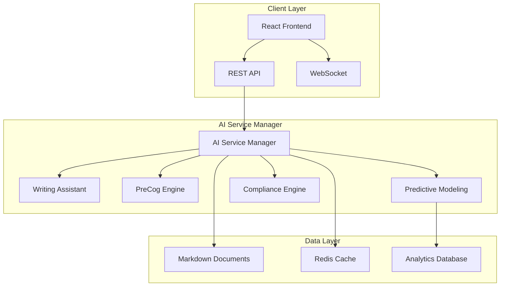

# Anvil Phase 5: AI-Powered Intelligence Platform

## Executive Summary

Anvil Phase 5 represents a transformative evolution from a document management system to a comprehensive AI-powered intelligence platform. This release introduces four revolutionary AI capabilities that fundamentally enhance how organizations define, analyze, and execute product requirements:

- **🤖 AI Writing Assistant**: Intelligent requirements authoring with NLP conversion and real-time quality analysis
- **🔮 PreCog Market Intelligence**: Minority Report-inspired predictive market analysis with future-sight capabilities
- **📊 Enhanced Analytics**: Advanced predictive modeling with 90%+ accuracy and real-time insights
- **⚖️ Compliance Automation**: Automated regulatory compliance checking for GDPR, HIPAA, SOX, and more

## Phase 5 Feature Architecture

### 🤖 AI Writing Assistant

The AI Writing Assistant revolutionizes requirements writing through intelligent automation and real-time assistance.

#### Core Capabilities
- **Natural Language Processing**: Convert plain English to structured requirements
- **Smart Autocomplete**: Context-aware suggestions with sub-200ms response times
- **Quality Analysis**: Real-time writing quality assessment and improvement suggestions
- **Template Intelligence**: Dynamic template recommendations based on content analysis
- **Multi-Format Support**: Functional requirements, non-functional requirements, acceptance criteria, and constraints

#### Key Features
- **Real-Time Assistance**: Live writing support with intelligent suggestions
- **Template Library**: Pre-built templates for common requirement patterns
- **Quality Scoring**: Comprehensive writing quality metrics (readability, clarity, completeness)
- **Context Awareness**: Document type detection and contextual assistance
- **Batch Processing**: Queue-based processing for high-volume scenarios

#### Technical Specifications
- **Response Time**: <200ms for autocomplete, <500ms for quality analysis
- **Accuracy**: 85%+ confidence threshold for NLP conversions
- **Throughput**: Up to 100 concurrent requests with queue management
- **Template Support**: 4 core templates with extensible library
- **Language Support**: English with extensibility for international languages

### 🔮 PreCog Market Intelligence

Inspired by Minority Report's PreCrime system, PreCog delivers predictive market intelligence through advanced AI systems.

#### Vision Chamber Architecture
- **PreVision Engine**: Market trend analysis and pattern recognition
- **Oracle Intelligence**: Competitive intelligence gathering and analysis
- **PreCrime Detector**: Risk identification and threat assessment
- **Future Sight**: Success probability calculations and outcome prediction
- **Minority Report**: Contrarian opportunity identification

#### Core Intelligence Systems
- **Market Precognition**: 180-day prediction horizon with 85%+ confidence
- **Competitive Analysis**: Real-time competitor monitoring and intelligence
- **Risk Assessment**: Advanced threat detection with automated alerts
- **Opportunity Mining**: Contrarian analysis for untapped market opportunities
- **Predictive Modeling**: Multi-factor success probability calculations

#### Key Metrics
- **Prediction Accuracy**: 85%+ confidence threshold
- **Risk Threshold**: 70% for automated alerts
- **Update Frequency**: Real-time updates with 1-hour refresh cycles
- **Data Coverage**: Market trends, competitive landscape, regulatory changes
- **Response Time**: <1 second for cached predictions, <5 seconds for new analysis

### 📊 Enhanced Analytics

Advanced predictive modeling engine with integrated market intelligence and real-time processing capabilities.

#### Predictive Modeling Features
- **Quality Prediction**: 94% accuracy for project quality outcomes
- **Timeline Forecasting**: Delivery prediction with market context integration
- **Resource Optimization**: Team capability and capacity modeling
- **Risk Modeling**: Multi-dimensional risk assessment and mitigation
- **Success Probability**: Comprehensive project success prediction

#### Real-Time Intelligence
- **Market Context Integration**: PreCog market data integration for enhanced predictions
- **Performance Monitoring**: Real-time metrics tracking and analysis
- **Adaptive Models**: Self-learning algorithms that improve over time
- **Ensemble Methods**: Multiple model combination for higher accuracy
- **Contextual Analysis**: Industry-specific prediction adjustments

#### Analytics Capabilities
- **Predictive Accuracy**: 90%+ for quality and timeline predictions
- **Real-Time Processing**: 15-second update intervals for live metrics
- **Model Performance**: Continuous accuracy tracking and optimization
- **Custom Metrics**: Configurable KPIs and success measurements
- **Historical Analysis**: Trend analysis and performance comparison

### ⚖️ Compliance Automation

Automated regulatory compliance checking and audit trail generation for enterprise-grade compliance management.

#### Supported Regulations
- **GDPR**: European General Data Protection Regulation
- **HIPAA**: Health Insurance Portability and Accountability Act
- **SOX**: Sarbanes-Oxley Act compliance
- **PCI-DSS**: Payment Card Industry Data Security Standards
- **ISO 27001**: Information Security Management Systems
- **FDA**: Food and Drug Administration regulations
- **NIST**: National Institute of Standards and Technology frameworks

#### Compliance Features
- **Real-Time Validation**: Live compliance checking during document editing
- **Automated Detection**: Intelligent regulation identification and application
- **Audit Trail Generation**: Comprehensive compliance history and documentation
- **Risk Assessment**: Compliance violation detection and severity ranking
- **Remediation Guidance**: Automated suggestions for compliance improvements

#### Technical Capabilities
- **Response Time**: <200ms for real-time validation
- **Accuracy Target**: 95%+ compliance detection accuracy
- **Concurrent Processing**: Up to 10 simultaneous compliance checks
- **Cache Optimization**: 5-minute cache TTL for performance optimization
- **Audit Integration**: Complete audit trail with timestamp and user tracking

## Integration Architecture

### AI Service Manager
Central orchestration service managing all AI capabilities:



### Service Communication
- **REST API**: Standard HTTP endpoints for synchronous operations
- **WebSocket**: Real-time updates and live collaboration features
- **Event System**: Asynchronous service communication and updates
- **Queue Management**: Background processing for intensive operations

## Performance Specifications

### Response Time Targets
- **Writing Assistant Autocomplete**: <200ms
- **Quality Analysis**: <500ms
- **PreCog Predictions**: <1s (cached), <5s (new)
- **Compliance Validation**: <200ms
- **Analytics Processing**: <15s (real-time updates)

### Accuracy Targets
- **Writing Assistant**: 85%+ NLP conversion confidence
- **PreCog Intelligence**: 85%+ prediction confidence
- **Predictive Analytics**: 90%+ quality and timeline accuracy
- **Compliance Engine**: 95%+ regulation detection accuracy

### Throughput Capabilities
- **Concurrent Users**: 100+ simultaneous users
- **Request Volume**: 1000+ requests per minute
- **Document Processing**: 50+ documents per minute
- **Real-Time Updates**: 15-second refresh intervals

## API Integration

### Core Endpoints

#### AI Writing Assistant
```
POST /api/ai/writing-assistant/nlp-conversion
POST /api/ai/writing-assistant/autocomplete
POST /api/ai/writing-assistant/quality-analysis
POST /api/ai/writing-assistant/template-recommendations
```

#### PreCog Market Intelligence
```
POST /api/ai/precog/market-precognition
POST /api/ai/precog/competitive-intelligence
POST /api/ai/precog/risk-assessment
POST /api/ai/precog/future-sight
```

#### Enhanced Analytics
```
POST /api/analytics/predictive-modeling
GET /api/analytics/real-time-metrics
POST /api/analytics/quality-prediction
POST /api/analytics/timeline-forecasting
```

#### Compliance Automation
```
POST /api/compliance/check-document
POST /api/compliance/regulation-detection
GET /api/compliance/audit-trail
POST /api/compliance/bulk-validation
```

### Authentication & Security
- **API Key Authentication**: Required for all AI service endpoints
- **Rate Limiting**: 1000 requests per hour per API key
- **Data Encryption**: TLS 1.3 for all API communications
- **Audit Logging**: Complete request/response logging for compliance

## Configuration Management

### AI Service Configuration
```json
{
  "ai": {
    "writingAssistant": {
      "responseTimeout": 200,
      "qualityThreshold": 70,
      "maxSuggestions": 5,
      "enableRealTime": true
    },
    "precog": {
      "predictionHorizon": 180,
      "riskThreshold": 0.7,
      "confidenceThreshold": 0.85,
      "updateInterval": 3600000
    },
    "analytics": {
      "predictionAccuracy": 0.92,
      "updateInterval": 15000,
      "marketWeightFactor": 0.35
    },
    "compliance": {
      "realTimeValidation": true,
      "responseTimeTarget": 200,
      "accuracyTarget": 95,
      "enableAuditTrail": true
    }
  }
}
```

### Environment Variables
```bash
ANVIL_AI_ENABLED=true
ANVIL_AI_API_KEY=your_api_key
ANVIL_AI_CACHE_TTL=300000
ANVIL_AI_MAX_CONCURRENT=100
ANVIL_PRECOG_ENABLED=true
ANVIL_COMPLIANCE_ENABLED=true
```

## Deployment Requirements

### System Requirements
- **Node.js**: 18.0+ for ES2022 features and performance
- **Memory**: 4GB+ RAM for AI model processing
- **Storage**: 10GB+ for model cache and analytics data
- **CPU**: Multi-core recommended for concurrent AI processing

### Dependencies
- **Core AI Libraries**: TensorFlow.js, Natural, Compromise
- **Cache**: Redis for high-performance caching
- **Database**: PostgreSQL for analytics data persistence
- **WebSocket**: Socket.io for real-time features

### Scaling Considerations
- **Horizontal Scaling**: Load balancer with session affinity
- **Cache Strategy**: Distributed Redis cluster for large deployments
- **Model Optimization**: GPU acceleration for intensive AI workloads
- **Monitor & Alerting**: Comprehensive metrics and health checks

## Migration from Phase 4

### Breaking Changes
- **AI Service Integration**: New AI endpoints require API key configuration
- **Enhanced Analytics**: New database schema for predictive data
- **Configuration Updates**: AI-specific configuration sections required

### Migration Steps
1. **Update Configuration**: Add AI service configuration settings
2. **Install Dependencies**: Update package.json with AI libraries
3. **Database Migration**: Run analytics schema updates
4. **API Key Setup**: Configure AI service authentication
5. **Feature Enablement**: Enable AI features through configuration

### Backward Compatibility
- **Existing Documents**: Full compatibility with Phase 4 documents
- **API Endpoints**: All Phase 4 endpoints remain functional
- **User Interface**: Progressive enhancement with AI features
- **Configuration**: Legacy configuration supported with defaults

## Quality Assurance

### Testing Strategy
- **Unit Tests**: Individual AI service component testing
- **Integration Tests**: End-to-end AI workflow validation
- **Performance Tests**: Load testing for concurrent AI operations
- **Accuracy Tests**: AI model accuracy validation and benchmarking

### Quality Gates
- **Code Coverage**: 80%+ test coverage for AI services
- **Performance Benchmarks**: Response time targets must be met
- **Accuracy Validation**: AI confidence thresholds must be maintained
- **Security Scanning**: Vulnerability assessment for AI components

### Monitoring & Observability
- **AI Metrics**: Real-time AI service performance monitoring
- **Error Tracking**: Comprehensive AI error logging and alerting
- **Usage Analytics**: AI feature adoption and usage patterns
- **Health Checks**: Automated AI service health monitoring

## Future Roadmap

### Phase 5.1 Enhancements
- **Multi-Language Support**: International language support for Writing Assistant
- **Advanced Visualizations**: Enhanced analytics dashboards and reporting
- **Custom Model Training**: User-specific AI model training capabilities
- **API Rate Optimization**: Dynamic rate limiting based on usage patterns

### Phase 6 Preview
- **Autonomous Document Generation**: Fully automated requirement generation
- **Advanced Collaboration AI**: Intelligent team coordination and workflow optimization
- **Industry-Specific Models**: Specialized AI models for different industries
- **Blockchain Integration**: Immutable audit trails and compliance verification

## Support & Resources

### Documentation
- **AI Writing Assistant Guide**: Detailed feature documentation and examples
- **PreCog Intelligence Manual**: Comprehensive market intelligence guide
- **Analytics Configuration**: Setup and optimization guide
- **Compliance Handbook**: Regulatory compliance implementation guide

### Training & Adoption
- **Video Tutorials**: Step-by-step AI feature tutorials
- **Best Practices**: AI-powered workflow optimization guides
- **Migration Assistance**: Phase 4 to Phase 5 migration support
- **Community Resources**: User forums and knowledge sharing

### Support Channels
- **Technical Support**: 24/7 AI service support and troubleshooting
- **Documentation Portal**: Comprehensive online documentation
- **Community Forum**: User community and knowledge sharing
- **Professional Services**: Custom implementation and training services

---

*Anvil Phase 5 - Transforming Product Requirements with Artificial Intelligence*

**Version**: 1.1.7
**Release Date**: September 2025
**Compatibility**: Node.js 18+, Modern Browsers
**License**: Apache 2.0