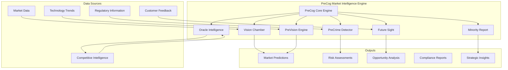

# PreCog Market Intelligence - Minority Report-Inspired Predictive Analytics

## Overview

PreCog Market Intelligence is Anvil Phase 5's revolutionary predictive market analysis system, inspired by the PreCrime technology from Minority Report. This advanced AI system provides future-sight capabilities, risk detection, and contrarian opportunity identification through a sophisticated network of specialized intelligence engines.

## Table of Contents

1. [Core Architecture](#core-architecture)
2. [Vision Chamber](#vision-chamber)
3. [PreVision Engine](#prevision-engine)
4. [Oracle Intelligence](#oracle-intelligence)
5. [PreCrime Detector](#precrime-detector)
6. [Future Sight](#future-sight)
7. [Minority Report](#minority-report)
8. [API Reference](#api-reference)
9. [Configuration](#configuration)
10. [Use Cases](#use-cases)
11. [Best Practices](#best-practices)

## Core Architecture

PreCog operates through six interconnected intelligence systems, each providing specialized market analysis capabilities:



### System Capabilities

- **Prediction Horizon**: 180-day forward-looking analysis
- **Confidence Threshold**: 85%+ for actionable insights
- **Risk Detection**: 70% threshold for automated alerts
- **Update Frequency**: Real-time with hourly market scans
- **Analysis Depth**: Multi-dimensional market factor analysis

## Vision Chamber

The Vision Chamber serves as the central neural network for deep market analysis, combining multiple data streams into comprehensive market intelligence.

### Core Functions

#### Deep Market Analysis
The Vision Chamber processes vast amounts of market data to identify patterns, trends, and emerging opportunities:

```javascript
// Vision Chamber Analysis Request
const analysisRequest = {
  type: 'vision-chamber-analysis',
  parameters: {
    industry: 'software_development',
    timeHorizon: 180, // days
    factors: ['market_size', 'competition', 'technology_trends', 'regulatory_changes'],
    confidenceThreshold: 0.85
  }
};
```

#### Multi-Dimensional Processing
- **Market Dynamics**: Size, growth rate, saturation levels
- **Competitive Landscape**: Player positioning, market share, strategies
- **Technology Evolution**: Emerging technologies, adoption curves
- **Regulatory Environment**: Compliance requirements, policy changes
- **Customer Behavior**: Preferences, adoption patterns, feedback analysis

### Vision Chamber Outputs

#### Market Intelligence Reports
```json
{
  "marketAnalysis": {
    "industry": "software_development",
    "currentSize": "$150B",
    "projectedSize": "$180B",
    "growthRate": 0.12,
    "saturationLevel": 0.35,
    "keyDrivers": [
      "Digital transformation acceleration",
      "Remote work technology adoption",
      "AI/ML integration demand"
    ]
  },
  "confidenceScore": 0.89,
  "lastUpdated": "2025-09-20T10:30:00Z"
}
```

#### Trend Identification
- **Emerging Technologies**: Early-stage technology adoption signals
- **Market Shifts**: Consumer behavior and preference changes
- **Disruption Indicators**: Signals of potential market disruption
- **Growth Opportunities**: Untapped market segments and niches

## PreVision Engine

The PreVision Engine specializes in forward-looking market trend analysis, predicting future market conditions and opportunities.

### Predictive Capabilities

#### Market Trend Forecasting
```javascript
const trendAnalysis = await preVisionEngine.analyzeMarketTrends({
  market: 'enterprise_software',
  timeframe: 'next_quarter',
  factors: ['adoption_rate', 'competitive_pressure', 'technology_readiness'],
  granularity: 'weekly'
});
```

#### Technology Adoption Curves
- **Early Adoption Signals**: Identify technologies gaining traction
- **Mainstream Adoption Timing**: Predict when technologies reach mainstream
- **Market Saturation Points**: Forecast when markets become saturated
- **Disruption Windows**: Identify optimal timing for market entry

### PreVision Outputs

#### Trend Predictions
```json
{
  "trendAnalysis": {
    "technology": "AI_automation_tools",
    "currentAdoption": 0.15,
    "predictedAdoption": {
      "30_days": 0.18,
      "90_days": 0.25,
      "180_days": 0.35
    },
    "peakAdoption": {
      "value": 0.75,
      "timeframe": "18_months"
    },
    "confidence": 0.87
  }
}
```

#### Market Timing Insights
- **Entry Windows**: Optimal timing for market entry
- **Expansion Opportunities**: When to scale or expand offerings
- **Exit Signals**: When to pivot or exit declining markets
- **Investment Timing**: Optimal periods for technology investments

## Oracle Intelligence

Oracle Intelligence serves as the competitive intelligence gathering and analysis system, providing deep insights into competitive landscape and strategic positioning.

### Intelligence Gathering

#### Competitive Analysis
```javascript
const competitiveIntel = await oracleIntelligence.gatherCompetitiveIntel({
  competitors: ['microsoft', 'google', 'amazon'],
  analysisDepth: 'comprehensive',
  timeframe: 'last_quarter',
  focusAreas: ['product_launches', 'pricing_changes', 'market_strategy']
});
```

#### Strategic Intelligence Areas
- **Competitor Positioning**: Market position, strategy, and capabilities
- **Product Intelligence**: Feature comparisons, roadmap analysis
- **Pricing Intelligence**: Pricing strategies, competitive pricing analysis
- **Market Share Analysis**: Share distribution, growth patterns
- **Partnership Intelligence**: Strategic alliances, acquisition activity

### Oracle Outputs

#### Competitive Landscape Report
```json
{
  "competitiveAnalysis": {
    "marketLeader": {
      "company": "Microsoft",
      "marketShare": 0.35,
      "keyStrengths": ["enterprise_relationships", "platform_integration"],
      "vulnerabilities": ["innovation_speed", "niche_market_penetration"]
    },
    "emergingThreats": [
      {
        "company": "OpenAI",
        "threat_level": "high",
        "reason": "AI technology advancement",
        "timeline": "6_months"
      }
    ],
    "opportunities": [
      {
        "gap": "mid_market_AI_tools",
        "potential": "high",
        "difficulty": "medium"
      }
    ]
  }
}
```

#### Strategic Recommendations
- **Positioning Strategies**: How to position against competitors
- **Differentiation Opportunities**: Unique value proposition areas
- **Competitive Responses**: Recommended responses to competitor moves
- **Market Gap Analysis**: Unserved market segments identification

## PreCrime Detector

The PreCrime Detector identifies potential market risks, regulatory threats, and business dangers before they materialize.

### Risk Detection Capabilities

#### Market Risk Analysis
```javascript
const riskAssessment = await preCrimeDetector.detectMarketRisks({
  riskTypes: ['regulatory', 'competitive', 'technology', 'economic'],
  severityThreshold: 0.7,
  timeHorizon: 90, // days
  industry: 'fintech'
});
```

#### Risk Categories
- **Regulatory Risks**: New regulations, compliance changes, policy shifts
- **Competitive Risks**: Aggressive competitor moves, market disruption
- **Technology Risks**: Technology obsolescence, security vulnerabilities
- **Economic Risks**: Market downturns, economic instability
- **Operational Risks**: Supply chain issues, talent shortages

### PreCrime Outputs

#### Risk Assessment Report
```json
{
  "riskAnalysis": {
    "highPriorityRisks": [
      {
        "riskType": "regulatory",
        "description": "New data privacy regulation in EU",
        "severity": 0.85,
        "probability": 0.75,
        "timeline": "60_days",
        "impact": "high",
        "mitigationStrategies": [
          "Implement privacy controls",
          "Update data handling processes",
          "Legal compliance review"
        ]
      }
    ],
    "riskTrends": {
      "increasing": ["regulatory", "cybersecurity"],
      "decreasing": ["economic", "supply_chain"]
    }
  }
}
```

#### Early Warning System
- **Threat Indicators**: Early signals of potential risks
- **Alert Thresholds**: Automated alerts when risk levels exceed thresholds
- **Mitigation Strategies**: Recommended actions to address identified risks
- **Monitoring Protocols**: Ongoing risk monitoring and assessment

## Future Sight

Future Sight calculates success probabilities for strategic initiatives, product launches, and market opportunities.

### Probability Calculations

#### Success Probability Analysis
```javascript
const successAnalysis = await futureSight.calculateSuccessProbability({
  initiative: 'ai_product_launch',
  factors: {
    market_readiness: 0.8,
    competitive_landscape: 0.6,
    team_capability: 0.9,
    technology_maturity: 0.7,
    funding_availability: 0.8
  },
  timeframe: '12_months'
});
```

#### Analysis Factors
- **Market Readiness**: Customer demand, market timing, adoption willingness
- **Competitive Position**: Competitive advantages, differentiation strength
- **Execution Capability**: Team skills, resources, operational readiness
- **Technology Maturity**: Technology readiness, scalability, reliability
- **External Factors**: Economic conditions, regulatory environment

### Future Sight Outputs

#### Success Probability Report
```json
{
  "successAnalysis": {
    "overallProbability": 0.78,
    "factorAnalysis": {
      "market_readiness": {
        "score": 0.8,
        "weight": 0.3,
        "contribution": 0.24
      },
      "competitive_advantage": {
        "score": 0.75,
        "weight": 0.25,
        "contribution": 0.19
      }
    },
    "scenarios": {
      "best_case": 0.92,
      "most_likely": 0.78,
      "worst_case": 0.45
    },
    "keyRiskFactors": [
      "Market timing uncertainty",
      "Competitive response intensity"
    ],
    "recommendedActions": [
      "Accelerate market validation",
      "Strengthen competitive differentiation"
    ]
  }
}
```

#### Scenario Planning
- **Best Case Scenarios**: Optimal outcome probabilities and requirements
- **Most Likely Scenarios**: Expected outcome analysis
- **Worst Case Scenarios**: Risk mitigation and contingency planning
- **Sensitivity Analysis**: Impact of changing key variables

## Minority Report

The Minority Report system identifies contrarian opportunities and alternative perspectives that challenge conventional market wisdom.

### Contrarian Analysis

#### Opportunity Identification
```javascript
const contrarianAnalysis = await minorityReport.findContrarianOpportunities({
  market: 'cloud_computing',
  analysisType: 'unconventional_opportunities',
  riskTolerance: 'medium',
  timeHorizon: 'long_term'
});
```

#### Contrarian Indicators
- **Market Oversaturation**: Opportunities in declining or saturated markets
- **Technology Contrarians**: Alternative technology approaches
- **Behavioral Contrarians**: Opportunities based on contrarian user behavior
- **Geographic Contrarians**: Untapped geographic markets
- **Demographic Contrarians**: Underserved demographic segments

### Minority Report Outputs

#### Contrarian Opportunity Report
```json
{
  "contrarianAnalysis": {
    "unconventionalOpportunities": [
      {
        "opportunity": "Legacy system modernization",
        "reasoning": "While market focuses on greenfield AI, massive legacy modernization opportunity exists",
        "marketSize": "$50B",
        "competitionLevel": "low",
        "successProbability": 0.72,
        "timeToMarket": "18_months",
        "riskLevel": "medium"
      }
    ],
    "alternativePerspectives": [
      {
        "conventional_wisdom": "AI will replace human workers",
        "contrarian_view": "AI will augment human capabilities, creating new job categories",
        "evidence": ["historical_technology_adoption", "current_job_creation_data"],
        "confidence": 0.68
      }
    ]
  }
}
```

#### Alternative Strategy Recommendations
- **Blue Ocean Opportunities**: Uncontested market spaces
- **Niche Market Focus**: Specialized segment opportunities
- **Technology Alternatives**: Non-mainstream technology approaches
- **Business Model Innovation**: Alternative revenue and delivery models

## API Reference

### Base URL
```
https://your-anvil-instance.com/api/ai/precog
```

### Authentication
```
Authorization: Bearer YOUR_API_KEY
```

### Core Endpoints

#### POST /market-precognition
Comprehensive market analysis using all PreCog systems.

**Request:**
```json
{
  "market": "enterprise_software",
  "analysis_depth": "comprehensive",
  "timeframe": 180,
  "systems": ["vision_chamber", "prevision", "oracle", "precrime", "future_sight", "minority_report"]
}
```

**Response:**
```json
{
  "success": true,
  "requestId": "precog_001",
  "result": {
    "marketAnalysis": { /* Vision Chamber output */ },
    "trendPredictions": { /* PreVision output */ },
    "competitiveIntel": { /* Oracle output */ },
    "riskAssessment": { /* PreCrime output */ },
    "successProbabilities": { /* Future Sight output */ },
    "contrarianOpportunities": { /* Minority Report output */ }
  },
  "confidence": 0.87,
  "processingTime": 2350
}
```

#### POST /prevision-analysis
Market trend analysis and predictions.

**Request:**
```json
{
  "type": "prevision-analysis",
  "market": "ai_automation",
  "timeframe": "next_quarter",
  "factors": ["adoption_rate", "technology_readiness", "market_demand"]
}
```

#### POST /oracle-intelligence
Competitive intelligence gathering.

**Request:**
```json
{
  "type": "oracle-intelligence",
  "competitors": ["company1", "company2"],
  "analysis_areas": ["product_strategy", "pricing", "market_position"],
  "timeframe": "last_6_months"
}
```

#### POST /precrime-detection
Risk assessment and threat identification.

**Request:**
```json
{
  "type": "precrime-detection",
  "risk_types": ["regulatory", "competitive", "technology"],
  "severity_threshold": 0.7,
  "industry": "fintech"
}
```

#### POST /future-sight
Success probability calculations.

**Request:**
```json
{
  "type": "future-sight",
  "initiative": "product_launch",
  "factors": {
    "market_readiness": 0.8,
    "team_capability": 0.9,
    "competitive_position": 0.7
  }
}
```

#### POST /minority-report
Contrarian opportunity analysis.

**Request:**
```json
{
  "type": "minority-report",
  "market": "cloud_services",
  "analysis_type": "contrarian_opportunities",
  "risk_tolerance": "medium"
}
```

#### POST /vision-chamber-analysis
Deep market analysis.

**Request:**
```json
{
  "type": "vision-chamber-analysis",
  "industry": "healthcare_tech",
  "analysis_depth": "comprehensive",
  "timeframe": 365
}
```

### Response Format

All endpoints return standardized responses:

```json
{
  "success": true|false,
  "requestId": "unique_request_id",
  "result": {
    /* Endpoint-specific analysis results */
  },
  "confidence": 0.0-1.0,
  "responseTime": 1234,
  "timestamp": "2025-09-20T10:30:00Z",
  "error": "Error message if success is false"
}
```

## Configuration

### Basic Configuration
```json
{
  "ai": {
    "precog": {
      "enabled": true,
      "predictionHorizon": 180,
      "riskThreshold": 0.7,
      "confidenceThreshold": 0.85,
      "updateInterval": 3600000
    }
  }
}
```

### Advanced Configuration
```json
{
  "ai": {
    "precog": {
      "visionChamber": {
        "maxDataSources": 50,
        "analysisDepth": "comprehensive",
        "cacheResults": true,
        "cacheTTL": 1800000
      },
      "preVision": {
        "trendSensitivity": 0.1,
        "predictionAccuracy": 0.85,
        "updateFrequency": "hourly"
      },
      "oracle": {
        "competitorTrackingLimit": 20,
        "intelligenceDepth": "detailed",
        "realTimeMonitoring": true
      },
      "preCrime": {
        "riskCategories": ["regulatory", "competitive", "technology", "economic"],
        "alertThresholds": {
          "low": 0.3,
          "medium": 0.5,
          "high": 0.7,
          "critical": 0.9
        }
      },
      "futureSight": {
        "scenarioModeling": true,
        "monteCarlo": {
          "enabled": true,
          "iterations": 10000
        }
      },
      "minorityReport": {
        "contrarianSensitivity": 0.3,
        "alternativeThreshold": 0.4,
        "enableUnconventionalAnalysis": true
      }
    }
  }
}
```

### Environment Variables
```bash
ANVIL_PRECOG_ENABLED=true
ANVIL_PRECOG_PREDICTION_HORIZON=180
ANVIL_PRECOG_RISK_THRESHOLD=0.7
ANVIL_PRECOG_CONFIDENCE_THRESHOLD=0.85
ANVIL_PRECOG_UPDATE_INTERVAL=3600000
```

## Use Cases

### Product Strategy Planning

#### Market Entry Analysis
```javascript
// Analyze market entry opportunity
const entryAnalysis = await precogEngine.process({
  type: 'market-precognition',
  parameters: {
    market: 'ai_productivity_tools',
    analysis_type: 'entry_opportunity',
    timeframe: 12 // months
  }
});

// Get contrarian perspectives
const contrarianView = await precogEngine.process({
  type: 'minority-report',
  parameters: {
    market: 'ai_productivity_tools',
    analysis_type: 'alternative_approaches'
  }
});
```

### Risk Management

#### Comprehensive Risk Assessment
```javascript
// Detect emerging risks
const riskAnalysis = await precogEngine.process({
  type: 'precrime-detection',
  parameters: {
    risk_types: 'all',
    industry: 'software_development',
    timeline: 90
  }
});

// Calculate success probability with risk factors
const successAnalysis = await precogEngine.process({
  type: 'future-sight',
  parameters: {
    initiative: 'product_expansion',
    include_risk_factors: true
  }
});
```

### Competitive Intelligence

#### Competitive Positioning
```javascript
// Gather competitive intelligence
const competitiveIntel = await precogEngine.process({
  type: 'oracle-intelligence',
  parameters: {
    competitors: ['microsoft', 'google', 'salesforce'],
    analysis_depth: 'comprehensive',
    focus_areas: ['ai_capabilities', 'market_strategy', 'pricing']
  }
});

// Identify market trends
const trendAnalysis = await precogEngine.process({
  type: 'prevision-analysis',
  parameters: {
    market: 'enterprise_ai',
    trend_focus: ['technology_adoption', 'customer_preferences']
  }
});
```

### Investment Planning

#### Investment Opportunity Analysis
```javascript
// Analyze investment opportunities
const investmentAnalysis = await precogEngine.process({
  type: 'vision-chamber-analysis',
  parameters: {
    analysis_type: 'investment_opportunity',
    sectors: ['ai', 'automation', 'cloud'],
    timeframe: 24 // months
  }
});

// Find contrarian investment opportunities
const contrarianInvestments = await precogEngine.process({
  type: 'minority-report',
  parameters: {
    analysis_type: 'contrarian_investments',
    risk_tolerance: 'medium_high'
  }
});
```

## Best Practices

### Interpretation Guidelines

#### Understanding Confidence Scores
- **90-100%**: High confidence, actionable insights
- **80-89%**: Good confidence, recommend validation
- **70-79%**: Moderate confidence, use with caution
- **60-69%**: Low confidence, additional analysis needed
- **Below 60%**: Insufficient confidence, not recommended for decisions

#### Using Predictions Effectively
1. **Combine Multiple Sources**: Use multiple PreCog systems for comprehensive analysis
2. **Validate with External Data**: Cross-reference predictions with external sources
3. **Monitor Accuracy**: Track prediction accuracy over time
4. **Update Regularly**: Refresh analyses as market conditions change

### Data Quality Management

#### Input Data Quality
- Ensure data sources are current and reliable
- Validate data consistency across sources
- Remove outliers and anomalous data points
- Maintain data freshness through regular updates

#### Analysis Validation
- Cross-validate results across different systems
- Compare predictions with historical patterns
- Test predictions against known outcomes
- Regularly calibrate confidence thresholds

### Strategic Application

#### Decision Integration
1. **Strategic Planning**: Use for long-term strategic planning
2. **Risk Management**: Integrate into risk management processes
3. **Investment Decisions**: Support investment and resource allocation
4. **Product Planning**: Inform product development and launch timing

#### Organizational Adoption
- Train teams on PreCog interpretation
- Establish governance for AI-driven insights
- Create feedback loops for prediction accuracy
- Develop standard operating procedures

### Performance Optimization

#### Response Time Optimization
```javascript
// Enable caching for frequently requested analyses
const config = {
  caching: {
    enabled: true,
    ttl: 1800000, // 30 minutes
    maxSize: 1000
  }
};

// Batch multiple requests for efficiency
const batchRequests = [
  { type: 'prevision-analysis', market: 'ai' },
  { type: 'oracle-intelligence', competitors: ['company1'] },
  { type: 'precrime-detection', risks: ['regulatory'] }
];
```

#### Resource Management
- Monitor API usage and rate limits
- Implement request prioritization
- Use asynchronous processing for large analyses
- Cache frequently requested insights

---

*PreCog Market Intelligence - Future-Sight Capabilities for Anvil Phase 5*

**Version**: 1.1.7
**Last Updated**: September 2025
**Compatibility**: Anvil Phase 5+
**Inspired by**: Minority Report PreCrime Technology