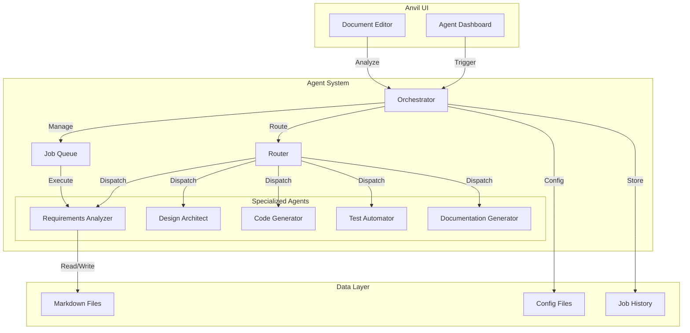

# Anvil

[](https://opensource.org/licenses/Apache-2.0)
[]()

**An AI-Powered No-Code Development Framework** that takes you from **Idea → Requirements → Design → Code → Test** without writing a single line of code.

Anvil is not just a PRD management tool - it's a complete product development pipeline that transforms ideas into working software. Define your product requirements using structured capabilities and enablers, then watch as AI automatically generates your entire application with comprehensive testing through seamless integration with Claude Code and other AI development tools.

**Complete Development Pipeline:**
- 💡 **Idea**: Capture and organize product concepts
- 📋 **Requirements**: Structure capabilities, enablers, and detailed specifications
- 🎨 **Design**: Automated system architecture and component design
- ⚙️ **Code**: AI-generated implementation with full functionality
- 🧪 **Test**: Automated test generation and validation
- 🚀 **Deploy**: Ready-to-run applications from your specifications

## Application Interface


*Anvil's clean interface showing capability management with structured metadata, enabler relationships, and comprehensive status tracking*

## Philosophy & Focus

Anvil is specifically designed for the **right side of the engineering problem** - the **Technical Capabilities and Enablers** that form the architectural foundation of software systems.

Product development has two distinct sides:
- **Left Side (Creative Design Space)**: Experiences and Features - the domain of Product Managers and UX designers
- **Right Side (Technical Implementation)**: Technical Capabilities and Enablers - the domain of Engineers and Architects

Anvil focuses exclusively on the right side, helping engineering teams define, organize, and manage the technical capabilities that enable product experiences. A new platform is coming soon for the left side that will marry **Experiences and Features** (Product Managers) with **Technical Capabilities and Enablers** (Engineers) to build the architectural runway needed to support exceptional user experiences.

## Overview

Anvil provides a clean, organized interface for defining product specifications that automatically transform into working software through AI-powered development workflows.

## 🚀 Implementation Workflow with Claude Code

Anvil is designed to work seamlessly with Claude Code for automated development implementation. Follow this workflow to implement your specifications:

### Step 1: Product Definition
1. **Create Capabilities**: Define high-level system capabilities using Anvil's capability forms
2. **Add Enablers**: Break down capabilities into detailed enablers with requirements
3. **Set Status Fields**: Configure Analysis Review and Design Review requirements for each document
4. **Development Plans**: Ensure each enabler includes a comprehensive Development Plan section

### Step 2: Claude Code Implementation
1. **Navigate to Specifications Directory**:
   ```bash
   cd /path/to/your/project/specifications
   ```

2. **Launch Claude Code**:
   ```bash
   claude
   ```

3. **Implementation Command**:
   ```
   Please implement this application by looking in the specifications folder and following the development plan closely.
   ```

### Step 3: Automated Development Sequence
Claude Code will automatically:

1. **📋 Analysis Phase** (if Analysis Review = "Required"):
   - Read all capability and enabler specifications
   - Analyze requirements and dependencies
   - Generate technical analysis documentation
   - Update Status: "Ready for Analysis" → "In Analysis" → "Ready for Design"

2. **🎨 Design Phase** (if Design Review = "Required"):
   - Create system architecture designs
   - Design component interfaces and APIs
   - Generate design documentation
   - Update Status: "Ready for Design" → "In Design" → "Ready for Implementation"

3. **⚙️ Implementation Phase**:
   - Generate code following development plans
   - Implement functional and non-functional requirements
   - Create tests and documentation
   - Update Status: "Ready for Implementation" → "In Implementation" → "Implemented"

4. **🔄 Status Synchronization**:
   - Automatically update Anvil document statuses
   - Sync requirement completion states
   - Trigger automated workflow transitions

### 💡 Implementation Tips
- **Detailed Development Plans**: Include specific implementation steps, file structures, and dependencies
- **Clear Requirements**: Use Functional and Non-Functional requirement tables with priorities
- **Status Configuration**: Set Analysis Review and Design Review to "Required" for comprehensive implementation
- **Directory Structure**: Organize specifications in logical system/component folders for Claude to navigate
- **Regular Sync**: Refresh Anvil after implementation phases to see updated statuses

## Quick Start

### Windows
```bash
start-anvil.bat
```

### Mac/Linux
```bash
chmod +x start-anvil.sh
./start-anvil.sh
```

The start scripts will:
- Automatically install dependencies if needed
- Start the Anvil server
- Open at http://localhost:3000

### Manual Start
```bash
npm install  # First time only
npm start    # Start the server
```

## 🤖 NEW: Claude Code Subagent Integration

### **AI-Powered Development Automation**
Anvil now includes a comprehensive **Claude Code Subagent System** that transforms your specifications into working software through AI-orchestrated workflows.

#### **Agent Control Center**
Access the Agent Dashboard by clicking the **Bot icon** (🤖) in the header or navigate to `/agents`

#### **Available Agents**
- **📋 Requirements Analyzer**: Analyzes and validates capabilities and enablers
  - Extracts metadata and requirements
  - Validates document completeness
  - Checks dependencies and relationships
  - Generates improvement suggestions

- **🎨 Design Architect** *(Coming Soon)*: Creates system designs from requirements
- **💻 Code Generator** *(Coming Soon)*: Generates implementation code
- **🧪 Test Automator** *(Coming Soon)*: Creates comprehensive test suites
- **📚 Documentation Generator** *(Coming Soon)*: Produces technical documentation

#### **Predefined Workflows**
- **Full Implementation Pipeline**: Analysis → Design → Code → Test → Document
- **Quick Analysis**: Fast requirements validation
- **Design Only**: Requirements analysis + system design
- **Test Generation**: Code analysis + test creation

#### **Agent API Endpoints**
```
GET  /api/agents              # List all agents
POST /api/agents/analyze      # Analyze documents
POST /api/agents/workflow     # Execute workflows
GET  /api/agents/job/:id      # Check job status
GET  /api/agents/history      # View execution history
```

### 📊 **Agent Architecture Diagram**



### 🚀 **Usage Examples**

#### **Analyzing a Capability Document**
```javascript
// Using the API directly
fetch('/api/agents/analyze', {
  method: 'POST',
  headers: { 'Content-Type': 'application/json' },
  body: JSON.stringify({
    documentId: 'CAP-0001',
    documentContent: markdownContent,
    documentType: 'Capability'
  })
})
```

#### **Executing a Workflow**
```javascript
// Execute full implementation pipeline
fetch('/api/agents/workflow', {
  method: 'POST',
  headers: { 'Content-Type': 'application/json' },
  body: JSON.stringify({
    workflowName: 'full-implementation',
    input: { documentId: 'CAP-0001' }
  })
})
```

#### **Via UI Dashboard**
1. Navigate to `/agents` or click the Bot icon
2. Select the "Workflows" tab
3. Click "Execute" on desired workflow
4. Monitor progress in real-time
5. View results in Job History

## Features Implemented

### 🗂️ **Document Organization**
- **Capabilities Section**: High-level capability documents
- **Enablers Section**: Detailed feature enabler documents
- **Templates Section**: Template files for creating new documents
- Automatic categorization based on Type metadata field

### 📋 **Metadata System**
- **Type**: Automatically categorizes documents (Capability, Enabler, Template)
- **ID**: Unique identifier (CAP-XXXX for capabilities, ENB-XXXX for enablers)
- **Description**: Brief description extracted and displayed in navigation
- **Title**: Clean titles without redundant prefixes

### 🎨 **User Interface**
- Responsive 2-column layout with editor swap-in functionality
- Uses 95% of horizontal browser space for maximum real estate
- Editor replaces content view (no side-by-side) to save space
- Wider navigation panel (400px) for better document browsing
- Clean, modern design with gradient header
- Hover effects and active states for navigation items
- Mobile-responsive design

### 🔍 **Content Viewing**
- Click any document in sidebar to view full content
- Automatic markdown rendering with proper styling
- Tables, code blocks, and formatting preserved
- Mermaid diagram support in markdown

### ✨ **Document Creation**
- **Create New Capabilities**: Generate new capability documents from templates
- **Create New Enablers**: Generate new enabler documents from templates
- **Smart Template Loading**: Automatically populates metadata with current date and generated IDs
- **Auto-naming Convention**: Ensures proper file naming (-capability.md, -enabler.md)
- **Immediate Editing**: New documents open directly in the form editor
- **Navigation Refresh**: New documents appear in sidebar after saving

## Architecture

Anvil is a modern **React + Node.js** application with AI agent integration:

### Frontend (React)
- **Framework**: React 18 with Vite for fast development and building
- **State Management**: React Context for global application state
- **Routing**: React Router for client-side navigation
- **Styling**: CSS modules with modern responsive design
- **Components**: Modular component architecture for maintainability
- **Agent Dashboard**: Real-time monitoring and control interface

### Backend (Node.js + Express)
- **Server**: Express.js REST API
- **File Operations**: Markdown file management and parsing
- **APIs**: RESTful endpoints for CRUD operations
- **Agent System**: Orchestrator-based subagent management

### AI Agent Layer
- **Orchestrator**: Central command system managing all subagents
- **Router**: Intelligent request routing to appropriate agents
- **Job Queue**: Concurrent execution with history tracking
- **Event System**: Real-time status updates and notifications

## File Structure

```
anvil/
├── server.js                    # Express server with API endpoints
├── package.json                 # Server dependencies and scripts
├── agent-config.json            # Agent system configuration
├── agents/                      # AI subagent modules
│   ├── orchestrator/           # Central orchestrator
│   │   ├── index.js           # Orchestrator core
│   │   └── router.js          # Intelligent routing
│   └── requirements/           # Requirements analyzer
│       └── analyzer.js        # Analysis logic
├── api/                         # API layer
│   └── agent-endpoints.js      # Agent REST endpoints
├── client/                      # React frontend application
│   ├── package.json            # Client dependencies
│   ├── vite.config.js          # Vite build configuration
│   ├── index.html              # React app entry point
│   └── src/
│       ├── main.jsx            # React app initialization
│       ├── App.jsx             # Root React component
│       ├── index.css           # Global styles
│       ├── components/         # React components
│       │   ├── Layout.jsx      # Main layout component
│       │   ├── Header.jsx      # Application header
│       │   ├── Sidebar.jsx     # Navigation sidebar
│       │   ├── Dashboard.jsx   # Main dashboard
│       │   ├── DocumentView.jsx # Document viewer
│       │   ├── DocumentEditor.jsx # Document editor
│       │   ├── AgentDashboard.jsx # Agent control center
│       │   └── forms/          # Form components
│       │       ├── CapabilityForm.jsx
│       │       └── EnablerForm.jsx
│       ├── contexts/           # React Context providers
│       │   └── AppContext.jsx  # Global app state
│       ├── services/           # API services
│       │   └── apiService.js   # Backend API client
│       └── utils/              # Utility functions
│           ├── markdownUtils.js # Markdown parsing
│           └── mermaidUtils.js  # Mermaid diagram rendering
├── templates/                   # Document templates
│   ├── capability-template.md
│   └── enabler-template.md
├── dist/                        # Built React application (generated)
├── examples/                    # Document storage directory
│   └── specifications/          # Capability and enabler documents
└── README.md                    # This file
```

## Document Conventions

### **File Naming**
- Capabilities: `name-capability.md`
- Enablers: `name-enabler.md`
- Templates: `type-template.md`

### **Document Format**
All documents follow this metadata structure:
```markdown
# [Document Title]

## Metadata
- **Type**: Capability | Enabler
- **ID**: CAP-XXXX | ENB-XXXX
- **Description**: Brief description of what this document covers
- **Status**: Draft | In Review | Approved | etc.
- **Priority**: Critical | High | Medium | Low
- **Owner**: [Team/Person]
- **Created Date**: YYYY-MM-DD
- **Last Updated**: YYYY-MM-DD
```

### **Document Relationships**
The system implements a **1-to-Many relationship** between Capabilities and Enablers:

**Capability → Enablers (1:Many)**
- One Capability can have many Enablers
- Capabilities contain an "Enablers" table listing all related enablers
- Each table row references an enabler by ID

**Enabler → Capability (Many:1)**
- Each Enabler belongs to exactly one Capability
- Enablers contain a **Capability ID** metadata field linking to parent capability
- **Capability ID**: CAP-XXXX (Parent Capability)

**Relationship Metadata Fields:**
- **Capabilities**: Include Enablers table with columns: Enabler ID, Name, Description, Status, Priority
- **Enablers**: Include **Capability ID** field in metadata section

### **Dependency Rules**
The system enforces specific dependency constraints based on document type:

**Capability Dependencies:**
- **Cross-System Dependencies**: Capabilities can have dependencies on other Capabilities or system components from different systems/projects
- **External Integration**: Supports dependencies across organizational boundaries and technical architectures
- **Flexible Scope**: No restrictions on dependency relationships for capabilities

**Enabler Dependencies:**
- **Same-Component Constraint**: Enablers can only have dependencies on other Enablers within the same system component
- **Internal Scope**: Dependencies must remain within the boundary of the parent capability/component
- **Focused Dependencies**: Ensures enabler dependencies stay logically contained within their architectural context

### **Requirements Management (Enablers)**
Enablers support two types of requirements:

**Functional Requirements Table:**
- Req ID, Requirement, Description, Priority, Status (5 columns)
- Supports adding/removing requirements dynamically in form editor
- Requirements persist correctly between edit sessions

**Non-Functional Requirements Table:**
- Req ID, Type, Requirement, Target Value, Priority, Status, Test Approach
- Type options: Performance, Reliability, Usability, Security, Scalability, Maintainability
- Supports adding/removing requirements dynamically in form editor
- Requirements persist correctly between edit sessions

## API Endpoints

- `GET /api/capabilities` - Returns categorized documents (capabilities, enablers, templates)
- `GET /api/file/*` - Returns specific file content with rendered HTML
- `GET /` - Serves the main web interface

## Dependencies

### Server Dependencies
- **express**: Web server framework
- **marked**: Markdown parsing and rendering
- **fs-extra**: Enhanced file system operations
- **uuid**: Unique ID generation for agent jobs
- **nodemon**: Development auto-restart (dev dependency)

### Client Dependencies
- **react**: UI framework
- **react-router-dom**: Client-side routing
- **axios**: HTTP client for API calls
- **lucide-react**: Icon library
- **mermaid**: Diagram rendering

## Quick Start

```bash
cd anvil
npm install
npm start
```

Open browser to: http://localhost:3000

## Development

For auto-restart during development:
```bash
npm run dev
```

## Technical Details

### **Server Features**
- Automatic directory scanning for markdown files
- Metadata extraction from document headers
- Document categorization by Type field
- Security checks for file access
- Error handling and logging
- Automatic backup creation in backup/ directory before saving or deleting files

### **Frontend Features (React)**
- Modern React 18 application with hooks and context
- Component-based architecture for maintainability
- React Router for client-side navigation
- Real-time state management with Context API
- Responsive CSS Grid and Flexbox layouts
- Hot module replacement for fast development
- Toast notifications for user feedback
- Modern ES6+ JavaScript with Vite build system

### **Key Features**
- **Form-based Editor**: User-friendly web forms with markdown editing toggle
- **Document Management**: Create, edit, and organize capabilities, enablers, and requirements
- **Relationship Mapping**: Visual connections between capabilities and enablers
- **Workspace Management**: Multi-workspace support for different projects
- **Dynamic Tables**: Add/remove requirements with auto-incrementing IDs
- **Status Tracking**: Comprehensive workflow management with approval gates
- **Template System**: Smart template processing with auto-generated metadata
- **Real-time State Management**: Automated status cascading and relationship updates
- **Backup System**: Automatic backup creation before modifications
- **Responsive Design**: Modern UI with sticky toolbars and mobile support
- **Search Functionality**: Search across all documents
- **Enhanced Visual Mapping**: Advanced graphical relationship views
- **Export Options**: PDF/Word export capabilities
- **Version History**: Track document changes over time
- **Advanced Validation**: Required field enforcement
- **Auto-save**: Automatic saving while editing
- **User Authentication**: Multi-user support with permissions
- **Collaborative Features**: Comments and review workflows


## Configuration

### Workspace Management

Anvil supports **workspace-based configuration** for managing multiple document collections:

#### Workspace Features
- **Multiple Workspaces**: Create and manage multiple independent workspaces
- **Multi-Path Support**: Each workspace can have multiple project paths for document storage
- **Active Workspace**: Only one workspace is active at a time, determining which documents are visible
- **Centralized Templates**: Single templates directory shared across all workspaces

#### Configuration Structure (config.json)
```json
{
  "workspaces": [
    {
      "id": "ws-default",
      "name": "Default Workspace",
      "description": "Primary document workspace",
      "isActive": true,
      "projectPaths": ["../specifications", "./docs"],
      "createdDate": "2025-09-17T22:30:00.000Z"
    }
  ],
  "activeWorkspaceId": "ws-default",
  "templates": "./templates",
  "server": { "port": 3000 },
  "ui": {
    "title": "Anvil",
    "description": "Product Requirements Document Browser"
  },
  "defaults": {
    "owner": "Product Team",
    "analysisReview": "Not Required",
    "designReview": "Required"
  }
}
```

#### Workspace API Endpoints
- `GET /api/workspaces` - Get all workspaces and active workspace ID
- `POST /api/workspaces` - Create new workspace
- `PUT /api/workspaces/:id` - Update workspace details
- `POST /api/workspaces/:id/activate` - Set workspace as active
- `DELETE /api/workspaces/:id` - Delete workspace (cannot delete active workspace)
- `POST /api/workspaces/:id/paths` - Add project path to workspace
- `DELETE /api/workspaces/:id/paths` - Remove project path from workspace

#### Workspace Validation
- Each workspace must have at least one project path
- Active workspace ID must reference an existing workspace
- Cannot delete the currently active workspace
- Project paths are validated for existence and security

#### Configuration Migration
The system uses workspace-based configuration. Legacy path-based configurations are automatically migrated to the workspace structure.


## Technical Features

### 📋 **Document Creation & Management**
- **Use Form Mode First**: Create new documents using Form mode for structured input, then switch to Markdown mode if needed for custom formatting
- **Consistent Naming**: Follow the established naming conventions (CAP-XXXX for capabilities, ENB-XXXX for enablers)
- **Complete Metadata**: Always fill out Status, Priority, Owner, and Approval fields for proper workflow tracking
- **Descriptive Titles**: Use clear, concise titles that describe the capability or enabler's purpose

### 🔗 **Relationships & Dependencies**
- **Link Enablers to Capabilities**: Always associate enablers with their parent capability using the Capability ID field
- **Document Dependencies**: Use Internal Upstream/Downstream sections to track capability relationships
- **Requirement Traceability**: Link requirements to implementation tasks and maintain requirement IDs consistently

### 🏗️ **Workspace Organization**
- **Logical Path Structure**: Organize project paths by system/component (e.g., ./auth-system/specifications, ./payment-system/specifications)
- **Workspace Separation**: Use separate workspaces for different projects or environments
- **Template Consistency**: Customize templates to match your organization's standards before creating new documents

### 🔄 **Workflow Management**
- **Status Progression**: Follow the defined status progression (Ready → In Progress → Review → Implemented)
- **Approval Gates**: Use approval fields to control implementation flow and ensure quality gates
- **Regular Updates**: Keep Status and Last Updated fields current to maintain project visibility

### 💾 **Configuration Management**
- **Local Configuration**: Use config.local.json for environment-specific settings (workspace paths, personal defaults)
- **Version Control**: Commit only config.json (factory defaults) to version control, never config.local.json
- **Backup Strategy**: Regularly backup your workspace directories and local configuration

### 🛠️ **Development Workflow**
- **Form ↔ Markdown Toggle**: Use Form mode for structured editing, Markdown mode for advanced formatting
- **Save Frequently**: Use Ctrl+S to save changes, especially when working on complex documents
- **Review Before Implementation**: Use Ready states to pause and review before moving to implementation phases

### 📊 **State Management**
- **Automated Workflows**: Leverage state listeners for automatic status transitions (e.g., requirement refactoring)
- **Batch Operations**: Complete related requirements together to trigger enabler status updates efficiently
- **Status Visibility**: Use the relationship diagrams to visualize system architecture and dependencies

### 🚀 **Performance & Scalability**
- **Document Size**: Keep individual documents focused and reasonably sized for better loading performance
- **Image Management**: Store large images externally and link rather than embedding directly in markdown
- **Regular Cleanup**: Archive or remove obsolete documents to maintain system performance


## Status and Approval Field Structure

### Current Field Configuration

The system uses **separate Status and Approval fields** throughout the application for better workflow management:

#### **Capabilities (Metadata)**
- **Status Options**: Draft, In Review, In Development, Testing, Deployed, Deprecated
- **Approval Options**: Not Approved, Approved
- Both fields appear in document metadata sections
- Automatic conversion: Old "Approved" status → "In Development" status + "Approved" approval

#### **Enablers (Metadata)**
- **Status Options**: In Draft, Ready for Analysis, Ready for Analysis Review, In Analysis Review, Ready for Design, In Design, In Design Review, Ready to Implement, In Implementation, Implemented, Refactored
- **Approval Options**: Not Approved, Approved
- **Review Fields**: Analysis Review, Design Review, Requirements Review, Code Review (Required/Not Required)
- Comprehensive 11-stage workflow supporting full development lifecycle from analysis through refactoring

#### **Functional Requirements**
| Req ID | Requirement | Description | Priority | Status | Approval |
|--------|-------------|-------------|----------|--------|----------|
- **Status Options**: In Draft, Ready for Review, In Review, Ready to Implement, In Implementation, Implemented, Refactored
- **Approval Options**: Not Approved, Approved

#### **Non-Functional Requirements**
| Req ID | Type | Requirement | Priority | Status | Approval |
|--------|------|-------------|----------|--------|----------|
- **Status Options**: In Draft, Ready for Review, In Review, Ready to Implement, In Implementation, Implemented, Refactored
- **Approval Options**: Not Approved, Approved
- **Type Options**: Performance, Reliability, Usability, Security, Scalability, Maintainability, Technical Constraint, Portability

#### **Enabler Tables in Capabilities**
| Enabler ID | Name | Description | Status | Approval | Priority |
|------------|------|-------------|--------|----------|----------|
- Shows enabler status and approval directly in capability documents

### Backward Compatibility
The system automatically handles legacy formats by converting older table structures to the current 6-column format with separate Status and Approval fields.

## Implementation Plan Logic

The Implementation Plan sections in capabilities and enablers follow a strict approval-based execution flow:

### **Capability Implementation Plan**
1. **Task 1**: Check Capability Approval Status
   - If Approval = "Approved" → Continue to Task 2
   - If Approval = "Not Approved" → Skip all remaining tasks

2. **Task 2**: Implement Enablers
   - For each enabler, check if Enabler Approval = "Approved"
   - If approved → Implement the enabler
   - If not approved → Skip that enabler

### **Enabler Implementation Plan**
1. **Task 1**: Check Enabler Approval Status
   - If Approval = "Approved" → Continue to Task 2
   - If Approval = "Not Approved" → Skip all remaining tasks

2. **Task 2**: Implement Requirements
   - For each requirement, check if Requirement Approval = "Approved"
   - If approved → Implement the requirement
   - If not approved → Skip that requirement

**Important**: The implementation follows a hierarchical approval model where parent elements must be approved before child elements are considered.

## State Automation Triggers

### State Automation

The system includes automated state management:
- **Requirement → Enabler Status Cascade**: When any requirement in an enabler becomes "Refactored" AND the enabler status is "Implemented" → enabler status changes to "Refactored"
- **Event-driven Architecture**: State changes trigger automated behaviors across the document hierarchy
- **Real-time Updates**: Status changes are reflected immediately across related documents

## Version History

### v1.1.3 - Mermaid Diagram Fix ✅
- **RELATIONSHIP DIAGRAM FIX**: Fixed Mermaid parsing error that caused "Parse error on line 15" when rendering component relationship diagrams
- **ROBUST ID GENERATION**: Improved node ID generation to ensure valid Mermaid identifiers by replacing special characters with underscores
- **CLASS ASSIGNMENT SAFETY**: Added filtering and validation to prevent empty or invalid class assignments in Mermaid diagrams
- **ERROR PREVENTION**: Enhanced defensive programming for edge cases in diagram rendering

### v1.1.2 - Discovery UI Updates ✅
- **DISCOVERY ICON**: Changed Discovery icon from search to lightbulb with consistent blue styling
- **FEATURE STATUS**: Added "Feature Not Yet Implemented" notice banner to Discovery page
- **UI CONSISTENCY**: Ensured Discovery button matches other header buttons with same hover effects and styling

### v1.1.1 - Discovery Feature and Smart Rebuild ✅
- **DISCOVERY FEATURE**: Added Discovery page with markdown-capable text editor and AI analysis engine
- **SMART REBUILD DETECTION**: Enhanced startup scripts to detect client changes and automatically rebuild when needed
- **AI PATTERN MATCHING**: Implemented intelligent text parsing to extract capabilities and enablers from project descriptions
- **AUTOMATIC DOCUMENT GENERATION**: Created template-based document generation with proper Anvil formatting

### v1.0.2 - Defect Fixes and Version Management ✅
- **DUPLICATE ENABLER FIX**: Fixed duplicate enabler file creation issue where inconsistent filename generation between frontend and backend created files with and without `-enabler` suffix
- **CENTRALIZED VERSION MANAGEMENT**: Updated all code to use package.json as single source of truth for version information
- **FILENAME CONSISTENCY**: Standardized enabler file naming to use `-enabler.md` suffix consistently across the application
- **VERSION SYNC SCRIPT**: Added `npm run version:sync` command to synchronize versions between root and client package.json files

### v1.0.0 - Initial Open Source Release ✅
- **APACHE 2.0 LICENSE**: Released under Apache 2.0 license with full open source compliance
- **COMPREHENSIVE FEATURE SET**: Complete PRD management system with capabilities, enablers, and requirements tracking
- **REACT + NODE.JS**: Modern full-stack application with React frontend and Node.js Express backend
- **CLAUDE CODE INTEGRATION**: Seamless integration with Claude Code for automated development implementation
- **CONFIGURATION SYSTEM**: Factory + local configuration pattern for Git-safe deployment
- **DOCUMENT MANAGEMENT**: Form-based and markdown editing with real-time status tracking
- **RELATIONSHIP MAPPING**: Dynamic diagrams showing capability-enabler dependencies and system architecture
- **WORKSPACE MANAGEMENT**: Multi-workspace support for organizing different projects and document collections

## Contributing

We welcome contributions! Please read our [Contributing Guidelines](CONTRIBUTING.md) for details on our code of conduct and the process for submitting pull requests.

## License

This project is licensed under the Apache License 2.0 - see the [LICENSE](LICENSE) file for details.

## Copyright

Copyright 2025 Darcy Davidson

## Acknowledgments

- Built with React and Node.js
- Uses Lucide React for icons
- Markdown rendering with marked.js
- Diagram support via Mermaid.js
