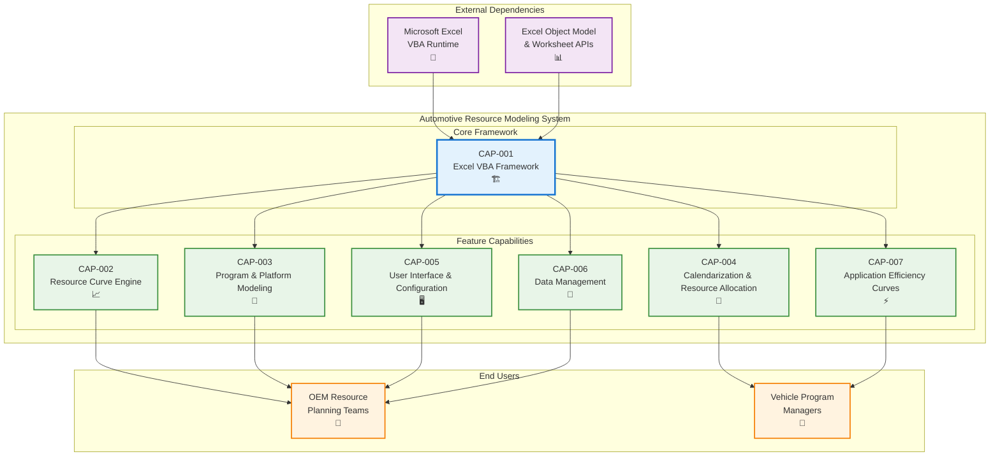

# Excel VBA Framework

## Metadata
- **Name**: Excel VBA Framework
- **Type**: Capability
- **System**: Automotive Resource Modeling
- **Component**: Core Infrastructure
- **ID**: CAP-001
- **Status**: In Draft
- **Approval**: Not Approved
- **Priority**: Critical
- **Analysis Review**: Required
- **Owner**: Engineering Team
- **Created Date**: 2025-09-19
- **Last Updated**: 2025-09-19
- **Version**: 1.0

## Technical Overview
### Purpose
Provides the core VBA infrastructure and framework for the automotive resource modeling Excel tool. This capability establishes the foundation for all resource modeling functionality, including one-time setup, domain configuration management, data validation, and error handling across the entire system.

## Enablers
List of enablers that implement this capability:

| Enabler ID | Name | Description | Status | Approval | Priority |
|------------|------|-------------|--------|----------|----------|
| ENB-001 | One-Time Setup System | Automated setup function that creates worksheets, formatting, and user interface | In Draft | Not Approved | Critical |
| ENB-002 | Domain Configuration Management | Dynamic add/remove domains with validation and persistence | In Draft | Not Approved | High |
| ENB-003 | Data Validation & Error Handling | Comprehensive input validation and user-friendly error management | In Draft | Not Approved | High |

## Dependencies
### Internal Upstream Dependency
| Capability ID | Name | Description |
|---------------|------|-------------|
| N/A | N/A | No internal upstream dependencies |

### Internal Downstream Impact
| Capability ID | Name | Description |
|---------------|------|-------------|
| CAP-002 | Resource Curve Engine | Depends on VBA framework for curve calculations |
| CAP-003 | Program & Platform Modeling | Depends on VBA framework for modeling logic |
| CAP-004 | Calendarization & Resource Allocation | Depends on VBA framework for timeline calculations |
| CAP-005 | User Interface & Configuration | Depends on VBA framework for UI components |
| CAP-006 | Data Management | Depends on VBA framework for data operations |
| CAP-007 | Application Efficiency Curves | Depends on VBA framework for efficiency calculations |

### External Upstream Dependencies
- Microsoft Excel VBA Runtime Environment
- Excel Object Model and Worksheet APIs

### External Downstream Impact
- Automotive OEM resource planning teams
- Vehicle program managers and architects

## Technical Specifications

### Capability Dependency Flow Diagram

### Core Framework Architecture
The Excel VBA Framework provides:

1. **Initialization System**: One-time setup that creates all necessary worksheets, applies formatting, and establishes the user interface structure
2. **Configuration Management**: Dynamic domain management allowing users to add/remove work domains (Design, SW Dev, V&V, etc.) with automatic validation
3. **Error Handling Infrastructure**: Centralized error management with user-friendly messages and graceful degradation
4. **Data Validation Framework**: Input validation across all user entry points with real-time feedback
5. **Utility Functions**: Shared VBA functions used by all other capabilities

### Technical Requirements
- **Single VBA Module**: All code contained in one module for easy deployment
- **Setup Function**: `InitializeResourceModelingTool()` creates complete working environment
- **Domain Configuration**: Support for 7 default domains with ability to add/remove
- **Error Recovery**: Graceful handling of user input errors and system exceptions
- **Performance**: Efficient execution for up to 30 vehicle programs per platform

# Development Plan

## CRITICAL WORKFLOW RULES

### APPROVAL vs STATE - FUNDAMENTAL DIFFERENCE:
- **Approval Definition**: Authorization/permission to proceed when workflow reaches appropriate state
- **State**: Current position in the development workflow that MUST be followed sequentially
- **Pre-condition Verification**: Never change value of a condition to make the condition true. This is not a set.
- **KEY RULE**: NEVER skip states even if approved - approval only grants permission, not workflow bypass
- **ZERO TOLERANCE**: Never modify pre-condition values.

### STATE MACHINE COMPLIANCE:
- Always respect the current **State** field value
- Follow tasks order in strict sequential order
- Each task moves the enabler to the next appropriate state
- Approval status does NOT override state requirements

### FORBIDDEN SHORTCUTS:
- Do NOT jump out of task order
- Do NOT skip analysis, design, or review phases based on approval alone
- Do NOT assume any workflow steps are complete without verifying state progression

## Task 1: Approval Verification (MANDATORY)
**Purpose**: Ensure proper authorization before proceeding with any implementation tasks.

### Pre-Conditions Verification
| Condition | Required Value | Action if True | Action if False |
|-------|----------------|------------------|------------------|
| Capability Approval | "Approved" | Continue to next task | Stop all processing, Respond with "Capability not approved."  |

#### Critical Rules
- **ABSOLUTE PROHIBITION**: Never ask user to change Pre-Conditions values
- **IMMEDIATE TERMINATION**: Stop ALL processing if pre-conditions fail
- **NO EXCEPTIONS**: Pre-condition failures = MANDATORY STOP
- **WORKFLOW HALT**: Do not proceed past failed pre-condition verification
- **RESPONSE REQUIREMENT**: Must explicitly state "STOPPING due to failed pre-conditions" and explain which conditions failed

### Exit Criteria Checklist
-[ ] Both approval statuses verified
-[ ] Decision made (proceed/stop)
-[ ] Appropriate response provided

---

## Task 2: Analysis
**Purpose**: Analyze the current capability and determine what new enablers or modifications need to be made.

### Pre-Conditions Verification
| Condition | Required Value | Action if True | Action if False |
|-----------|----------------|----------------|-----------------|
| Task 1 Completion | Must be "Passed" | Continue to next condition check | STOP - explain why you are stopping |
| Capability Status | "Ready for Analysis" | Continue to Analysis Process Section | SKIP to Task 3: Design |

#### Critical Rules
- **ABSOLUTE PROHIBITION**: Never ask user to change Pre-Conditions values
- **IMMEDIATE TERMINATION**: Stop ALL processing if pre-conditions fail
- **NO EXCEPTIONS**: Pre-condition failures = MANDATORY STOP
- **WORKFLOW HALT**: Do not proceed past failed pre-condition verification
- **RESPONSE REQUIREMENT**: Must explicitly state "STOPPING due to failed pre-conditions" and explain which conditions failed

### Perform Analysis
| Step | Action | Result |
|------|--------|--------|
| 1 | Verify pre-conditions | ALL must be met |
| 2 | Set Capability Status | "In Analysis" |
| 3 | Generate new Enablers, add Enablers to Capability List and Create the actual Enabler files, ensure you include the Technical Specifications section from the Enabler Template| Analyze the Capability and create new Enablers |
| 4 | Configure Enablers | Apply Enabler Configuration Rules below |

### Enabler Configuration Rules
| Enabler Analysis Review Setting | Enabler Approval | Enabler Status | Enabler Priority |
|------------------------|---------------------|-------------------|-------------------|
| "Required" | "Pending" | "In Draft" | "High" or "Medium" or "Low" |
| "Not Required" | "Approved" | "Ready for Analysis" | "High" or "Medium" or "Low" |

### Post-Condition Transition
| Step | Action |
|------|--------|
| 1 | Set Enabler Status "Ready for Design"

### Exit Criteria Checklist
- [ ] All new Enablers added to Capability
- [ ] All Enablers have appropriate Approval and Status set following the Enabler Configuration Rules

### Critical Rules
- Do NOT modify existing Enablers
- Create copies as new Enablers if improvements needed
- ONLY explicitly obtained user approval can change Approval to "Approved"

---

## Task 3: Design
**Purpose**: Create a design based only on approved and ready to implement Enablers by following the sections below.

### Pre-Conditions Verification (ABSOLUTELY MANDATORY)
| Condition | Required Value | Action if True | Action if False |
|-----------|----------------|---------|----------------------|
| Capability Approval | "Approved" | continue to next pre-condition check | IMMEDIATE STOP |
| Capability Status | "Ready for Design" | continue to next section | SKIP to Task 4: Develop the Enablers |

#### Critical Rules
- **ABSOLUTE PROHIBITION**: Never ask user to change Pre-Conditions values
- **IMMEDIATE TERMINATION**: Stop ALL processing if pre-conditions fail
- **NO EXCEPTIONS**: Pre-condition failures = MANDATORY STOP
- **WORKFLOW HALT**: Do not proceed past failed pre-condition verification
- **RESPONSE REQUIREMENT**: Must explicitly state "STOPPING due to failed pre-conditions" and explain which conditions failed

### Perform Design
| Step | Action | Requirement |
|------|--------|-------------|
| 1 | Verify pre-conditions | ALL must be met |
| 2 | Set Capability Status | "In Design" |
| 3 | Display the Enablers you are using in the design. Following the Enabler State Processing below and only for Enablers in Approval = "Approved"
| 4 | Do the design by updating the Technical Specification documenting and updating All applicable sections using only the Enabler outlined in the Enabler State Processing below and only Enabler in Approval = "Approved" |

### Enabler State Processing
| Enabler State | Action |
|------------------|--------|
| "In Draft" | Do NOT include in design |
| "Ready for Analysis" | Include in design |
| "Ready for Design" | Include in design |
| "Ready for Implementation" | Include in design |
| "Ready for Refactor" | Include in design |
| "Ready for Retirement" | Remove from design completely |

### Documentation Requirements
| Section | Content | If Not Applicable |
|---------|---------|-------------------|
| Technical Specifications | Main design | Required |
| Document any Dependency Flow Diagrams in the Capability Dependency Flow Diagrams Section | Flow diagrams | Mark "Not Applicable" if not applicable |

### Post-Condition Transition
| Step | Action |
|------|--------|
| 1 | Set Capability Status "Ready for Implementation"

### Absolute Prohibitions (ZERO TOLERANCE)
- 🚫 Never bypass for any reason whatsoever
- 🚫 Never write implementation code during this task
- 🚫 Never used unapproved or not ready to implement requirements in design

---

## Task 4: Develop the Enablers (by Following the Enablers Development Plan)
**Purpose**: Develop the Enabler the by following the Enablers Development Plan very closely

### Pre-Conditions Verification (ABSOLUTELY MANDATORY)
| Condition | Required Value | Action if True | Action if False |
|-----------|----------------|---------|----------------------|
| Capability Approval | "Approved" | continue to next pre-condition check | IMMEDIATE STOP |
| Capability Status | "Ready for Implementation" | continue to next section | SKIP to Task 5: Refactor |

#### Critical Rules
- **ABSOLUTE PROHIBITION**: Never ask user to change Pre-Conditions values
- **IMMEDIATE TERMINATION**: Stop ALL processing if pre-conditions fail
- **NO EXCEPTIONS**: Pre-condition failures = MANDATORY STOP
- **WORKFLOW HALT**: Do not proceed past failed pre-condition verification
- **RESPONSE REQUIREMENT**: Must explicitly state "STOPPING due to failed pre-conditions" and explain which conditions failed

### Develop Enabler
|Step | Condition | Required Value | Action if True | Action if False |
|------|---------------------|----------------|---------|----------------------|
| 1 | Enabler Approval | "Approved" | Develop  Enabler following the Enabler's Development Plan | IMMEDIATE STOP |

### Post-Condition Transition
| Step | Action |
|------|--------|
| 1 | Set Enabler Status "Implemented"

### Exit Criteria Checklist
- [ ] Implementation completed for all approved requirements
- [ ] Requirement Status updated appropriately
- [ ] Unapproved requirements skipped
- [ ] Enabler State set to "Implemented"