# Application Lifecycle Logging

## Metadata

- **Name**: Application Lifecycle Logging
- **Type**: Enabler
- **ID**: ENB-212431
- **Capability ID**: CAP-230875
- **Owner**: Product Team
- **Status**: Ready for Design
- **Approval**: Approved
- **Priority**: High
- **Analysis Review**: Not Required
- **Code Review**: Not Required

## Technical Overview
### Purpose
Log the start and stop of the application

## Functional Requirements

| ID | Name | Requirement | Priority | Status | Approval |
|----|------|-------------|----------|--------|----------|
| FR-201001 | Log Application Start | Log when the application starts up | Must Have | Ready for Design | Approved |
| FR-201002 | Log Application Stop | Log when the application shuts down | Must Have | Ready for Design | Approved |
| FR-201003 | Log Server Events | Log server startup, shutdown, and error events | Must Have | Ready for Design | Approved |

## Non-Functional Requirements

| ID | Name | Type | Requirement | Priority | Status | Approval |
|----|------|------|-------------|----------|--------|----------|
| | | | | | | |

## Technical Specifications

### Enabler Dependency Flow Diagram

```mermaid
flowchart TD
    ENB_XXXXXX["ENB-XXXXXX<br/>[Enabler Name]<br/>📡"]
    
    %% Add your dependency flows here
    
    classDef enabler fill:#e3f2fd,stroke:#1976d2,stroke-width:2px
    class ENB_XXXXXX enabler
```

### API Technical Specifications (if applicable)

| API Type | Operation | Channel / Endpoint | Description | Request / Publish Payload | Response / Subscribe Data |
|----------|-----------|---------------------|-------------|----------------------------|----------------------------|
| | | | | | |

### Data Models

### Class Diagrams

### Sequence Diagrams

### Dataflow Diagrams

### State Diagrams

