# Event Logging

## Metadata

- **Name**: Event Logging
- **Type**: Enabler
- **ID**: ENB-507753
- **Capability ID**: CAP-997490
- **Owner**: Product Team
- **Status**: Ready for Design
- **Approval**: Approved
- **Priority**: High
- **Analysis Review**: Not Required
- **Code Review**: Not Required

## Technical Overview
### Purpose
Provide event logging

## Functional Requirements

| ID | Name | Requirement | Priority | Status | Approval |
|----|------|-------------|----------|--------|----------|
| FR-585505 | Log Directory | Store logs in the log directory. If the log directory does not exist create it. | Must Have | Ready for Design | Approved |
| FR-941436 | Log Events | Provide a mechanism for the application the application to log events | Must Have | Ready for Design | Approved |
| FR-666691 | Log File Extension | The log format extension should be .log | Must Have | Ready for Design | Approved |
| FR-395577 | Log Entry Format | The log entry should be Time:Event | Must Have | Ready for Design | Approved |

## Non-Functional Requirements

| ID | Name | Type | Requirement | Priority | Status | Approval |
|----|------|------|-------------|----------|--------|----------|
| | | | | | | |

## Technical Specifications

### Enabler Dependency Flow Diagram

```mermaid
flowchart TD
    ENB_XXXXXX["ENB-XXXXXX<br/>[Enabler Name]<br/>📡"]
    
    %% Add your dependency flows here
    
    classDef enabler fill:#e3f2fd,stroke:#1976d2,stroke-width:2px
    class ENB_XXXXXX enabler
```

### API Technical Specifications (if applicable)

| API Type | Operation | Channel / Endpoint | Description | Request / Publish Payload | Response / Subscribe Data |
|----------|-----------|---------------------|-------------|----------------------------|----------------------------|
| | | | | | |

### Data Models

### Class Diagrams

### Sequence Diagrams

### Dataflow Diagrams

### State Diagrams

