# Display Hello World

## Metadata

- **Name**: Display Hello World
- **Type**: Enabler
- **ID**: ENB-670075
- **Capability ID**: CAP-176180
- **Owner**: Product Team
- **Status**: Ready for Design
- **Approval**: Approved
- **Priority**: High
- **Analysis Review**: Not Required
- **Code Review**: Not Required

## Technical Overview
### Purpose
Display Hello world

## Functional Requirements

| ID | Name | Requirement | Priority | Status | Approval |
|----|------|-------------|----------|--------|----------|
| FR-301001 | Display HTML Content | Render HTML page with Hello World message | Must Have | Ready for Design | Approved |
| FR-301002 | Apply Styling | Apply CSS styling to make the display visually appealing | Should Have | Ready for Design | Approved |
| FR-460900 | Background Color | Make it a nice blue background | Must Have | Ready for Design | Approved |

## Non-Functional Requirements

| ID | Name | Type | Requirement | Priority | Status | Approval |
|----|------|------|-------------|----------|--------|----------|
| NFR-743703 | Display Message | Maintainability | Log the display message | Must Have | Ready for Design | Approved |

## Technical Specifications

### Enabler Dependency Flow Diagram

```mermaid
flowchart TD
    ENB_XXXXXX["ENB-XXXXXX<br/>[Enabler Name]<br/>📡"]
    
    %% Add your dependency flows here
    
    classDef enabler fill:#e3f2fd,stroke:#1976d2,stroke-width:2px
    class ENB_XXXXXX enabler
```

### API Technical Specifications (if applicable)

| API Type | Operation | Channel / Endpoint | Description | Request / Publish Payload | Response / Subscribe Data |
|----------|-----------|---------------------|-------------|----------------------------|----------------------------|
| | | | | | |

### Data Models

### Class Diagrams

### Sequence Diagrams

### Dataflow Diagrams

### State Diagrams

