# Javascript Node Application

## Metadata

- **Name**: Javascript Node Application
- **Type**: Enabler
- **ID**: ENB-678403
- **Capability ID**: CAP-230875
- **Owner**: Product Team
- **Status**: Ready for Design
- **Approval**: Approved
- **Priority**: High
- **Analysis Review**: Not Required
- **Code Review**: Not Required

## Technical Overview
### Purpose
Provide a Javascript Node application

## Functional Requirements

| ID | Name | Requirement | Priority | Status | Approval |
|----|------|-------------|----------|--------|----------|
| FR-101001 | Web Server | Create a Node.js web server using Express framework | Must Have | Ready for Design | Approved |
| FR-101002 | Root Route | Implement a root route (/) that serves the hello world page | Must Have | Ready for Design | Approved |
| FR-101003 | Static Files | Serve static HTML/CSS files for the web interface | Must Have | Ready for Design | Approved |
| FR-101004 | Graceful Shutdown | Implement graceful shutdown handling for the server | Should Have | Ready for Design | Approved |
| FR-665546 | Launch Script | Make a launch script that launches the application and installs any node dependencies if needed | Must Have | Ready for Design | Approved |

## Non-Functional Requirements

| ID | Name | Type | Requirement | Priority | Status | Approval |
|----|------|------|-------------|----------|--------|----------|
| NFR-939932 | Port | Technical Constraint | Host the application on port 4443 | Must Have | Ready for Design | Approved |

## Technical Specifications

### Enabler Dependency Flow Diagram

```mermaid
flowchart TD
    ENB_XXXXXX["ENB-XXXXXX<br/>[Enabler Name]<br/>📡"]
    
    %% Add your dependency flows here
    
    classDef enabler fill:#e3f2fd,stroke:#1976d2,stroke-width:2px
    class ENB_XXXXXX enabler
```

### API Technical Specifications (if applicable)

| API Type | Operation | Channel / Endpoint | Description | Request / Publish Payload | Response / Subscribe Data |
|----------|-----------|---------------------|-------------|----------------------------|----------------------------|
| | | | | | |

### Data Models

### Class Diagrams

### Sequence Diagrams

### Dataflow Diagrams

### State Diagrams

