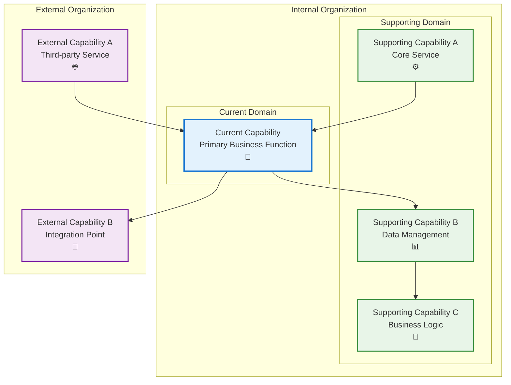

# Logging

## Metadata

- **Name**: Logging
- **Type**: Capability
- **System**: hello-world
- **Component**: application
- **ID**: CAP-997490
- **Owner**: Product Team
- **Status**: Ready for Design
- **Approval**: Approved
- **Priority**: High
- **Analysis Review**: Not Required

## Technical Overview
### Purpose
Provide a logging capability

## Enablers

| Enabler ID | Name | Description | Status | Approval | Priority |
|------------|------|-------------|--------|----------|----------|
| ENB-507753 | Event Logging |  | Ready for Design | Approved | High |

## Dependencies

### Internal Upstream Dependency

| Capability ID | Description |
|---------------|-------------|
| CAP-230875 | Web application lifecycle logging |
| CAP-176180 | Logs application events |

### Internal Downstream Impact

| Capability ID | Description |
|---------------|-------------|
| | |

### External Dependencies

**External Upstream Dependencies**: None identified.

**External Downstream Impact**: None identified.

## Technical Specifications (Template)

### Capability Dependency Flow Diagram
> **Note for AI**: When designing this section, show the direct relationships and dependencies between capabilities (NOT enablers). Focus on capability-to-capability interactions, business value flows, and how capabilities work together to deliver end-to-end business outcomes. Include:
> - **Current Capability**: The capability being defined and its role in the business value chain
> - **Internal Dependencies**: Dependencies on other capabilities within the same organizational boundary/domain
> - **External Dependencies**: Dependencies on capabilities across organizational boundaries.
> - **Business Flow**: How business value and data flows between capabilities
> - **Exclude**: Enabler-level details, technical implementation specifics, infrastructure components

