# Display Hello World

## Metadata

- **Name**: Display Hello World
- **Type**: Capability
- **System**: example
- **Component**: Hello World Application
- **ID**: CAP-993034
- **Owner**: Product Team
- **Status**: Ready for Design
- **Approval**: Approved
- **Priority**: Medium
- **Analysis Review**: Not Required

## Technical Overview
### Purpose
Display Hello World in a Web application

## Enablers

| Enabler ID | Name | Description | Status | Approval | Priority |
|------------|------|-------------|--------|----------|----------|
| ENB-424964 | Display Hello World |  | Ready for Design | Approved | High |
| ENB-128923 | Node Javascript Application |  | Ready for Design | Approved | High |

## Dependencies

### Internal Upstream Dependency

| Capability ID | Description |
|---------------|-------------|
| | |

### Internal Downstream Impact

| Capability ID | Description |
|---------------|-------------|
| | |

### External Dependencies

**External Upstream Dependencies**: None identified.

**External Downstream Impact**: None identified.

## Technical Specifications

### System Architecture
The Hello World capability is implemented as a standalone web application with the following architecture:

- **Frontend**: React-based web interface for displaying Hello World message
- **Backend**: Node.js Express server hosting the application on port 4443
- **Deployment**: Cross-platform support for Windows, Mac, and Linux
- **Launch**: Convenient launch scripts for easy startup

### Capability Dependency Flow Diagram
> **Note**: This Hello World application is a standalone capability with no external dependencies.

```mermaid
flowchart TD
    %% Current Capability
    CAP993034["CAP-993034<br/>Display Hello World<br/>🌐"]

    %% Browser Access
    USER([User Browser])

    %% Simple flow
    USER -->|Access Application| CAP993034
    CAP993034 -->|Display Message| USER

    %% Styling
    classDef current fill:#e3f2fd,stroke:#1976d2,stroke-width:3px
    classDef user fill:#f3e5f5,stroke:#7b1fa2,stroke-width:2px

    class CAP993034 current
    class USER user

    %% Note about standalone nature
    subgraph STANDALONE ["Standalone Application"]
        CAP993034
    end
```

# Development Plan

# Development Plan

# Development Plan

# Development Plan

# Development Plan

# Development Plan

# Development Plan

# Development Plan

# Development Plan

# Development Plan

# Development Plan

# Development Plan

# Development Plan

# Development Plan

# Development Plan

# Development Plan

## CRITICAL WORKFLOW RULES

### APPROVAL vs STATE - FUNDAMENTAL DIFFERENCE:
- **Approval Definition**: Authorization/permission to proceed when workflow reaches appropriate state
- **State**: Current position in the development workflow that MUST be followed sequentially
- **Pre-condition Verification**: Never change value of a condition to make the condition true. This is not a set.
- **KEY RULE**: NEVER skip states even if approved - approval only grants permission, not workflow bypass
- **ZERO TOLERANCE**: Never modify pre-condition values.

### STATE MACHINE COMPLIANCE:
- Always respect the current **State** field value
- Follow tasks order in strict sequential order
- Each task moves the enabler to the next appropriate state
- Approval status does NOT override state requirements

### FORBIDDEN SHORTCUTS:
- Do NOT jump out of task order
- Do NOT skip analysis, design, or review phases based on approval alone
- Do NOT assume any workflow steps are complete without verifying state progression

## Task 1: Approval Verification (MANDATORY)
**Purpose**: Ensure proper authorization before proceeding with any implementation tasks.

### Pre-Conditions Verification
| Condition | Required Value | Action if True | Action if False |
|-------|----------------|------------------|------------------|
| Capability Approval | "Approved" | Continue to next task | Stop all processing, Respond with "Capability not approved."  |

#### Critical Rules
- **ABSOLUTE PROHIBITION**: Never ask user to change Pre-Conditions values
- **IMMEDIATE TERMINATION**: Stop ALL processing if pre-conditions fail
- **NO EXCEPTIONS**: Pre-condition failures = MANDATORY STOP
- **WORKFLOW HALT**: Do not proceed past failed pre-condition verification
- **RESPONSE REQUIREMENT**: Must explicitly state "STOPPING due to failed pre-conditions" and explain which conditions failed

### Exit Criteria Checklist
-[ ] Both approval statuses verified
-[ ] Decision made (proceed/stop)
-[ ] Appropriate response provided

---

## Task 2: Analysis
**Purpose**: Analyze the current capability and determine what new enablers or modifications need to be made.

### Pre-Conditions Verification
| Condition | Required Value | Action if True | Action if False |
|-----------|----------------|----------------|-----------------|
| Task 1 Completion | Must be "Passed" | Continue to next condition check | STOP - explain why you are stopping |
| Capability Status | "Ready for Analysis" | Continue to Analysis Process Section | SKIP to Task 3: Design |

#### Critical Rules
- **ABSOLUTE PROHIBITION**: Never ask user to change Pre-Conditions values
- **IMMEDIATE TERMINATION**: Stop ALL processing if pre-conditions fail
- **NO EXCEPTIONS**: Pre-condition failures = MANDATORY STOP
- **WORKFLOW HALT**: Do not proceed past failed pre-condition verification
- **RESPONSE REQUIREMENT**: Must explicitly state "STOPPING due to failed pre-conditions" and explain which conditions failed

### Perform Analysis 
| Step | Action | Result |
|------|--------|--------|
| 1 | Verify pre-conditions | ALL must be met |
| 2 | Set Capability Status | "In Analysis" |
| 3 | Generate new Enablers, add Enablers to Capability List and Create the actual Enabler files, ensure you include the Technical Specifications section from the Enabler Template| Analyze the Capability and create new Enablers |
| 4 | Configure Enablers | Apply Enabler Configuration Rules below |

### Enabler Configuration Rules
| Enabler Analysis Review Setting | Enabler Approval | Enabler Status | Enabler Priority |
|------------------------|---------------------|-------------------|-------------------|
| "Required" | "Pending" | "In Draft" | "High" or "Medium" or "Low" |
| "Not Required" | "Approved" | "Ready for Analysis" | "High" or "Medium" or "Low" |

### Post-Condition Transition
| Step | Action |
|------|--------|
| 1 | Set Enabler Status "Ready for Design"

### Exit Criteria Checklist
- [ ] All new Enablers added to Capability
- [ ] All Enablers have appropriate Approval and Status set following the Enabler Configuration Rules

### Critical Rules
- Do NOT modify existing Enablers
- Create copies as new Enablers if improvements needed
- ONLY explicitly obtained user approval can change Approval to "Approved"

---

## Task 3: Design
**Purpose**: Create a design based only on approved and ready to implement Enablers by following the sections below.

### Pre-Conditions Verification (ABSOLUTELY MANDATORY)
| Condition | Required Value | Action if True | Action if False |
|-----------|----------------|---------|----------------------|
| Capability Approval | "Approved" | continue to next pre-condition check | IMMEDIATE STOP |
| Capability Status | "Ready for Design" | continue to next section | SKIP to Task 4: Develop the Enablers |

#### Critical Rules
- **ABSOLUTE PROHIBITION**: Never ask user to change Pre-Conditions values
- **IMMEDIATE TERMINATION**: Stop ALL processing if pre-conditions fail
- **NO EXCEPTIONS**: Pre-condition failures = MANDATORY STOP
- **WORKFLOW HALT**: Do not proceed past failed pre-condition verification
- **RESPONSE REQUIREMENT**: Must explicitly state "STOPPING due to failed pre-conditions" and explain which conditions failed

### Perform Design
| Step | Action | Requirement |
|------|--------|-------------|
| 1 | Verify pre-conditions | ALL must be met |
| 2 | Set Capability Status | "In Design" |
| 3 | Display the Enablers you are using in the design. Following the Enabler State Processing below and only for Enablers in Approval = "Approved"
| 4 | Do the design by updating the Technical Specification documenting and updating All applicable sections using only the Enabler outlined in the Enabler State Processing below and only Enabler in Approval = "Approved" |

### Enabler State Processing
| Enabler State | Action |
|------------------|--------|
| "In Draft" | Do NOT include in design |
| "Ready for Analysis" | Include in design |
| "Ready for Design" | Include in design |
| "Ready for Implementation" | Include in design |
| "Ready for Refactor" | Include in design |
| "Ready for Retirement" | Remove from design completely |

### Documentation Requirements
| Section | Content | If Not Applicable |
|---------|---------|-------------------|
| Technical Specifications | Main design | Required |
| Document any Dependency Flow Diagrams in the Capability Dependency Flow Diagrams Section | Flow diagrams | Mark "Not Applicable" if not applicable |

**CRITICAL**: When creating dependency diagrams, follow these rules for non-existent capabilities:
    - **Grey Theme Rule**: Any capability that does not actually exist in the specifications directory must be styled with grey theme
    - **Placeholder Naming**: Use generic placeholder names like "CAP-XXX01", "CAP-XXX02" for non-existent capabilities
    - **Grey Styling**: Apply grey fill and stroke colors (e.g., `fill:#f5f5f5,stroke:#999999`) to non-existent capabilities
    - **Clear Labeling**: Add "(Placeholder)" suffix to non-existent capability names
    - **Documentation Note**: Include a note in the diagram explaining that grey capabilities are placeholders for future implementation

### Post-Condition Transition
| Step | Action |
|------|--------|
| 1 | Set Capability Status "Ready for Implementation"

### Absolute Prohibitions (ZERO TOLERANCE)
- 🚫 Never bypass for any reason whatsoever
- 🚫 Never write implementation code during this task
- 🚫 Never used unapproved or not ready to implement requirements in design

**Example Grey Styling for Non-Existent Capabilities**:

```mermaid
flowchart TD
    CAP567693["CAP-567693<br/>Web Application<br/>🌐"]
    CAPXXX01["CAP-XXX01<br/>Auth Service (Placeholder)<br/>🔐"]
    CAPXXX02["CAP-XXX02<br/>Content Manager (Placeholder)<br/>📝"]

    classDef current fill:#e3f2fd,stroke:#1976d2,stroke-width:3px
    classDef placeholder fill:#f5f5f5,stroke:#999999,stroke-width:2px,stroke-dasharray: 5 5

    class CAP567693 current
    class CAPXXX01,CAPXXX02 placeholder
```

**Key Rule**: Only use actual capability IDs that exist in your specifications directory. All others must be clearly
marked as placeholders with grey styling.

---

## Task 4: Develop the Enablers (by Following the Enablers Development Plan)
**Purpose**: Develop the Enabler the by following the Enablers Development Plan very closely

### Pre-Conditions Verification (ABSOLUTELY MANDATORY)
| Condition | Required Value | Action if True | Action if False |
|-----------|----------------|---------|----------------------|
| Capability Approval | "Approved" | continue to next pre-condition check | IMMEDIATE STOP |
| Capability Status | "Ready for Implementation" | continue to next section | SKIP to Task 5: Refactor |

#### Critical Rules
- **ABSOLUTE PROHIBITION**: Never ask user to change Pre-Conditions values
- **IMMEDIATE TERMINATION**: Stop ALL processing if pre-conditions fail
- **NO EXCEPTIONS**: Pre-condition failures = MANDATORY STOP
- **WORKFLOW HALT**: Do not proceed past failed pre-condition verification
- **RESPONSE REQUIREMENT**: Must explicitly state "STOPPING due to failed pre-conditions" and explain which conditions failed

### Develop Enabler
|Step | Condition | Required Value | Action if True | Action if False |
|------|---------------------|----------------|---------|----------------------|
| 1 | Enabler Approval | "Approved" | Develop  Enabler following the Enabler's Development Plan | IMMEDIATE STOP |

### Post-Condition Transition
| Step | Action |
|------|--------|
| 1 | Set Enabler Status "Implemented"

### Exit Criteria Checklist
- [ ] Implementation completed for all approved requirements
- [ ] Requirement Status updated appropriately
- [ ] Unapproved requirements skipped
- [ ] Enabler State set to "Implemented"

