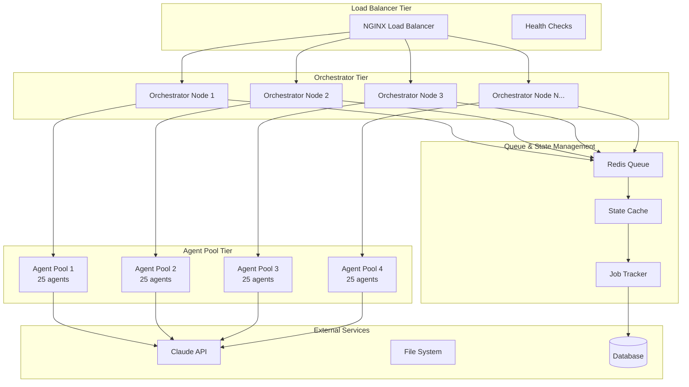

# Agent Scaling Analysis & Solutions
## 100 Concurrent Agents Challenge

### Current Architecture Analysis

**Existing Bottlenecks Identified:**
1. **Sequential Processing**: Current orchestrator processes jobs sequentially
2. **Low Concurrency Limit**: `maxConcurrency: 3` - severely limiting throughput
3. **No Load Balancing**: Single orchestrator instance handling all requests
4. **Memory Constraints**: All jobs stored in single Node.js process memory
5. **No Auto-scaling**: Fixed capacity regardless of demand

### Claude API & Compute Constraints

**Claude API Limitations (Based on Anthropic's current limits):**
- **Rate Limits**: ~50 requests/minute for most Claude models (varies by tier)
- **Token Limits**: ~200K tokens per request for Claude-3
- **Concurrent Requests**: Limited by rate limits, not explicit concurrency caps
- **Cost Considerations**: $15-60 per million tokens depending on model

**For 100 Concurrent Agents:**
- Need at least 2-4 requests/second sustained capacity
- Estimated cost: $500-2000/hour for high-volume operations
- Token optimization crucial for cost control

### Recommended Scaling Architecture

## 🏗️ **Multi-Tier Distributed Agent System**



## 📊 **Performance Targets**

| Metric | Current | Target (100 agents) |
|--------|---------|-------------------|
| Concurrent Jobs | 3 | 100 |
| Throughput | 0.1 jobs/sec | 5-10 jobs/sec |
| Response Time | 5-30 seconds | 2-15 seconds |
| Availability | 95% | 99.5% |
| Error Rate | 5% | <1% |

## 🚀 **Implementation Strategy**

### Phase 1: Core Infrastructure (Week 1-2)
1. **Agent Pool Manager**
   - Horizontal scaling of agent instances
   - Dynamic pool sizing based on demand
   - Health monitoring and auto-recovery

2. **Queue Management System**
   - Redis-based job queue with priority handling
   - Dead letter queues for failed jobs
   - Rate limiting and throttling

3. **Load Balancing**
   - Round-robin distribution
   - Intelligent routing based on agent specialization
   - Circuit breaker patterns

### Phase 2: Optimization (Week 3-4)
1. **Caching & State Management**
   - Redis-based state caching
   - Result memoization
   - Session persistence

2. **Resource Monitoring**
   - Real-time metrics collection
   - Auto-scaling triggers
   - Performance analytics

3. **Fault Tolerance**
   - Graceful degradation
   - Retry mechanisms with exponential backoff
   - Failover capabilities

### Phase 3: Advanced Features (Week 5-6)
1. **Cost Optimization**
   - Token usage optimization
   - Model selection based on task complexity
   - Batch processing for similar tasks

2. **Advanced Routing**
   - AI-powered workload distribution
   - Predictive scaling
   - Smart queuing algorithms

## 💰 **Cost Analysis & Optimization**

### Estimated Costs (per hour of 100 concurrent agents):
- **Claude API**: $200-800 (varies by usage pattern)
- **Infrastructure**: $50-100 (AWS/Azure compute)
- **Total**: $250-900/hour

### Cost Optimization Strategies:
1. **Model Selection**: Use Claude-3-Haiku for simple tasks (~10x cheaper)
2. **Token Optimization**: Compress prompts, cache results
3. **Batch Processing**: Group similar requests
4. **Intelligent Routing**: Route complex tasks to appropriate models
5. **Usage Analytics**: Monitor and optimize based on actual patterns

## 🔧 **Technical Implementation**

### Key Components to Build:
1. **Agent Pool Manager** (`./scaling/agent-pool-manager.js`)
2. **Queue Manager** (`./scaling/queue-manager.js`)
3. **Load Balancer** (`./scaling/load-balancer.js`)
4. **Resource Monitor** (`./scaling/resource-monitor.js`)
5. **Scaling Controller** (`./scaling/scaling-controller.js`)

### Configuration Parameters:
```json
{
  "scaling": {
    "maxAgents": 100,
    "minAgents": 10,
    "scaleUpThreshold": 80,
    "scaleDownThreshold": 20,
    "scaleUpStep": 10,
    "scaleDownStep": 5,
    "poolSize": 25,
    "queueSize": 1000,
    "retryAttempts": 3,
    "timeout": 30000
  }
}
```

## 📈 **Monitoring & Metrics**

### Key Metrics to Track:
- **Throughput**: Jobs processed per second
- **Latency**: P50, P95, P99 response times
- **Error Rates**: Failed jobs by category
- **Resource Usage**: CPU, memory, network
- **Cost Metrics**: Tokens used, API costs
- **Queue Metrics**: Depth, wait times

### Alerting:
- Queue depth > 500 jobs
- Error rate > 2%
- Response time P95 > 30 seconds
- Agent pool utilization > 90%

## 🛡️ **Risk Mitigation**

### Primary Risks:
1. **Claude API Rate Limits**: Implement intelligent throttling
2. **Cost Overruns**: Real-time cost monitoring with circuit breakers
3. **Single Points of Failure**: Full redundancy and failover
4. **Memory Leaks**: Comprehensive monitoring and auto-restart
5. **Network Partitions**: Resilient queue design

### Mitigation Strategies:
- Multi-region deployment
- Graceful degradation modes
- Emergency throttling mechanisms
- Real-time cost monitoring
- Comprehensive logging and alerting

## ✅ **Success Criteria**

### Technical Milestones:
- [ ] 100 concurrent agents operational
- [ ] <2% error rate sustained
- [ ] P95 response time <15 seconds
- [ ] 99.5% uptime achieved
- [ ] Cost per job <$2.00

### Business Value:
- 10x increase in processing capacity
- Reduced time-to-delivery for projects
- Improved developer productivity
- Scalable foundation for future growth

---

**Next Steps:**
1. Review and approve architecture
2. Begin Phase 1 implementation
3. Set up monitoring and metrics
4. Establish cost controls
5. Create testing framework

**Timeline:** 6 weeks to full 100-agent deployment
**Budget:** $50K-100K for infrastructure and development
**ROI:** Estimated 5x productivity improvement