# Mobile-Responsive Design

## Metadata
- **Name**: Mobile-Responsive Design
- **Type**: Enabler
- **ID**: ENB-567004
- **Capability ID**: CAP-567693 (MTV Music Video Streaming Application)
- **Status**: In Draft
- **Approval**: Pending
- **Priority**: High
- **Analysis Review**: Required
- **Code Review**: Not Required
- **Owner**: Product Team
- **Developer**: [Development Team/Lead]
- **Created Date**: 2025-09-21
- **Last Updated**: 2025-09-21
- **Version**: 1.0

## Technical Overview
### Purpose
Ensure the MTV music video streaming application works seamlessly on mobile devices with responsive design patterns, touch-optimized controls, and mobile-specific optimizations for an optimal viewing experience across all screen sizes.

## Functional Requirements

| ID | Name | Requirement | Priority | Status | Approval |
|----|------|-------------|----------|--------|----------|
| FR-567004-01 | Responsive Layout | Implement fluid responsive design that adapts to all screen sizes (mobile, tablet, desktop) | Must Have | In Draft | Pending |
| FR-567004-02 | Touch Controls | Implement touch-optimized controls for mobile video playback | Must Have | In Draft | Pending |
| FR-567004-03 | Mobile Navigation | Create mobile-friendly navigation with gesture support | Should Have | In Draft | Pending |
| FR-567004-04 | Orientation Support | Support both portrait and landscape orientations with optimized layouts | Should Have | In Draft | Pending |
| FR-567004-05 | Mobile Video Player | Optimize video player for mobile viewing with appropriate sizing and controls | Must Have | In Draft | Pending |
| FR-567004-06 | Offline Indicators | Show connection status and handle offline scenarios gracefully | Should Have | In Draft | Pending |

## Non-Functional Requirements

| ID | Name | Type | Requirement | Priority | Status | Approval |
|----|------|------|-------------|----------|--------|----------|
| NFR-567004-01 | Mobile Performance | Performance | Fast loading and smooth interactions on mobile devices (< 3s load time) | Must Have | In Draft | Pending |
| NFR-567004-02 | Touch Responsiveness | Usability | Touch interactions must respond within 100ms | Must Have | In Draft | Pending |
| NFR-567004-03 | Battery Optimization | Performance | Minimize battery drain during video playback | Should Have | In Draft | Pending |
| NFR-567004-04 | Network Efficiency | Performance | Optimize for limited mobile data with adaptive streaming | Should Have | In Draft | Pending |
| NFR-567004-05 | Accessibility | Usability | Support mobile accessibility features and screen readers | Should Have | In Draft | Pending |

# Technical Specifications

## API Technical Specifications

| API Type | Operation | Channel / Endpoint | Description | Request / Publish Payload | Response / Subscribe Data |
|----------|-----------|---------------------|-------------|----------------------------|----------------------------|
| **REST** | GET | `/api/v1/mobile/config` | Get mobile-specific configuration | N/A | Mobile settings and optimizations |
| REST | POST | `/api/v1/mobile/orientation` | Handle orientation changes | {orientation, dimensions} | Layout configuration |
| REST | GET | `/api/v1/mobile/network` | Check network status | N/A | Connection quality and type |
| REST | POST | `/api/v1/mobile/performance` | Report mobile performance metrics | {metrics: {}, deviceInfo: {}} | Performance acknowledgment |

## Technical Drawings

## Enabler Dependency Flow Diagram

```mermaid
flowchart TD
    %% Current Capability Enablers
    ENB567002["ENB-567002<br/>Auto-Playing Video Interface<br/>▶️"]
    ENB567004["ENB-567004<br/>Mobile-Responsive Design<br/>📱"]
    ENB567005["ENB-567005<br/>Local Network Hosting<br/>🌐"]

    %% Dependencies Flow
    ENB567002 --> ENB567004
    ENB567004 --> ENB567005

    %% Styling
    classDef current fill:#e3f2fd,stroke:#1976d2,stroke-width:2px
    classDef dependency fill:#e8f5e8,stroke:#388e3c,stroke-width:2px

    class ENB567004 current
    class ENB567002,ENB567005 dependency

    %% Capability Grouping
    subgraph CAP567693 ["MTV Music Video App"]
        ENB567002
        ENB567004
        ENB567005
    end
```

### Data Models

### Class Diagrams

### Sequence Diagrams

### Dataflow Diagrams

### State Diagrams

## Dependencies
### Internal Dependencies
- ENB-567002 (Auto-Playing Video Interface): Provides base video player for mobile optimization

### External Dependencies
- CSS Media Queries: For responsive breakpoints and device adaptation
- Touch Event APIs: For touch interaction handling
- Device Orientation APIs: For orientation change detection
- Network Information API: For connection quality monitoring

---

# Development Plan

## CRITICAL WORKFLOW RULES

### APPROVAL vs STATE - FUNDAMENTAL DIFFERENCE:
- **Approval Definition**: Authorization/permission to proceed when workflow reaches appropriate state
- **State**: Current position in the development workflow that MUST be followed sequentially
- **Pre-condition Verification**: Never change value of a condition to make the condition true. This is not a set.
- **KEY RULE**: NEVER skip states even if approved - approval only grants permission, not workflow bypass
- **ZERO TOLERANCE**: Never modify pre-condition values.

### STATE MACHINE COMPLIANCE:
- Always respect the current **State** field value
- Follow tasks order in strict sequential order
- Each task moves the enabler to the next appropriate state
- Approval status does NOT override state requirements

### FORBIDDEN SHORTCUTS:
- Do NOT jump out of task order
- Do NOT skip analysis, design, or review phases based on approval alone
- Do NOT assume any workflow steps are complete without verifying state progression

## Task 1: Approval Verification (MANDATORY)
**Purpose**: Ensure proper authorization before proceeding with any implementation tasks.

### Pre-Conditions Verification
| Condition | Required Value | Action if True | Action if False |
|-------|----------------|------------------|------------------|
| Parent Capability Approval | "Approved" | Continue to next condition check |1. Stop all processing 2. Respond with "Parent Capability is not approved. Both Parent Capability and Enabler status must be 'Approved' to proceed."  |
| Enabler Approval | "Approved" | Continue to next task | Stop all processing, Respond with "Enabler is not approved. Both Parent Capability and Enabler status must be 'Approved' to proceed." |

#### Critical Rules
- **ABSOLUTE PROHIBITION**: Never ask user to change Pre-Conditions values
- **IMMEDIATE TERMINATION**: Stop ALL processing if pre-conditions fail
- **NO EXCEPTIONS**: Pre-condition failures = MANDATORY STOP
- **WORKFLOW HALT**: Do not proceed past failed pre-condition verification
- **RESPONSE REQUIREMENT**: Must explicitly state "STOPPING due to failed pre-conditions" and explain which conditions failed

### Exit Criteria Checklist
-[ ] Both approval statuses verified
-[ ] Decision made (proceed/stop)
-[ ] Appropriate response provided

---

## Task 2: Analysis
**Purpose**: Analyze the current enabler and determine what new requirements or modifications need to be made.

### Pre-Conditions Verification
| Condition | Required Value | Action if True | Action if False |
|-----------|----------------|----------------|-----------------|
| Task 1 Completion | Must be "Passed" | Continue to next condition check | STOP - explain why you are stopping |
| Enabler Status | "Ready for Analysis" | Continue to Analysis Process Section | SKIP to Task 3: Design |

#### Critical Rules
- **ABSOLUTE PROHIBITION**: Never ask user to change Pre-Conditions values
- **IMMEDIATE TERMINATION**: Stop ALL processing if pre-conditions fail
- **NO EXCEPTIONS**: Pre-condition failures = MANDATORY STOP
- **WORKFLOW HALT**: Do not proceed past failed pre-condition verification
- **RESPONSE REQUIREMENT**: Must explicitly state "STOPPING due to failed pre-conditions" and explain which conditions failed

### Perform Analysis
| Step | Action | Result |
|------|--------|--------|
| 1 | Verify pre-conditions | ALL must be met |
| 2 | Set Enabler Status | "In Analysis" |
| 3 | Generate new requirements | Analyze the Enabler and create new requirements |
| 4 | Configure requirements | Apply Requirement Configuration rules below |

### Requirement Configuration Rules
| Enabler Analysis Review Setting | Requirement Approval | Requirement Status | Requirement Priority |
|------------------------|---------------------|-------------------|-------------------|
| "Required" | "Pending" | "Ready for Design" | "Must Have" or "Should Have" or "Could Have" or "Won't Have" |
| "Not Required" | "Approved" | "Ready for Design" | "Must Have" or "Should Have" or "Could Have" or "Won't Have" |

### Post-Condition Transition
| Step | Action |
|------|--------|
| 1 | Set Enabler Status "Ready for Design"

### Exit Criteria Checklist
- [ ] All new requirements added to Enabler
- [ ] All requirements have appropriate Approval and Status set following the Requirement Configuration Rules

### Critical Rules
- Do NOT modify existing requirements
- Create copies as new requirements if improvements needed
- ONLY explicitly obtained user approval can change Approval to "Approved"

---

## Task 3: Design
**Purpose**: Create a design based only on approved and ready to implement requirements by following the sections below.

### Pre-Conditions Verification (ABSOLUTELY MANDATORY)
| Condition | Required Value | Action if True | Action if False |
|-----------|----------------|---------|----------------------|
| Enabler Approval | "Approved" | continue to next pre-condition check | IMMEDIATE STOP |
| Enabler Status | "Ready for Design" | continue to next section | SKIP to Task 4: Implementation |

#### Critical Rules
- **ABSOLUTE PROHIBITION**: Never ask user to change Pre-Conditions values
- **IMMEDIATE TERMINATION**: Stop ALL processing if pre-conditions fail
- **NO EXCEPTIONS**: Pre-condition failures = MANDATORY STOP
- **WORKFLOW HALT**: Do not proceed past failed pre-condition verification
- **RESPONSE REQUIREMENT**: Must explicitly state "STOPPING due to failed pre-conditions" and explain which conditions failed

### Perform Design
| Step | Action | Requirement |
|------|--------|-------------|
| 1 | Verify pre-conditions | ALL must be met |
| 2 | Set Enabler Status | "In Design" |
| 3 | Display the requirements you are using in the design. Following the Requirements State Processing below and only Requirements in Approval = "Approved" | only Requirements in Approval = "Approved" |
| 4 | Do the design by updating the Technical Specification documenting and updating All applicable sections using only the Requirements outlined in the Requirements State Processing below and only Requirements in Approval = "Approved" | only Requirements in Approval = "Approved" |

### Requirements State Processing
| Requirement State | Action |
|------------------|--------|
| "In Draft" | Do NOT include in design |
| "Ready for Design" | Include in design |
| "Ready for Implementation" | Include in design |
| "Ready for Refactor" | Include in design |
| "Ready for Retirement" | Remove from design completely |

### Documentation Requirements
| Section | Content | If Not Applicable |
|---------|---------|-------------------|
| Technical Specifications | Main design | Required |
| Dependency Flow Diagrams | Flow diagrams | Mark "Not Applicable" if not applicable |
| API Technical Specifications | JSON structures, configs | Mark "Not Applicable" if not applicable |
| Data Models | Data structures | Mark "Not Applicable" if not applicable |
| Sequence Diagrams | Process flows | Mark "Not Applicable" if not applicable |
| Class Diagrams | Class structures | Mark "Not Applicable" if not applicable |
| Data Flow Diagrams | Data movement | Mark "Not Applicable" if not applicable |
| State Diagrams | State transitions | Mark "Not Applicable" if not applicable |

### Post-Condition Transition
| Step | Action |
|------|--------|
| 1 | Set Enabler Status "Ready for Implementation"
| 2 | Set Each Requirement in State  "Ready for Implementation"

### Absolute Prohibitions (ZERO TOLERANCE)
- 🚫 Never bypass for any reason whatsoever
- 🚫 Never write implementation code during this task
- 🚫 Never used unapproved or not ready to implement requirements in design

---

## Task 4: Implementation
**Purpose**: Execute requirement implementation only if approved.

### Pre-Conditions Verification (ABSOLUTELY MANDATORY)
| Condition | Required Value | Action if True | Action if False |
|-----------|----------------|---------|----------------------|
| Enabler Approval | "Approved" | continue to next pre-condition check | IMMEDIATE STOP |
| Enabler Status | "Ready for Implementation" | continue to next section | SKIP to Task 5: Refactor |

#### Critical Rules
- **ABSOLUTE PROHIBITION**: Never ask user to change Pre-Conditions values
- **IMMEDIATE TERMINATION**: Stop ALL processing if pre-conditions fail
- **NO EXCEPTIONS**: Pre-condition failures = MANDATORY STOP
- **WORKFLOW HALT**: Do not proceed past failed pre-condition verification
- **RESPONSE REQUIREMENT**: Must explicitly state "STOPPING due to failed pre-conditions" and explain which conditions failed

### Implement
| Step | Action | Requirement |
|------|--------|-------------|
| 1 | Implement each requirement following the requirement rules below | Requirement Appproval = "Approved" |

### Requirement Rules
| Requirement State | Action | Final Requirement Status |
|------------------|--------|--------------|
| Requirement Status = "Ready for Implementation" | Implement the new requirement | "Implemented" |

### Post-Condition Transition Checklist
| Step | Action |
|------|--------|
| 1 | Set Enabler Status "Implemented" |
| 2 | Update ALL Functional Requirements Status to "Implemented" |
| 3 | Update ALL Non-Functional Requirements Status to "Implemented" |
| 4 | Verify all requirements are marked "Implemented" |

### Exit Criteria Checklist
- [ ] Implementation completed for all approved requirements
  - [ ] ALL Functional Requirements Status = "Implemented"
  - [ ] ALL Non-Functional Requirements Status = "Implemented"
  - [ ] Enabler Status = "Implemented"

**CRITICAL REMINDER**: After implementing code, you MUST update the status of ALL requirements that were implemented. This is not optional - it's a mandatory part of the implementation task.

---

## Task 5: Refactor
**Purpose**: Refactor the design and code based on specification and requirement changes.

### Pre-Conditions Verification (ABSOLUTELY MANDATORY)
| Condition | Required Value | Action if True | Action if False |
|-----------|----------------|---------|----------------------|
| Enabler Approval | "Approved" | continue to next pre-condition check | IMMEDIATE STOP |
| Enabler Status | "Ready for Refactor" | continue to next section | SKIP to Task 6: Retire |

#### Critical Rules
- **ABSOLUTE PROHIBITION**: Never ask user to change Pre-Conditions values
- **IMMEDIATE TERMINATION**: Stop ALL processing if pre-conditions fail
- **NO EXCEPTIONS**: Pre-condition failures = MANDATORY STOP
- **WORKFLOW HALT**: Do not proceed past failed pre-condition verification
- **RESPONSE REQUIREMENT**: Must explicitly state "STOPPING due to failed pre-conditions" and explain which conditions failed

### Refactor Process
| Step | Action | Target State |
|------|--------|-------------|
| 1 | Verify pre-conditions | All must pass |
| 2 | Set Enabler State | "In Refactor" |
| 3 | Update **technical specifications** and code for all Requirements in Approval = "Approved" and State = "Ready for Refactor" | Requirement State = "Implemented" |
| 4 | Update **code** for all Requirements in Approval = "Approved" and State = "Ready for Refactor" | Requirement State = "Implemented" |
| 5 | Remove **technical specifications** for all Requirements in Approval = "Approved" and in State = "Ready for Retirement" |
| 6 | Remove **technical specifications** and code for all Requirements in Approval = "Approved" and in State = "Ready for Retirement" |
| 7 | Set Requirement State | "Retired" |

#### Critical Rules
- **DO NOT REMOVE REQUIREMENT FROM ENABLER**: Do not remove the requirement from the Enabler requirements list.

### Post-Condition Transition
| Step | Action |
|------|--------|
| 1 | Set Enabler Status "Implemented"

---

## Task 6: Retire
**Purpose**: Completely remove enabler from codebase.

### Pre-Conditions Verification (ABSOLUTELY MANDATORY)
| Condition | Required Value | Action if True | Action if False |
|-----------|----------------|---------|----------------------|
| Enabler Approval | "Approved" | continue to next pre-condition check | IMMEDIATE STOP |
| Enabler Status | "Ready for Retirement" | continue to next section | IMMEDIATE STOP |

#### Critical Rules
- **DO NOT REMOVE REQUIREMENT FROM ENABLER**: Do not remove the **Enabler** from the **Capability** Enablers list.
- **ABSOLUTE PROHIBITION**: Never ask user to change Pre-Conditions values
- **IMMEDIATE TERMINATION**: Stop ALL processing if pre-conditions fail
- **NO EXCEPTIONS**: Pre-condition failures = MANDATORY STOP
- **WORKFLOW HALT**: Do not proceed past failed pre-condition verification
- **RESPONSE REQUIREMENT**: Must explicitly state "STOPPING due to failed pre-conditions" and explain which conditions failed

### Retirement Process
| Step | Action | Result |
|------|--------|--------|
| 1 | Verify pre-conditions | All must pass |
| 2 | Set Enabler State | "In Retirement" |
| 3 | Remove Enabler from parent specifications | Clean parent capability |
| 4 | Remove all enabler code | Complete removal |
| 5 | Mark requirements | All set to "Retired" |

### Post-Condition Transition
| Step | Action |
|------|--------|
| 1 | Set Enabler Status "Retired"

### Exit Criteria Checklist
- [ ] All code removed from codebase
- [ ] Parent capability updated
- [ ] All requirements marked "Retired"
- [ ] Enabler State set to "Retired"

---

## Universal Rules

### Critical Prohibitions (Apply to All Tasks)
| Rule | Description | Consequence |
|------|-------------|-------------|
| Never modify pre-conditions | Pre-condition values must already be correct | IMMEDIATE TASK FAILURE |
| Zero tolerance for unapproved requirements | Never implement/design without approval | IMMEDIATE STOP |
| No bypassing for any reason | Never bypass for "testing", "demo", etc. | PERMANENT PROHIBITION |

### Response Format Requirements
| Task | Must Include |
|------|-------------|
| All | Pre-condition verification status |
| All | Clear proceed/stop decision |
| All | Explanation if stopping |
| Analysis | List of new requirements created |
| Design | List of design elements documented |
| Implementation | List of implemented requirements |

## Notes
This enabler ensures the MTV app provides an excellent mobile viewing experience with responsive design, touch optimizations, and mobile-specific performance enhancements. Special focus on battery optimization and data efficiency for mobile users.