# Auto-Playing Video Interface

## Metadata
- **Name**: Auto-Playing Video Interface
- **Type**: Enabler
- **ID**: ENB-567002
- **Capability ID**: CAP-567693 (Parent Capability)
- **Status**: Ready for Implementation
- **Approval**: Approved
- **Priority**: High
- **Analysis Review**: Not Required
- **Code Review**: Not Required
- **Owner**: Product Team
- **Developer**: AI Development Team
- **Created Date**: 2025-09-20
- **Last Updated**: 2025-09-20
- **Version**: 1.0

## Technical Overview
### Purpose
Create a continuous auto-playing video interface that seamlessly transitions between music videos to recreate the classic MTV television experience in a web application.

## Functional Requirements

| ID | Name | Requirement | Priority | Status | Approval |
|----|------|-------------|----------|--------|----------|
| FR-001 | Continuous Video Playback | Videos should automatically transition to the next video without user interaction | Must Have | Ready for Implementation | Approved |
| FR-002 | Full-Screen Video Player | Display videos in a prominent, television-like interface | Must Have | Ready for Implementation | Approved |
| FR-003 | Video Controls Overlay | Provide minimal controls (play/pause, volume, skip) that auto-hide | Should Have | Ready for Implementation | Approved |
| FR-004 | Now Playing Information | Display current video title, artist, and progress | Must Have | Ready for Implementation | Approved |
| FR-005 | Next Video Preview | Show upcoming video information during transitions | Could Have | Ready for Implementation | Approved |

## Non-Functional Requirements

| ID | Name | Type | Requirement | Priority | Status | Approval |
|----|------|------|-------------|----------|--------|----------|
| NFR-001 | Seamless Transitions | Performance | Video transitions should be smooth with minimal buffering | Must Have | Ready for Implementation | Approved |
| NFR-002 | Mobile Responsiveness | Usability | Interface should work perfectly on mobile devices | Must Have | Ready for Implementation | Approved |
| NFR-003 | Loading Performance | Performance | Videos should preload to minimize buffering delays | Should Have | Ready for Implementation | Approved |
| NFR-004 | Accessibility | Usability | Support keyboard navigation and screen readers | Should Have | Ready for Implementation | Approved |

# Technical Specifications

## API Technical Specifications

| API Type | Operation | Channel / Endpoint | Description | Request / Publish Payload | Response / Subscribe Data |
|----------|-----------|---------------------|-------------|----------------------------|----------------------------|
| **REST** | GET | `/api/v1/player/current` | Get current playing video | N/A | Current video data |
| REST | POST | `/api/v1/player/play` | Start/resume playback | `{videoId: string}` | Playback status |
| REST | POST | `/api/v1/player/pause` | Pause playback | N/A | Playback status |
| REST | POST | `/api/v1/player/skip` | Skip to next video | N/A | Next video data |
| **WebSocket** | SUBSCRIBE | `/ws/player/events` | Real-time player events | N/A | Player state changes |

## Enabler Dependency Flow Diagram

```mermaid
flowchart TD
    %% Current Enabler
    ENB567002["ENB-567002<br/>Auto-Playing Interface"]

    %% Dependencies
    ENB567001["ENB-567001<br/>Video Content API"]
    ENB567003["ENB-567003<br/>Music Curation"]
    ENB567004["ENB-567004<br/>Mobile Responsive Design"]

    %% External Services
    YOUTUBE_PLAYER["YouTube Player API<br/>📺"]

    %% Internal Components
    UI_FRAMEWORK["React Framework<br/>⚛️"]
    STATE_MANAGEMENT["State Management<br/>🔄"]

    %% Dependencies Flow
    ENB567001 --> ENB567002
    ENB567003 --> ENB567002
    YOUTUBE_PLAYER --> ENB567002
    ENB567002 --> ENB567004
    UI_FRAMEWORK --> ENB567002
    STATE_MANAGEMENT --> ENB567002

    %% Styling
    classDef current fill:#e3f2fd,stroke:#1976d2,stroke-width:2px
    classDef internal fill:#e8f5e8,stroke:#388e3c,stroke-width:2px
    classDef external fill:#f3e5f5,stroke:#7b1fa2,stroke-width:2px
    classDef framework fill:#fff3e0,stroke:#f57c00,stroke-width:2px

    class ENB567002 current
    class ENB567001,ENB567003,ENB567004 internal
    class YOUTUBE_PLAYER external
    class UI_FRAMEWORK,STATE_MANAGEMENT framework
```

### Data Models

### Class Diagrams

### Sequence Diagrams

### State Diagrams

## Dependencies
### Internal Dependencies
- Video Content API Integration: Provides video playlist and metadata
- Music Curation Service: Determines video order and recommendations

### External Dependencies
- YouTube Player API: Handles video embedding and playback
- React Framework: UI component rendering and state management

---

# Development Plan

## CRITICAL WORKFLOW RULES

### APPROVAL vs STATE - FUNDAMENTAL DIFFERENCE:
- **Approval Definition**: Authorization/permission to proceed when workflow reaches appropriate state
- **State**: Current position in the development workflow that MUST be followed sequentially
- **Pre-condition Verification**: Never change value of a condition to make the condition true. This is not a set.
- **KEY RULE**: NEVER skip states even if approved - approval only grants permission, not workflow bypass
- **ZERO TOLERANCE**: Never modify pre-condition values.

### STATE MACHINE COMPLIANCE:
- Always respect the current **State** field value
- Follow tasks order in strict sequential order
- Each task moves the enabler to the next appropriate state
- Approval status does NOT override state requirements

### FORBIDDEN SHORTCUTS:
- Do NOT jump out of task order
- Do NOT skip analysis, design, or review phases based on approval alone
- Do NOT assume any workflow steps are complete without verifying state progression

## Task 1: Approval Verification (MANDATORY)
**Purpose**: Ensure proper authorization before proceeding with any implementation tasks.

### Pre-Conditions Verification
| Condition | Required Value | Action if True | Action if False |
|-------|----------------|------------------|------------------|
| Parent Capability Approval | "Approved" | Continue to next condition check | 1. Stop all processing 2. Respond with "Parent Capability is not approved. Both Parent Capability and Enabler status must be 'Approved' to proceed." |
| Enabler Approval | "Approved" | Continue to next task | Stop all processing, Respond with "Enabler is not approved. Both Parent Capability and Enabler status must be 'Approved' to proceed." |

#### Critical Rules
- **ABSOLUTE PROHIBITION**: Never ask user to change Pre-Conditions values
- **IMMEDIATE TERMINATION**: Stop ALL processing if pre-conditions fail
- **NO EXCEPTIONS**: Pre-condition failures = MANDATORY STOP
- **WORKFLOW HALT**: Do not proceed past failed pre-condition verification
- **RESPONSE REQUIREMENT**: Must explicitly state "STOPPING due to failed pre-conditions" and explain which conditions failed

### Exit Criteria Checklist
-[x] Both approval statuses verified (Parent Capability: Approved, Enabler: Approved)
-[x] Decision made (proceed)
-[x] Appropriate response provided

## Notes
This enabler creates the core user interface for the MTV-style continuous video playback experience. All requirements are pre-approved and ready for implementation once the capability workflow progresses to the appropriate state.