# Curve Shape Preservation Algorithms

## Metadata
- **Name**: Curve Shape Preservation Algorithms
- **Type**: Enabler
- **ID**: ENB-004
- **Capability ID**: CAP-002 (Resource Curve Engine)
- **Status**: Ready for Implementation
- **Approval**: Approved
- **Priority**: Critical
- **Analysis Review**: Required
- **Code Review**: Not Required
- **Owner**: Engineering Team
- **Developer**: VBA Algorithm Team
- **Created Date**: 2025-09-19
- **Last Updated**: 2025-09-19
- **Version**: 1.0

## Technical Overview
### Purpose
Provides mathematical algorithms to maintain curve patterns, peaks, and valleys during time compression and expansion operations. This enabler enables the system to stretch a 48-month resource curve to fit a 35-month program timeline while preserving the original curve's shape characteristics and relative timing of resource allocation peaks.

## Functional Requirements

| ID | Name | Requirement | Priority | Status | Approval |
|----|------|-------------|----------|--------|----------|
| FR-001 | Peak Detection Algorithm | Identify peaks and valleys in original resource curves | Must Have | Ready for Implementation | Approved |
| FR-002 | Inflection Point Analysis | Detect curve inflection points and trend changes | Must Have | Ready for Implementation | Approved |
| FR-003 | Stretch Factor Calculation | Calculate optimal stretch/compression ratios | Must Have | Ready for Implementation | Approved |
| FR-004 | Proportional Time Mapping | Map original timeline to target timeline maintaining ratios | Must Have | Ready for Implementation | Approved |
| FR-005 | Value Interpolation | Calculate intermediate values preserving curve shape | Must Have | Ready for Implementation | Approved |
| FR-006 | Shape Validation | Verify stretched curve maintains logical patterns | Should Have | Ready for Implementation | Approved |
| FR-007 | Curve Smoothing | Apply smoothing algorithms to prevent artifacts | Should Have | Ready for Implementation | Approved |

## Non-Functional Requirements

| ID | Name | Type | Requirement | Priority | Status | Approval |
|----|------|------|-------------|----------|--------|----------|
| NFR-001 | Shape Fidelity | Performance | Maintain 95% shape fidelity during stretching | Must Have | Ready for Implementation | Approved |
| NFR-002 | Processing Speed | Performance | Process curve stretching in under 2 seconds per curve | Must Have | Ready for Implementation | Approved |
| NFR-003 | Curve Resolution | Technical Constraint | Support curves with up to 100 data points | Must Have | Ready for Implementation | Approved |
| NFR-004 | Numerical Precision | Technical Constraint | Maintain 4 decimal place precision in calculations | Should Have | Ready for Implementation | Approved |
| NFR-005 | Memory Efficiency | Performance | Limit memory usage to 10MB per curve operation | Should Have | Ready for Implementation | Approved |

# Technical Specifications

## Enabler Dependency Flow Diagram

```mermaid
flowchart TD
    %% Current Enabler
    ENB004["ENB-004<br/>Curve Shape Preservation<br/>📈"]

    %% Supporting Enablers (Same Capability)
    ENB005["ENB-005<br/>Timeline Compression/Expansion<br/>⏱️"]
    ENB006["ENB-006<br/>Domain-Specific Curves<br/>🏗️"]

    %% Foundation Enablers
    ENB001["ENB-001<br/>One-Time Setup System<br/>🚀"]
    ENB003["ENB-003<br/>Data Validation<br/>🛡️"]

    %% External Dependencies
    EXCEL["Microsoft Excel<br/>Mathematical Functions<br/>📊"]
    CURVES["Domain Resource<br/>Curve Data<br/>📈"]

    %% Dependent Enablers
    ENB007["ENB-007<br/>Job 1 Timeline Calculation<br/>📅"]
    ENB020["ENB-020<br/>Efficiency Curve Application<br/>⚡"]

    %% Dependencies Flow
    EXCEL --> ENB004
    CURVES --> ENB004
    ENB001 --> ENB004
    ENB003 --> ENB004

    ENB004 --> ENB005
    ENB004 --> ENB006
    ENB004 --> ENB007
    ENB004 --> ENB020

    %% Styling
    classDef current fill:#e3f2fd,stroke:#1976d2,stroke-width:3px
    classDef supporting fill:#e8f5e8,stroke:#388e3c,stroke-width:2px
    classDef foundation fill:#fff3e0,stroke:#f57c00,stroke-width:2px
    classDef external fill:#f3e5f5,stroke:#7b1fa2,stroke-width:2px
    classDef dependent fill:#fce4ec,stroke:#c2185b,stroke-width:2px

    class ENB004 current
    class ENB005,ENB006 supporting
    class ENB001,ENB003 foundation
    class EXCEL,CURVES external
    class ENB007,ENB020 dependent

    %% Capability Grouping
    subgraph CAP002 ["CAP-002: Resource Curve Engine"]
        ENB004
        ENB005
        ENB006
    end

    subgraph FOUNDATION ["Foundation Systems"]
        ENB001
        ENB003
    end

    subgraph EXTERNAL ["External Dependencies"]
        EXCEL
        CURVES
    end

    subgraph DEPENDENT ["Dependent Systems"]
        ENB007
        ENB020
    end
```


## Curve Stretching Algorithm Design

### Phase 1: Curve Analysis
```vba
Function AnalyzeCurveCharacteristics(curveData As Variant) As CurveAnalysis
    ' 1. Identify peaks and valleys
    ' 2. Detect inflection points
    ' 3. Calculate trend segments
    ' 4. Determine critical points
End Function
```

### Phase 2: Key Point Identification
```vba
Type KeyPoint
    TimePosition As Double     ' Original time position (0-1 normalized)
    Value As Double           ' Resource value at this point
    PointType As String       ' "Peak", "Valley", "Inflection", "Start", "End"
    Importance As Double      ' Weighting factor (0-1)
End Type
```

### Phase 3: Proportional Mapping
```vba
Function CalculateStretchMapping(originalDuration As Integer, targetDuration As Integer) As StretchMap
    Dim stretchFactor As Double
    stretchFactor = targetDuration / originalDuration

    ' Preserve relative timing of key points
    ' Apply stretch factor while maintaining proportions
End Function
```

### Phase 4: Value Interpolation
```vba
Function InterpolateValues(keyPoints As Collection, targetTimeline As Variant) As Variant
    ' Use spline interpolation to preserve curve smoothness
    ' Apply cubic spline between key points
    ' Ensure monotonic behavior where appropriate
End Function
```

## Mathematical Algorithms

### Peak Detection Algorithm
1. **First Derivative Analysis**: Calculate rate of change between adjacent points
2. **Zero Crossing Detection**: Identify where derivative changes sign
3. **Peak Classification**: Distinguish between significant peaks and noise
4. **Valley Identification**: Locate minimum points between peaks

### Curve Stretching Mathematics
```
Stretch Factor (SF) = Target Duration / Original Duration

For each original time point (t_orig):
t_new = t_orig × SF

For intermediate points, use cubic spline interpolation:
y(t) = a₀ + a₁(t-t₀) + a₂(t-t₀)² + a₃(t-t₀)³

Where coefficients preserve curve continuity and smoothness
```

### Shape Preservation Metrics
- **Peak Timing Accuracy**: ±2% of original relative timing
- **Peak Value Accuracy**: ±1% of original peak values
- **Area Under Curve**: Maintain total resource allocation ±3%
- **Monotonic Segments**: Preserve increasing/decreasing trends

## Data Structures

### Curve Data Model
```vba
Type ResourceCurve
    Domain As String              ' Work domain name
    OriginalDuration As Integer   ' Original curve duration (months)
    DataPoints() As Double        ' Resource values array
    TimePoints() As Double        ' Time positions array
    KeyPoints As Collection       ' Critical points collection
    Metadata As Dictionary        ' Curve properties
End Type
```

### Stretch Configuration
```vba
Type StretchConfig
    TargetDuration As Integer     ' Desired curve duration
    PreservePeaks As Boolean      ' Maintain peak timing
    PreserveArea As Boolean       ' Maintain total allocation
    SmoothingFactor As Double     ' Post-processing smoothing
    ValidationLevel As String     ' "Basic", "Standard", "Strict"
End Type
```

## Algorithm Implementation Steps

### Step 1: Input Validation
- Verify curve data integrity
- Check duration parameters
- Validate data point count
- Ensure monotonic time sequence

### Step 2: Curve Preprocessing
- Normalize time scale (0-1)
- Identify outliers and anomalies
- Apply initial smoothing if needed
- Calculate basic curve statistics

### Step 3: Key Point Extraction
- Detect peaks using derivative analysis
- Identify valleys and inflection points
- Calculate point importance weights
- Store critical timing relationships

### Step 4: Stretch Calculation
- Calculate overall stretch factor
- Map key points to new timeline
- Preserve relative positioning
- Maintain peak-to-peak ratios

### Step 5: Value Interpolation
- Apply cubic spline interpolation
- Ensure curve smoothness
- Preserve monotonic segments
- Calculate intermediate values

### Step 6: Validation and Adjustment
- Check shape fidelity metrics
- Validate resource allocation totals
- Apply smoothing if needed
- Generate quality assessment

## Quality Metrics

### Shape Fidelity Measurements
1. **Peak Correlation**: Compare peak timing and values (Target: >95%)
2. **Area Preservation**: Total resource allocation deviation (Target: <3%)
3. **Trend Preservation**: Maintain increasing/decreasing segments (Target: 100%)
4. **Smoothness Index**: Measure curve continuity (Target: >90%)

### Performance Benchmarks
- **Processing Time**: <2 seconds per curve
- **Memory Usage**: <10MB per operation
- **Numerical Precision**: 4 decimal places
- **Curve Resolution**: Up to 100 data points

## Error Handling

### Input Validation Errors
- **Invalid Duration**: Duration must be positive integer
- **Insufficient Data**: Minimum 5 data points required
- **Non-monotonic Time**: Time points must be sequential
- **Invalid Values**: Resource values must be non-negative

### Algorithm Errors
- **Numerical Instability**: Switch to linear interpolation
- **Peak Detection Failure**: Use simplified peak finding
- **Memory Overflow**: Reduce curve resolution
- **Convergence Issues**: Apply alternative smoothing

### Quality Validation Errors
- **Shape Fidelity Low**: Increase interpolation resolution
- **Area Deviation High**: Apply normalization correction
- **Peak Timing Error**: Adjust key point mapping
- **Smoothness Issues**: Apply post-processing filters

# Development Plan

## CRITICAL WORKFLOW RULES

### APPROVAL vs STATE - FUNDAMENTAL DIFFERENCE:
- **Approval Definition**: Authorization/permission to proceed when workflow reaches appropriate state
- **State**: Current position in the development workflow that MUST be followed sequentially
- **Pre-condition Verification**: Never change value of a condition to make the condition true. This is not a set.
- **KEY RULE**: NEVER skip states even if approved - approval only grants permission, not workflow bypass
- **ZERO TOLERANCE**: Never modify pre-condition values.

### STATE MACHINE COMPLIANCE:
- Always respect the current **State** field value
- Follow tasks order in strict sequential order
- Each task moves the enabler to the next appropriate state
- Approval status does NOT override state requirements

### FORBIDDEN SHORTCUTS:
- Do NOT jump out of task order
- Do NOT skip analysis, design, or review phases based on approval alone
- Do NOT assume any workflow steps are complete without verifying state progression

## Task 1: Approval Verification (MANDATORY)
**Purpose**: Ensure proper authorization before proceeding with any implementation tasks.

### Pre-Conditions Verification
| Condition | Required Value | Action if True | Action if False |
|-------|----------------|------------------|------------------|
| Parent Capability Approval | "Approved" | Continue to next condition check |1. Stop all processing 2. Respond with "Parent Capability is not approved. Both Parent Capability and Enabler status must be 'Approved' to proceed."  |
| Enabler Approval | "Approved" | Continue to next task | Stop all processing, Respond with "Enabler is not approved. Both Parent Capability and Enabler status must be 'Approved' to proceed." |

#### Critical Rules
- **ABSOLUTE PROHIBITION**: Never ask user to change Pre-Conditions values
- **IMMEDIATE TERMINATION**: Stop ALL processing if pre-conditions fail
- **NO EXCEPTIONS**: Pre-condition failures = MANDATORY STOP
- **WORKFLOW HALT**: Do not proceed past failed pre-condition verification
- **RESPONSE REQUIREMENT**: Must explicitly state "STOPPING due to failed pre-conditions" and explain which conditions failed

### Exit Criteria Checklist
-[ ] Both approval statuses verified
-[ ] Decision made (proceed/stop)
-[ ] Appropriate response provided

---

## Task 2: Analysis
**Purpose**: Analyze the current enabler and determine what new requirements or modifications need to be made.

### Pre-Conditions Verification
| Condition | Required Value | Action if True | Action if False |
|-----------|----------------|----------------|-----------------|
| Task 1 Completion | Must be "Passed" | Continue to next condition check | STOP - explain why you are stopping |
| Enabler Status | "Ready for Analysis" | Continue to Analysis Process Section | SKIP to Task 3: Design |

#### Critical Rules
- **ABSOLUTE PROHIBITION**: Never ask user to change Pre-Conditions values
- **IMMEDIATE TERMINATION**: Stop ALL processing if pre-conditions fail
- **NO EXCEPTIONS**: Pre-condition failures = MANDATORY STOP
- **WORKFLOW HALT**: Do not proceed past failed pre-condition verification
- **RESPONSE REQUIREMENT**: Must explicitly state "STOPPING due to failed pre-conditions" and explain which conditions failed

### Perform Analysis
| Step | Action | Result |
|------|--------|--------|
| 1 | Verify pre-conditions | ALL must be met |
| 2 | Set Enabler Status | "In Analysis" |
| 3 | Generate new requirements | Analyze the Enabler and create new requirements |
| 4 | Configure requirements | Apply Requirement Configuration rules below |

### Requirement Configuration Rules
| Enabler Analysis Review Setting | Requirement Approval | Requirement Status | Requirement Priority |
|------------------------|---------------------|-------------------|-------------------|
| "Required" | "Pending" | "Ready for Design" | "Must Have" or "Should Have" or "Could Have" or "Won't Have" |
| "Not Required" | "Approved" | "Ready for Design" | "Must Have" or "Should Have" or "Could Have" or "Won't Have" |

### Post-Condition Transition
| Step | Action |
|------|--------|
| 1 | Set Enabler Status "Ready for Design"

### Exit Criteria Checklist
- [ ] All new requirements added to Enabler
- [ ] All requirements have appropriate Approval and Status set following the Requirement Configuration Rules

### Critical Rules
- Do NOT modify existing requirements
- Create copies as new requirements if improvements needed
- ONLY explicitly obtained user approval can change Approval to "Approved"

---

## Task 3: Design
**Purpose**: Create a design based only on approved and ready to implement requirements by following the sections below.

### Pre-Conditions Verification (ABSOLUTELY MANDATORY)
| Condition | Required Value | Action if True | Action if False |
|-----------|----------------|---------|----------------------|
| Enabler Approval | "Approved" | continue to next pre-condition check | IMMEDIATE STOP |
| Enabler Status | "Ready for Design" | continue to next section | SKIP to Task 4: Implementation |

#### Critical Rules
- **ABSOLUTE PROHIBITION**: Never ask user to change Pre-Conditions values
- **IMMEDIATE TERMINATION**: Stop ALL processing if pre-conditions fail
- **NO EXCEPTIONS**: Pre-condition failures = MANDATORY STOP
- **WORKFLOW HALT**: Do not proceed past failed pre-condition verification
- **RESPONSE REQUIREMENT**: Must explicitly state "STOPPING due to failed pre-conditions" and explain which conditions failed

### Perform Design
| Step | Action | Requirement |
|------|--------|-------------|
| 1 | Verify pre-conditions | ALL must be met |
| 2 | Set Enabler Status | "In Design" |
| 3 | Display the requirements you are using in the design. Following the Requirements State Processing below and only Requirements in Approval = "Approved" | only Requirements in Approval = "Approved" |
| 4 | Do the design by updating the Technical Specification documenting and updating All applicable sections using only the Requirements outlined in the Requirements State Processing below and only Requirements in Approval = "Approved" | only Requirements in Approval = "Approved" |

### Requirements State Processing
| Requirement State | Action |
|------------------|--------|
| "In Draft" | Do NOT include in design |
| "Ready for Design" | Include in design |
| "Ready for Implementation" | Include in design |
| "Ready for Refactor" | Include in design |
| "Ready for Retirement" | Remove from design completely |

### Documentation Requirements
| Section | Content | If Not Applicable |
|---------|---------|-------------------|
| Technical Specifications | Main design | Required |
| Dependency Flow Diagrams | Flow diagrams | Mark "Not Applicable" if not applicable |
| API Technical Specifications | JSON structures, configs | Mark "Not Applicable" if not applicable |
| Data Models | Data structures | Mark "Not Applicable" if not applicable |
| Sequence Diagrams | Process flows | Mark "Not Applicable" if not applicable |
| Class Diagrams | Class structures | Mark "Not Applicable" if not applicable |
| Data Flow Diagrams | Data movement | Mark "Not Applicable" if not applicable |
| State Diagrams | State transitions | Mark "Not Applicable" if not applicable |

### Post-Condition Transition
| Step | Action |
|------|--------|
| 1 | Set Enabler Status "Ready for Implementation"
| 2 | Set Each Requirement in State  "Ready for Implementation"

### Absolute Prohibitions (ZERO TOLERANCE)
- 🚫 Never bypass for any reason whatsoever
- 🚫 Never write implementation code during this task
- 🚫 Never used unapproved or not ready to implement requirements in design

---

## Task 4: Implementation
**Purpose**: Execute requirement implementation only if approved.

### Pre-Conditions Verification (ABSOLUTELY MANDATORY)
| Condition | Required Value | Action if True | Action if False |
|-----------|----------------|---------|----------------------|
| Enabler Approval | "Approved" | continue to next pre-condition check | IMMEDIATE STOP |
| Enabler Status | "Ready for Implementation" | continue to next section | SKIP to Task 5: Refactor |

#### Critical Rules
- **ABSOLUTE PROHIBITION**: Never ask user to change Pre-Conditions values
- **IMMEDIATE TERMINATION**: Stop ALL processing if pre-conditions fail
- **NO EXCEPTIONS**: Pre-condition failures = MANDATORY STOP
- **WORKFLOW HALT**: Do not proceed past failed pre-condition verification
- **RESPONSE REQUIREMENT**: Must explicitly state "STOPPING due to failed pre-conditions" and explain which conditions failed

### Implement
| Step | Action | Requirement |
|------|--------|-------------|
| 1 | Implement each requirement following the requirement rules below | Requirement Appproval = "Approved" |

### Requirement Rules
| Requirement State | Action | Final Requirement Status |
|------------------|--------|--------------|
| Requirement Status = "Ready for Implementation" | Implement the new requirement | "Implemented" |

### Post-Condition Transition Checklist
| Step | Action |
|------|--------|
| 1 | Set Enabler Status "Implemented" |
| 2 | Update ALL Functional Requirements Status to "Implemented" |
| 3 | Update ALL Non-Functional Requirements Status to "Implemented" |
| 4 | Verify all requirements are marked "Implemented" |

### Exit Criteria Checklist
- [ ] Implementation completed for all approved requirements
  - [ ] ALL Functional Requirements Status = "Implemented"
  - [ ] ALL Non-Functional Requirements Status = "Implemented"
  - [ ] Enabler Status = "Implemented"

**CRITICAL REMINDER**: After implementing code, you MUST update the status of ALL requirements that were implemented. This is not optional - it's a mandatory part of the implementation task.

## Notes
This enabler is critical for maintaining the integrity of resource curves during timeline adjustments. The algorithms must balance mathematical precision with computational efficiency while ensuring the output remains practical for automotive resource planning purposes.