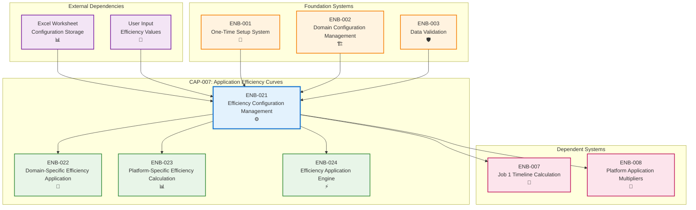

# Efficiency Configuration Management

## Metadata
- **Name**: Efficiency Configuration Management
- **Type**: Enabler
- **ID**: ENB-021
- **Capability ID**: CAP-007 (Application Efficiency Curves)
- **Status**: Ready for Implementation
- **Approval**: Approved
- **Priority**: High
- **Analysis Review**: Required
- **Code Review**: Not Required
- **Owner**: Engineering Team
- **Developer**: VBA Configuration Team
- **Created Date**: 2025-09-19
- **Last Updated**: 2025-09-19
- **Version**: 1.0

## Technical Overview
### Purpose
Provides platform-specific efficiency table management with both global and per-domain configuration options. This enabler allows users to define efficiency curves that reflect learning effects where subsequent applications of a platform become more efficient (e.g., 100% → 80% → 65%), with flexibility to apply these curves globally across all domains or customize per individual work domain.

## Functional Requirements

| ID | Name | Requirement | Priority | Status | Approval |
|----|------|-------------|----------|--------|----------|
| FR-001 | Platform Efficiency Configuration | Create efficiency tables for each platform (up to 30 programs) | Must Have | Ready for Implementation | Approved |
| FR-002 | Global vs Per-Domain Toggle | Allow users to choose between global and domain-specific efficiency | Must Have | Ready for Implementation | Approved |
| FR-003 | Efficiency Value Input Interface | Provide user interface for entering efficiency percentages | Must Have | Ready for Implementation | Approved |
| FR-004 | Efficiency Table Validation | Validate efficiency values (1%-100%) and logical progression | Must Have | Ready for Implementation | Approved |
| FR-005 | Configuration Persistence | Save and load efficiency configurations across Excel sessions | Must Have | Ready for Implementation | Approved |
| FR-006 | Default Efficiency Templates | Provide predefined efficiency curve templates for common patterns | Should Have | Ready for Implementation | Approved |
| FR-007 | Efficiency Configuration Export | Export efficiency configurations for backup/sharing | Should Have | Ready for Implementation | Approved |

## Non-Functional Requirements

| ID | Name | Type | Requirement | Priority | Status | Approval |
|----|------|------|-------------|----------|--------|----------|
| NFR-001 | Configuration Speed | Performance | Load/save efficiency configurations in under 1 second | Must Have | Ready for Implementation | Approved |
| NFR-002 | Data Integrity | Reliability | Ensure efficiency configurations are not corrupted | Must Have | Ready for Implementation | Approved |
| NFR-003 | User Interface Responsiveness | Usability | UI updates reflect changes immediately | Must Have | Ready for Implementation | Approved |
| NFR-004 | Configuration Scalability | Scalability | Support up to 10 platforms with 30 programs each | Must Have | Ready for Implementation | Approved |
| NFR-005 | Memory Efficiency | Performance | Limit memory usage for configurations to 5MB | Should Have | Ready for Implementation | Approved |

# Technical Specifications

## Enabler Dependency Flow Diagram


## Configuration Data Model

### Platform Efficiency Configuration Structure
```vba
Type PlatformEfficiencyConfig
    PlatformID As String              ' Platform identifier
    PlatformName As String            ' Display name
    EfficiencyMode As String          ' "Global" or "PerDomain"
    GlobalEfficiency() As Double      ' Global efficiency values (1-30 programs)
    DomainEfficiency As Dictionary    ' Domain-specific efficiency tables
    LastModified As Date             ' Configuration timestamp
    CreatedBy As String              ' User who created config
End Type
```

### Domain Efficiency Table
```vba
Type DomainEfficiencyTable
    DomainName As String             ' Work domain name
    Efficiency() As Double           ' Efficiency values per program sequence
    IsActive As Boolean              ' Whether domain is enabled
    ValidationStatus As String       ' "Valid", "Warning", "Error"
End Type
```

## Configuration Interface Design

### Efficiency Configuration Worksheet Layout
```
A1: Platform Efficiency Configuration
B1: [Platform Dropdown]

A3: Efficiency Mode:
B3: [Global / Per-Domain Radio Buttons]

A5: Platform A - Global Efficiency (when Global mode selected):
A6: Vehicle 1    B6: 100%    C6: Vehicle 2    D6: 80%    E6: Vehicle 3    F6: 65%

A8: Platform A - Per Domain Efficiency (when Per-Domain mode selected):
A9:           B9: V1    C9: V2    D9: V3    E9: V4    [up to V30]
A10: Design:   B10: 100%  C10: 80%  D10: 65%  E10: 55%
A11: SW Dev:   B11: 100%  C11: 85%  D11: 70%  E11: 60%
A12: V&V:      B12: 100%  C12: 75%  D12: 60%  E12: 50%
[Continue for all 7 domains]
```

### User Interface Controls
```vba
' Configuration Form Controls
- Platform Selection Dropdown
- Efficiency Mode Radio Buttons (Global/Per-Domain)
- Efficiency Value Input Grids
- Save Configuration Button
- Load Configuration Button
- Reset to Defaults Button
- Validate Configuration Button
- Export Configuration Button
```

## Configuration Management Functions

### Main Configuration Functions
```vba
Public Function LoadPlatformEfficiencyConfig(platformID As String) As PlatformEfficiencyConfig
    ' Load efficiency configuration for specified platform
End Function

Public Sub SavePlatformEfficiencyConfig(config As PlatformEfficiencyConfig)
    ' Save efficiency configuration to worksheet
End Sub

Public Function ValidateEfficiencyConfig(config As PlatformEfficiencyConfig) As ValidationResult
    ' Validate efficiency values and logical progression
End Function

Public Sub CreateDefaultEfficiencyTemplates()
    ' Create predefined efficiency templates
End Sub
```

### Configuration Validation Rules
```vba
Public Function ValidateEfficiencyValues(efficiencyArray() As Double) As Boolean
    ' Rules:
    ' 1. All values between 1% and 100%
    ' 2. First value should be 100% (first application baseline)
    ' 3. Subsequent values should be ≤ previous value (learning effect)
    ' 4. No negative or zero values
    ' 5. Maximum 30 values per platform
End Function
```

## Default Efficiency Templates

### Template 1: Aggressive Learning Curve
```
Vehicle 1: 100%   Vehicle 2: 70%    Vehicle 3: 50%    Vehicle 4: 40%
Vehicle 5: 35%    Vehicle 6: 32%    Vehicle 7: 30%    Vehicle 8: 28%
...continuing to Vehicle 30
```

### Template 2: Moderate Learning Curve
```
Vehicle 1: 100%   Vehicle 2: 85%    Vehicle 3: 75%    Vehicle 4: 70%
Vehicle 5: 65%    Vehicle 6: 62%    Vehicle 7: 60%    Vehicle 8: 58%
...continuing to Vehicle 30
```

### Template 3: Conservative Learning Curve
```
Vehicle 1: 100%   Vehicle 2: 95%    Vehicle 3: 90%    Vehicle 4: 87%
Vehicle 5: 85%    Vehicle 6: 83%    Vehicle 7: 82%    Vehicle 8: 81%
...continuing to Vehicle 30
```

### Template 4: Well-Optimized Platform
```
Vehicle 1: 100%   Vehicle 2: 90%    Vehicle 3: 85%    Vehicle 4: 82%
Vehicle 5: 80%    Vehicle 6: 79%    Vehicle 7: 78%    Vehicle 8: 77%
...continuing to Vehicle 30
```

## Domain-Specific Configuration Examples

### Example 1: Platform A - Per Domain Configuration
```
                V1    V2    V3    V4    V5
Design:        100%   80%   65%   55%   50%
SW Dev:        100%   85%   70%   60%   55%
V&V:           100%   75%   60%   50%   45%
DevSecOps:     100%   80%   65%   55%   50%
OTA:           100%   90%   80%   75%   70%
Release:       100%   85%   75%   70%   65%
QA:            100%   80%   70%   60%   55%
```

### Example 2: Platform B - Global Configuration
```
All Domains:   100%   90%   85%   82%   80%   78%   77%   76%   75%...
```

## Configuration Storage Architecture

### Worksheet Storage Structure
- **EfficiencyConfig** worksheet contains all platform configurations
- **ConfigTemplates** worksheet stores default templates
- **ConfigBackup** worksheet maintains configuration history
- **ConfigValidation** worksheet holds validation rules and lookups

### Data Organization
```
EfficiencyConfig Worksheet:
Column A: Platform ID
Column B: Platform Name
Column C: Efficiency Mode
Column D-AG: Global Efficiency Values (V1-V30)
Column AH-XX: Domain-specific efficiency tables (7 domains × 30 values)
```

## Configuration Import/Export

### Export Format (CSV)
```csv
Platform,Mode,V1,V2,V3,V4,V5,...,V30
Platform_A,Global,100,80,65,55,50,...,25
Platform_B,PerDomain,Domain_Data_Reference,...
```

### Import Validation
- File format validation
- Data type checking
- Range validation (1%-100%)
- Logical progression validation
- Platform name uniqueness

## Performance Optimization

### Configuration Loading
- **Lazy Loading**: Load configurations only when accessed
- **Caching**: Cache frequently used configurations in memory
- **Batch Operations**: Load multiple platform configs in single operation
- **Background Loading**: Pre-load configurations during system idle time

### Memory Management
- **Configuration Compression**: Store only non-default values
- **Reference Sharing**: Share common efficiency patterns between platforms
- **Garbage Collection**: Clean up unused configuration objects
- **Memory Monitoring**: Track configuration memory usage

## Error Handling

### Configuration Errors
- **Invalid Efficiency Values**: Values outside 1%-100% range
- **Logical Inconsistency**: Increasing efficiency values (anti-learning)
- **Missing Configurations**: Platform without efficiency definition
- **Corrupt Data**: Configuration data integrity issues

### Recovery Procedures
- **Default Fallback**: Use default efficiency template
- **Validation Correction**: Auto-correct minor validation issues
- **Backup Restoration**: Restore from previous valid configuration
- **User Notification**: Clear error messages and resolution steps

### Validation Messages
```vba
Public Enum ValidationMessage
    EfficiencyOutOfRange = "Efficiency value must be between 1% and 100%"
    EfficiencyIncreasing = "Efficiency should not increase (learning effect expected)"
    FirstValueNot100 = "First application should be 100% (baseline)"
    TooManyPrograms = "Maximum 30 vehicle programs per platform supported"
    InvalidDomainName = "Domain name not recognized"
End Enum
```

# Development Plan

## CRITICAL WORKFLOW RULES

### APPROVAL vs STATE - FUNDAMENTAL DIFFERENCE:
- **Approval Definition**: Authorization/permission to proceed when workflow reaches appropriate state
- **State**: Current position in the development workflow that MUST be followed sequentially
- **Pre-condition Verification**: Never change value of a condition to make the condition true. This is not a set.
- **KEY RULE**: NEVER skip states even if approved - approval only grants permission, not workflow bypass
- **ZERO TOLERANCE**: Never modify pre-condition values.

### STATE MACHINE COMPLIANCE:
- Always respect the current **State** field value
- Follow tasks order in strict sequential order
- Each task moves the enabler to the next appropriate state
- Approval status does NOT override state requirements

### FORBIDDEN SHORTCUTS:
- Do NOT jump out of task order
- Do NOT skip analysis, design, or review phases based on approval alone
- Do NOT assume any workflow steps are complete without verifying state progression

## Task 1: Approval Verification (MANDATORY)
**Purpose**: Ensure proper authorization before proceeding with any implementation tasks.

### Pre-Conditions Verification
| Condition | Required Value | Action if True | Action if False |
|-------|----------------|------------------|------------------|
| Parent Capability Approval | "Approved" | Continue to next condition check |1. Stop all processing 2. Respond with "Parent Capability is not approved. Both Parent Capability and Enabler status must be 'Approved' to proceed."  |
| Enabler Approval | "Approved" | Continue to next task | Stop all processing, Respond with "Enabler is not approved. Both Parent Capability and Enabler status must be 'Approved' to proceed." |

#### Critical Rules
- **ABSOLUTE PROHIBITION**: Never ask user to change Pre-Conditions values
- **IMMEDIATE TERMINATION**: Stop ALL processing if pre-conditions fail
- **NO EXCEPTIONS**: Pre-condition failures = MANDATORY STOP
- **WORKFLOW HALT**: Do not proceed past failed pre-condition verification
- **RESPONSE REQUIREMENT**: Must explicitly state "STOPPING due to failed pre-conditions" and explain which conditions failed

### Exit Criteria Checklist
-[ ] Both approval statuses verified
-[ ] Decision made (proceed/stop)
-[ ] Appropriate response provided

---

## Task 2: Analysis
**Purpose**: Analyze the current enabler and determine what new requirements or modifications need to be made.

### Pre-Conditions Verification
| Condition | Required Value | Action if True | Action if False |
|-----------|----------------|----------------|-----------------|
| Task 1 Completion | Must be "Passed" | Continue to next condition check | STOP - explain why you are stopping |
| Enabler Status | "Ready for Analysis" | Continue to Analysis Process Section | SKIP to Task 3: Design |

#### Critical Rules
- **ABSOLUTE PROHIBITION**: Never ask user to change Pre-Conditions values
- **IMMEDIATE TERMINATION**: Stop ALL processing if pre-conditions fail
- **NO EXCEPTIONS**: Pre-condition failures = MANDATORY STOP
- **WORKFLOW HALT**: Do not proceed past failed pre-condition verification
- **RESPONSE REQUIREMENT**: Must explicitly state "STOPPING due to failed pre-conditions" and explain which conditions failed

### Perform Analysis
| Step | Action | Result |
|------|--------|--------|
| 1 | Verify pre-conditions | ALL must be met |
| 2 | Set Enabler Status | "In Analysis" |
| 3 | Generate new requirements | Analyze the Enabler and create new requirements |
| 4 | Configure requirements | Apply Requirement Configuration rules below |

### Requirement Configuration Rules
| Enabler Analysis Review Setting | Requirement Approval | Requirement Status | Requirement Priority |
|------------------------|---------------------|-------------------|-------------------|
| "Required" | "Pending" | "Ready for Design" | "Must Have" or "Should Have" or "Could Have" or "Won't Have" |
| "Not Required" | "Approved" | "Ready for Design" | "Must Have" or "Should Have" or "Could Have" or "Won't Have" |

### Post-Condition Transition
| Step | Action |
|------|--------|
| 1 | Set Enabler Status "Ready for Design"

### Exit Criteria Checklist
- [ ] All new requirements added to Enabler
- [ ] All requirements have appropriate Approval and Status set following the Requirement Configuration Rules

### Critical Rules
- Do NOT modify existing requirements
- Create copies as new requirements if improvements needed
- ONLY explicitly obtained user approval can change Approval to "Approved"

---

## Task 3: Design
**Purpose**: Create a design based only on approved and ready to implement requirements by following the sections below.

### Pre-Conditions Verification (ABSOLUTELY MANDATORY)
| Condition | Required Value | Action if True | Action if False |
|-----------|----------------|---------|----------------------|
| Enabler Approval | "Approved" | continue to next pre-condition check | IMMEDIATE STOP |
| Enabler Status | "Ready for Design" | continue to next section | SKIP to Task 4: Implementation |

#### Critical Rules
- **ABSOLUTE PROHIBITION**: Never ask user to change Pre-Conditions values
- **IMMEDIATE TERMINATION**: Stop ALL processing if pre-conditions fail
- **NO EXCEPTIONS**: Pre-condition failures = MANDATORY STOP
- **WORKFLOW HALT**: Do not proceed past failed pre-condition verification
- **RESPONSE REQUIREMENT**: Must explicitly state "STOPPING due to failed pre-conditions" and explain which conditions failed

### Perform Design
| Step | Action | Requirement |
|------|--------|-------------|
| 1 | Verify pre-conditions | ALL must be met |
| 2 | Set Enabler Status | "In Design" |
| 3 | Display the requirements you are using in the design. Following the Requirements State Processing below and only Requirements in Approval = "Approved" | only Requirements in Approval = "Approved" |
| 4 | Do the design by updating the Technical Specification documenting and updating All applicable sections using only the Requirements outlined in the Requirements State Processing below and only Requirements in Approval = "Approved" | only Requirements in Approval = "Approved" |

### Requirements State Processing
| Requirement State | Action |
|------------------|--------|
| "In Draft" | Do NOT include in design |
| "Ready for Design" | Include in design |
| "Ready for Implementation" | Include in design |
| "Ready for Refactor" | Include in design |
| "Ready for Retirement" | Remove from design completely |

### Documentation Requirements
| Section | Content | If Not Applicable |
|---------|---------|-------------------|
| Technical Specifications | Main design | Required |
| Dependency Flow Diagrams | Flow diagrams | Mark "Not Applicable" if not applicable |
| API Technical Specifications | JSON structures, configs | Mark "Not Applicable" if not applicable |
| Data Models | Data structures | Mark "Not Applicable" if not applicable |
| Sequence Diagrams | Process flows | Mark "Not Applicable" if not applicable |
| Class Diagrams | Class structures | Mark "Not Applicable" if not applicable |
| Data Flow Diagrams | Data movement | Mark "Not Applicable" if not applicable |
| State Diagrams | State transitions | Mark "Not Applicable" if not applicable |

### Post-Condition Transition
| Step | Action |
|------|--------|
| 1 | Set Enabler Status "Ready for Implementation"
| 2 | Set Each Requirement in State  "Ready for Implementation"

### Absolute Prohibitions (ZERO TOLERANCE)
- 🚫 Never bypass for any reason whatsoever
- 🚫 Never write implementation code during this task
- 🚫 Never used unapproved or not ready to implement requirements in design

---

## Task 4: Implementation
**Purpose**: Execute requirement implementation only if approved.

### Pre-Conditions Verification (ABSOLUTELY MANDATORY)
| Condition | Required Value | Action if True | Action if False |
|-----------|----------------|---------|----------------------|
| Enabler Approval | "Approved" | continue to next pre-condition check | IMMEDIATE STOP |
| Enabler Status | "Ready for Implementation" | continue to next section | SKIP to Task 5: Refactor |

#### Critical Rules
- **ABSOLUTE PROHIBITION**: Never ask user to change Pre-Conditions values
- **IMMEDIATE TERMINATION**: Stop ALL processing if pre-conditions fail
- **NO EXCEPTIONS**: Pre-condition failures = MANDATORY STOP
- **WORKFLOW HALT**: Do not proceed past failed pre-condition verification
- **RESPONSE REQUIREMENT**: Must explicitly state "STOPPING due to failed pre-conditions" and explain which conditions failed

### Implement
| Step | Action | Requirement |
|------|--------|-------------|
| 1 | Implement each requirement following the requirement rules below | Requirement Appproval = "Approved" |

### Requirement Rules
| Requirement State | Action | Final Requirement Status |
|------------------|--------|--------------|
| Requirement Status = "Ready for Implementation" | Implement the new requirement | "Implemented" |

### Post-Condition Transition Checklist
| Step | Action |
|------|--------|
| 1 | Set Enabler Status "Implemented" |
| 2 | Update ALL Functional Requirements Status to "Implemented" |
| 3 | Update ALL Non-Functional Requirements Status to "Implemented" |
| 4 | Verify all requirements are marked "Implemented" |

### Exit Criteria Checklist
- [ ] Implementation completed for all approved requirements
  - [ ] ALL Functional Requirements Status = "Implemented"
  - [ ] ALL Non-Functional Requirements Status = "Implemented"
  - [ ] Enabler Status = "Implemented"

**CRITICAL REMINDER**: After implementing code, you MUST update the status of ALL requirements that were implemented. This is not optional - it's a mandatory part of the implementation task.

## Notes
This enabler is central to the flexibility of the efficiency modeling system. It must provide an intuitive interface for users to configure platform-specific learning curves while maintaining data integrity and supporting both global and domain-specific efficiency patterns.