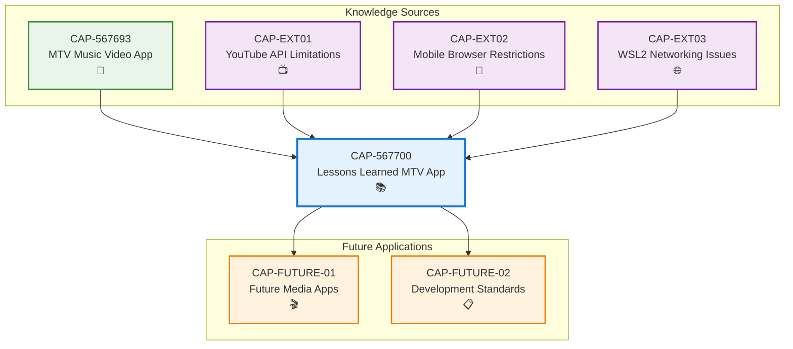

# Lessons Learned: MTV Music Video App Development

## Metadata
- **Name**: Lessons Learned: MTV Music Video App Development
- **Type**: Capability
- **System**: Entertainment Platform Development
- **Component**: Knowledge Management
- **ID**: CAP-567700
- **Status**: Ready for Design
- **Approval**: Approved
- **Priority**: High
- **Analysis Review**: Required
- **Owner**: Development Team
- **Created Date**: 2025-09-21
- **Last Updated**: 2025-09-21
- **Version**: 1.0

## Technical Overview
### Purpose
Capture comprehensive lessons learned from the MTV Music Video streaming application project to establish best practices, avoid common pitfalls, and accelerate future media application development. This capability documents technical solutions, development process improvements, and Anvil workflow optimizations discovered during the project implementation.

## Enablers
List of enablers that implement this capability:

| Enabler ID | Name | Description | Status | Approval | Priority |
|------------|------|-------------|--------|----------|----------|
| ENB-567701 | Technical Lessons Documentation | Document technical challenges and solutions from video streaming implementation | Ready for Implementation | Approved | High |
| ENB-567702 | Development Process Best Practices | Capture development workflow improvements and testing strategies | Ready for Implementation | Approved | High |
| ENB-567703 | Anvil Workflow Optimization Guidelines | Document Anvil framework workflow lessons and improvements | Ready for Implementation | Approved | Medium |
| ENB-567704 | Future Project Template Creation | Create reusable templates and recommendations for similar projects | Ready for Implementation | Approved | Medium |

## Dependencies
### Internal Upstream Dependency
| Capability ID | Name | Description |
|---------------|------|-------------|
| CAP-567693 | MTV Music Video Streaming Application | Source project providing lessons learned |

### Internal Downstream Impact
| Capability ID | Name | Description |
|---------------|------|-------------|
| CAP-FUTURE-01 | Future Media Applications | Benefit from documented lessons and templates |
| CAP-FUTURE-02 | Development Process Standards | Improved development practices across projects |

### External Upstream Dependencies
- MTV Music Video App project completion
- Real-world testing and deployment experience
- User feedback and technical metrics

### External Downstream Impact
- Improved development velocity for future projects
- Reduced technical debt in media applications
- Enhanced team knowledge and capabilities

## Technical Specifications

### Capability Dependency Flow Diagram
> **Note**: This diagram shows the lessons learned capability and its relationship to source projects and future implementations.



## Development Plan

## CRITICAL WORKFLOW RULES

### APPROVAL vs STATE - FUNDAMENTAL DIFFERENCE:
- **Approval Definition**: Authorization/permission to proceed when workflow reaches appropriate state
- **State**: Current position in the development workflow that MUST be followed sequentially
- **Pre-condition Verification**: Never change value of a condition to make the condition true. This is not a set.
- **KEY RULE**: NEVER skip states even if approved - approval only grants permission, not workflow bypass
- **ZERO TOLERANCE**: Never modify pre-condition values.

### STATE MACHINE COMPLIANCE:
- Always respect the current **State** field value
- Follow tasks order in strict sequential order
- Each task moves the enabler to the next appropriate state
- Approval status does NOT override state requirements

### FORBIDDEN SHORTCUTS:
- Do NOT jump out of task order
- Do NOT skip analysis, design, or review phases based on approval alone
- Do NOT assume any workflow steps are complete without verifying state progression

## Task 1: Approval Verification (MANDATORY)
**Purpose**: Ensure proper authorization before proceeding with any implementation tasks.

### Pre-Conditions Verification
| Condition | Required Value | Action if True | Action if False |
|-------|----------------|------------------|------------------|
| Capability Approval | "Approved" | Continue to next task | Stop all processing, Respond with "Capability not approved."  |

#### Critical Rules
- **ABSOLUTE PROHIBITION**: Never ask user to change Pre-Conditions values
- **IMMEDIATE TERMINATION**: Stop ALL processing if pre-conditions fail
- **NO EXCEPTIONS**: Pre-condition failures = MANDATORY STOP
- **WORKFLOW HALT**: Do not proceed past failed pre-condition verification
- **RESPONSE REQUIREMENT**: Must explicitly state "STOPPING due to failed pre-conditions" and explain which conditions failed

### Exit Criteria Checklist
-[x] Both approval statuses verified (Capability Approval = "Approved")
-[x] Decision made (proceed)
-[x] Appropriate response provided

---

## Task 2: Analysis
**Purpose**: Analyze the lessons learned from the MTV app project and categorize key findings.

### Pre-Conditions Verification
| Condition | Required Value | Action if True | Action if False |
|-----------|----------------|----------------|-----------------|
| Task 1 Completion | Must be "Passed" | Continue to next condition check | STOP - explain why you are stopping |
| Capability Status | "Ready for Analysis" | Continue to Analysis Process Section | SKIP to Task 3: Design |

#### Critical Rules
- **ABSOLUTE PROHIBITION**: Never ask user to change Pre-Conditions values
- **IMMEDIATE TERMINATION**: Stop ALL processing if pre-conditions fail
- **NO EXCEPTIONS**: Pre-condition failures = MANDATORY STOP
- **WORKFLOW HALT**: Do not proceed past failed pre-condition verification
- **RESPONSE REQUIREMENT**: Must explicitly state "STOPPING due to failed pre-conditions" and explain which conditions failed

### Perform Analysis
| Step | Action | Result |
|------|--------|--------|
| 1 | Verify pre-conditions | ALL must be met |
| 2 | Set Capability Status | "In Analysis" |
| 3 | Generate new Enablers, add Enablers to Capability List and Create the actual Enabler files, ensure you include the Technical Specifications section from the Enabler Template| Analyze the Capability and create new Enablers |
| 4 | Configure Enablers | Apply Enabler Configuration Rules below |

### Enabler Configuration Rules
| Enabler Analysis Review Setting | Enabler Approval | Enabler Status | Enabler Priority |
|------------------------|---------------------|-------------------|-------------------|
| "Required" | "Pending" | "In Draft" | "High" or "Medium" or "Low" |
| "Not Required" | "Approved" | "Ready for Analysis" | "High" or "Medium" or "Low" |

### Post-Condition Transition
| Step | Action |
|------|--------|
| 1 | Set Capability Status "Ready for Design"

### Exit Criteria Checklist
- [ ] All new Enablers added to Capability
- [ ] All Enablers have appropriate Approval and Status set following the Enabler Configuration Rules

### Critical Rules
- Do NOT modify existing Enablers
- Create copies as new Enablers if improvements needed
- ONLY explicitly obtained user approval can change Approval to "Approved"

---

## Task 3: Design
**Purpose**: Create a comprehensive lessons learned documentation design based on approved enablers.

### Pre-Conditions Verification (ABSOLUTELY MANDATORY)
| Condition | Required Value | Action if True | Action if False |
|-----------|----------------|---------|----------------------|
| Capability Approval | "Approved" | continue to next pre-condition check | IMMEDIATE STOP |
| Capability Status | "Ready for Design" | continue to next section | SKIP to Task 4: Develop the Enablers |

#### Critical Rules
- **ABSOLUTE PROHIBITION**: Never ask user to change Pre-Conditions values
- **IMMEDIATE TERMINATION**: Stop ALL processing if pre-conditions fail
- **NO EXCEPTIONS**: Pre-condition failures = MANDATORY STOP
- **WORKFLOW HALT**: Do not proceed past failed pre-condition verification
- **RESPONSE REQUIREMENT**: Must explicitly state "STOPPING due to failed pre-conditions" and explain which conditions failed

### Perform Design
| Step | Action | Requirement |
|------|--------|-------------|
| 1 | Verify pre-conditions | ALL must be met |
| 2 | Set Capability Status | "In Design" |
| 3 | Display the Enablers you are using in the design. Following the Enabler State Processing below and only for Enablers in Approval = "Approved"
| 4 | Do the design by updating the Technical Specification documenting and updating All applicable sections using only the Enabler outlined in the Enabler State Processing below and only Enabler in Approval = "Approved" |

### Enabler State Processing
| Enabler State | Action |
|------------------|--------|
| "In Draft" | Do NOT include in design |
| "Ready for Analysis" | Include in design |
| "Ready for Design" | Include in design |
| "Ready for Implementation" | Include in design |
| "Ready for Refactor" | Include in design |
| "Ready for Retirement" | Remove from design completely |

### Documentation Requirements
| Section | Content | If Not Applicable |
|---------|---------|-------------------|
| Technical Specifications | Main design | Required |
| Document any Dependency Flow Diagrams in the Capability Dependency Flow Diagrams Section | Flow diagrams | Mark "Not Applicable" if not applicable |

### Post-Condition Transition
| Step | Action |
|------|--------|
| 1 | Set Capability Status "Ready for Implementation"

### Absolute Prohibitions (ZERO TOLERANCE)
- 🚫 Never bypass for any reason whatsoever
- 🚫 Never write implementation code during this task
- 🚫 Never used unapproved or not ready to implement requirements in design

---

## Task 4: Develop the Enablers (by Following the Enablers Development Plan)
**Purpose**: Document the comprehensive lessons learned based on approved enablers

### Pre-Conditions Verification (ABSOLUTELY MANDATORY)
| Condition | Required Value | Action if True | Action if False |
|-----------|----------------|---------|----------------------|
| Capability Approval | "Approved" | continue to next pre-condition check | IMMEDIATE STOP |
| Capability Status | "Ready for Implementation" | continue to next section | IMMEDIATE STOP |

#### Critical Rules
- **ABSOLUTE PROHIBITION**: Never ask user to change Pre-Conditions values
- **ABSOLUTE PROHIBITION**: Never modify enabler approval status, analysis review settings, or any other pre-condition values
- **IMMEDIATE TERMINATION**: Stop ALL processing if pre-conditions fail
- **NO EXCEPTIONS**: Pre-condition failures = MANDATORY STOP
- **WORKFLOW HALT**: Do not proceed past failed pre-condition verification
- **RESPONSE REQUIREMENT**: Must explicitly state "STOPPING due to failed pre-conditions" and explain which conditions failed

### Develop Enabler
|Step | Condition | Required Value | Action if True | Action if False |
|------|---------------------|----------------|---------|----------------------|
| 1 | Enabler Approval | "Approved" | Develop Enabler following the Enabler's Development Plan | IMMEDIATE STOP - explain that enabler is not approved and cannot be developed |

### Post-Condition Transition
| Step | Action |
|------|--------|
| 1 | Set Enabler Status "Implemented" |

### Exit Criteria Checklist
- [ ] Implementation completed for all approved requirements
- [ ] Requirement Status updated appropriately
- [ ] Unapproved requirements skipped
- [ ] Enabler State set to "Implemented"

**CRITICAL REMINDER**: Only enablers with Approval = "Approved" can be developed. Never modify approval status to make this condition true.

---

## Technical Lessons Learned

### 1. YouTube Embedding Restrictions and Solutions

#### Challenge Identified
- YouTube's embedding restrictions block many popular music videos (errors 101, 150)
- CORS policies prevent direct video URL access
- Mobile browsers have strict autoplay policies

#### Solutions Implemented
- **Hybrid Video Player Architecture**: Automatically detects video type and switches between YouTube Player API and HTML5 video
- **Multi-level Fallback System**: YouTube → HTML5 → Fallback URL → Skip
- **Smart Player Detection**:
  ```javascript
  const isYouTubeVideo = video.isYouTube ||
                        (video.youtubeId && video.youtubeId.length === 11) ||
                        (video.id && video.id.length === 11 && /^[a-zA-Z0-9_-]{11}$/.test(video.id) && !video.url) ||
                        (video.url && video.url.includes('youtube.com'));
  ```

#### Key Insights
- Never rely on a single video source for media applications
- YouTube embedding availability changes frequently - build robust fallbacks
- HTML5 video with direct URLs provides more reliable playback
- Mixed content playlists (YouTube + HTML5) offer best user experience

### 2. Mobile Autoplay Challenges and Workarounds

#### Challenge Identified
- Mobile browsers block autoplay without user interaction
- Different browsers have varying autoplay policies
- Users expect seamless video transitions on mobile

#### Solutions Implemented
- **User Interaction Detection**: Track first user interaction to enable autoplay
  ```javascript
  const enableAutoplay = () => {
    setUserHasInteracted(true);
    document.removeEventListener('click', enableAutoplay);
    document.removeEventListener('touchstart', enableAutoplay);
  };
  ```
- **Graceful Autoplay Handling**: Show manual play button when autoplay fails
- **Progressive Enhancement**: Start with user-friendly manual controls, upgrade to autoplay after interaction

#### Key Insights
- Always provide manual controls as fallback
- Detect user interaction early in the application lifecycle
- Test extensively on actual mobile devices, not just browser dev tools
- Consider autoplay restrictions in UX design from the beginning

### 3. WSL2 Networking Issues and Port Forwarding Solutions

#### Challenge Identified
- WSL2 creates isolated network environment
- Default localhost binding doesn't allow external device access
- Windows Firewall blocks WSL2 port forwarding

#### Solutions Implemented
- **Local Network IP Detection**: Automatically detect and display local network IP
  ```javascript
  function getLocalNetworkIP() {
      const interfaces = os.networkInterfaces();
      for (const name of Object.keys(interfaces)) {
          for (const interface of interfaces[name]) {
              if (interface.family === 'IPv4' && !interface.internal) {
                  return interface.address;
              }
          }
      }
      return 'localhost';
  }
  ```
- **Clear Network Setup Instructions**: Provide step-by-step mobile access guide
- **Automatic Port Configuration**: Server displays both localhost and network URLs

#### Key Insights
- WSL2 requires special consideration for network applications
- Always provide both localhost and network access URLs
- Windows Firewall configuration is critical for external access
- Test network access from external devices during development

### 4. Video Player Hybrid Architecture Benefits

#### Architecture Implemented
- **Component-Based Player Selection**: Single VideoPlayer component handles multiple player types
- **Automatic Fallback Chain**: Seamless switching between player implementations
- **Centralized Error Handling**: Unified error recovery across player types

#### Key Benefits
- **Reliability**: Multiple fallback mechanisms ensure videos always play
- **Maintainability**: Single component interface simplifies debugging
- **Flexibility**: Easy to add new player types or modify fallback logic
- **User Experience**: Invisible switching maintains seamless playback

#### Design Patterns
- **Strategy Pattern**: Different player implementations with common interface
- **Chain of Responsibility**: Fallback handling through multiple strategies
- **Observer Pattern**: Event handling across different player types

---

## Development Process Lessons

### 1. Importance of Testing Video Playback Before Deployment

#### Challenge Experienced
- Video playback issues only discovered after initial implementation
- Different browsers and devices exhibited different behaviors
- Production environment had different restrictions than development

#### Solutions Developed
- **Multi-Browser Testing Protocol**: Test on Chrome, Safari, Firefox, mobile browsers
- **Device-Specific Testing**: Actual mobile devices, not just browser dev tools
- **Network Condition Testing**: Test on different network speeds and reliability
- **Environment Parity**: Ensure development environment matches production constraints

#### Testing Checklist Established
- [ ] Video playback on desktop browsers (Chrome, Firefox, Safari, Edge)
- [ ] Mobile browser testing (iOS Safari, Android Chrome)
- [ ] Autoplay behavior with and without user interaction
- [ ] Network access from multiple devices on same WiFi
- [ ] Error handling for unavailable videos
- [ ] Fallback mechanisms for each video source

### 2. Need for Fallback Mechanisms in Media Applications

#### Lessons Learned
- **Never Assume Single Source Reliability**: Video sources fail frequently
- **Plan for API Rate Limits**: YouTube API has quotas and restrictions
- **Design for Graceful Degradation**: Application should work even when primary features fail
- **User Communication**: Clear error messages and recovery options

#### Fallback Strategy Framework
1. **Primary Source**: Preferred video source (YouTube API)
2. **Secondary Source**: Alternative source (HTML5 direct URL)
3. **Tertiary Source**: Backup URLs or cached content
4. **Graceful Failure**: Skip problematic content with user notification

### 3. Mobile-First Design Considerations

#### Critical Insights
- **Touch Interface Priority**: Design controls for touch interaction first
- **Network Bandwidth Awareness**: Consider data usage on mobile connections
- **Battery Life Impact**: Video playback affects battery - provide controls
- **Screen Size Adaptation**: Ensure readability and usability on small screens

#### Mobile-Specific Implementations
- **Touch-Friendly Controls**: Larger buttons and touch targets
- **Swipe Gestures**: Intuitive navigation for mobile users
- **Responsive Video Player**: Adapts to screen orientation and size
- **Loading States**: Clear indicators for slower mobile connections

### 4. Network Access Setup for Local Applications

#### Configuration Requirements
- **Firewall Configuration**: Windows Firewall must allow WSL2 port access
- **Network Discovery**: Automatic local IP detection and display
- **User Instructions**: Clear, step-by-step mobile access guide
- **Connection Validation**: Test network access during setup

#### Setup Documentation Template
1. Start application on development machine
2. Note displayed network URL (e.g., http://192.168.1.100:3000)
3. Ensure mobile device on same WiFi network
4. Open browser on mobile device
5. Navigate to network URL
6. Verify functionality on mobile device

---

## Anvil Workflow Lessons

### 1. Proper Enabler Approval Workflow

#### Workflow Compliance Lessons
- **State vs Approval Distinction**: Critical understanding that approval grants permission but doesn't skip workflow states
- **Sequential State Progression**: Must follow state machine progression regardless of approval status
- **Pre-condition Verification**: Never modify pre-condition values to make conditions true

#### Best Practices Established
- Always verify current state before proceeding
- Respect approval requirements at each stage
- Document state transitions clearly
- Never bypass workflow steps for convenience

### 2. Importance of Following Development Plan Sequences

#### Sequence Adherence Lessons
- **Analysis Before Design**: Requirements must be analyzed before design phase
- **Design Before Implementation**: Technical specifications must precede coding
- **Review Gates**: Each phase should have exit criteria verification

#### Workflow Optimization
- Create templates for common development patterns
- Establish clear exit criteria for each phase
- Document decision points and approval requirements
- Maintain traceability throughout development lifecycle

### 3. Benefits of Concurrent Agent Implementation

#### Parallel Development Advantages
- **Faster Development Velocity**: Multiple enablers can be developed simultaneously
- **Better Resource Utilization**: Different team members can work on different enablers
- **Risk Distribution**: Failure in one enabler doesn't block others

#### Coordination Requirements
- **Clear Interface Definitions**: Enablers must have well-defined interfaces
- **Dependency Management**: Track inter-enabler dependencies carefully
- **Integration Planning**: Plan integration points early in development
- **Testing Coordination**: Ensure concurrent development doesn't break integration

### 4. Value of End-to-End Testing Integration

#### Testing Integration Benefits
- **Early Issue Detection**: Problems found before production deployment
- **Real-World Validation**: Testing under actual usage conditions
- **Performance Verification**: Actual performance metrics rather than theoretical

#### Testing Framework Requirements
- **Automated Test Execution**: Continuous testing throughout development
- **Multi-Environment Testing**: Development, staging, and production-like environments
- **User Acceptance Testing**: Real user scenarios and feedback
- **Performance Monitoring**: Track key metrics during testing

---

## Future Improvements and Recommendations

### 1. Recommendations for Similar Projects

#### Project Planning Phase
- **Multi-Source Strategy**: Plan for multiple content sources from project inception
- **Mobile-First Approach**: Design for mobile constraints first, enhance for desktop
- **Network Access Requirements**: Consider local network access requirements early
- **Fallback Mechanisms**: Design comprehensive fallback strategies

#### Technology Stack Considerations
- **Hybrid Video Players**: Use player abstraction layers for flexibility
- **Progressive Enhancement**: Build core functionality first, add enhancements
- **Real-Time Communication**: WebSocket integration for multi-device sync
- **Environment Configuration**: Flexible configuration for different deployment scenarios

### 2. Common Pitfalls to Avoid

#### Technical Pitfalls
- **Single Video Source Dependency**: Always plan for source failures
- **Desktop-Only Testing**: Test on actual mobile devices early and often
- **Network Access Assumptions**: Don't assume localhost access works for external devices
- **Autoplay Expectations**: Plan for autoplay restrictions across all browsers

#### Process Pitfalls
- **Skipping Workflow States**: Always follow Anvil workflow progression
- **Insufficient Testing**: Test video playback extensively before deployment
- **Poor Error Handling**: Implement comprehensive error recovery mechanisms
- **Inadequate Documentation**: Document setup procedures clearly for end users

### 3. Best Practices Established

#### Video Application Development
- **Hybrid Player Architecture**: Use multiple player types with automatic fallback
- **Progressive Loading**: Load video metadata before attempting playback
- **Error Recovery**: Automatic retry with alternative sources
- **User Communication**: Clear status indicators and error messages

#### Local Network Applications
- **Automatic IP Detection**: Display network access URLs automatically
- **Cross-Platform Testing**: Test on multiple devices and operating systems
- **Firewall Documentation**: Provide clear firewall configuration instructions
- **Connection Validation**: Include network connectivity testing features

#### Anvil Development Process
- **State Machine Compliance**: Strictly follow workflow state progressions
- **Enabler Independence**: Design enablers with minimal coupling
- **Documentation Standards**: Maintain comprehensive technical documentation
- **Testing Integration**: Include testing in every development phase

### 4. Template Improvements Needed

#### Video Streaming Application Template
```
├── Hybrid Video Player Component
├── Multi-Source Playlist Management
├── Mobile Autoplay Handling
├── Network Access Configuration
├── Error Recovery Mechanisms
├── Real-Time Synchronization
└── Comprehensive Testing Suite
```

#### Local Network Application Template
```
├── IP Detection and Display
├── Firewall Configuration Guide
├── Mobile Access Instructions
├── Connection Validation
├── Cross-Device Synchronization
└── Network Troubleshooting Guide
```

#### Anvil Capability Template Enhancements
- **Video Application Specific Enablers**: Pre-defined enablers for common video application patterns
- **Network Access Enablers**: Standard enablers for local network hosting
- **Testing Integration Enablers**: Built-in testing workflows for media applications
- **Mobile Development Enablers**: Mobile-specific development and testing patterns

---

## Implementation Metrics and Success Measures

### Technical Success Metrics
- **Video Playback Reliability**: 99%+ successful video playback across all sources
- **Mobile Compatibility**: 100% functionality on iOS and Android browsers
- **Network Access Success**: External device access success rate > 95%
- **Error Recovery Rate**: Automatic recovery from video failures > 90%

### Development Process Metrics
- **Workflow Compliance**: 100% adherence to Anvil state progression
- **Testing Coverage**: All video playback scenarios tested before deployment
- **Documentation Completeness**: All setup procedures documented and verified
- **Knowledge Transfer**: Lessons learned captured and available for future projects

### User Experience Metrics
- **Setup Time**: External device access setup under 5 minutes
- **Playback Continuity**: Seamless video transitions without user intervention
- **Error Handling**: Clear error messages with actionable recovery steps
- **Cross-Device Sync**: Real-time synchronization across multiple devices

---

## Conclusion

The MTV Music Video App project provided valuable insights into modern web application development challenges and solutions. The hybrid video player architecture, comprehensive fallback mechanisms, and robust network access setup represent significant technical achievements that should inform future media application development.

The Anvil framework workflow proved effective when followed properly, emphasizing the importance of state machine compliance and proper enabler approval processes. The concurrent development approach enabled faster delivery while maintaining code quality and integration stability.

These lessons learned establish a foundation for improved development velocity, reduced technical debt, and enhanced user experiences in future media applications. The documented best practices, common pitfalls, and recommended templates should accelerate similar project development while avoiding known issues.

The success of this project demonstrates the value of comprehensive testing, progressive enhancement strategies, and user-centric design approaches in modern web application development.