# Local Network Hosting

## Metadata
- **Name**: Local Network Hosting
- **Type**: Enabler
- **ID**: ENB-567005
- **Capability ID**: CAP-567693 (Parent Capability)
- **Status**: Ready for Implementation
- **Approval**: Approved
- **Priority**: Medium
- **Analysis Review**: Not Required
- **Code Review**: Not Required
- **Owner**: Product Team
- **Developer**: AI Development Team
- **Created Date**: 2025-09-20
- **Last Updated**: 2025-09-20
- **Version**: 1.0

## Technical Overview
### Purpose
Configure the MTV music video application to be accessible from any device on the local network, allowing family members to access the service from their mobile phones, tablets, and other devices.

## Functional Requirements

| ID | Name | Requirement | Priority | Status | Approval |
|----|------|-------------|----------|--------|----------|
| FR-001 | Local Network Server | Host application on local network IP address | Must Have | Ready for Implementation | Approved |
| FR-002 | Cross-Device Access | Allow access from multiple devices simultaneously | Must Have | Ready for Implementation | Approved |
| FR-003 | Network Discovery | Provide easy way to find the application on local network | Should Have | Ready for Implementation | Approved |
| FR-004 | Port Configuration | Allow configuration of server port for network access | Should Have | Ready for Implementation | Approved |
| FR-005 | Device Synchronization | Optional sync of playback state across devices | Could Have | Ready for Implementation | Approved |

## Non-Functional Requirements

| ID | Name | Type | Requirement | Priority | Status | Approval |
|----|------|------|-------------|----------|--------|----------|
| NFR-001 | Network Performance | Performance | Low latency access within local network | Must Have | Ready for Implementation | Approved |
| NFR-002 | Concurrent Users | Scalability | Support up to 10 concurrent devices on local network | Should Have | Ready for Implementation | Approved |
| NFR-003 | Network Security | Security | Basic security for local network access | Should Have | Ready for Implementation | Approved |
| NFR-004 | Easy Setup | Usability | Simple configuration for non-technical users | Must Have | Ready for Implementation | Approved |

# Technical Specifications

## API Technical Specifications

| API Type | Operation | Channel / Endpoint | Description | Request / Publish Payload | Response / Subscribe Data |
|----------|-----------|---------------------|-------------|----------------------------|----------------------------|
| **REST** | GET | `/api/v1/network/info` | Get network configuration | N/A | IP address, port, device count |
| REST | GET | `/api/v1/network/devices` | List connected devices | N/A | Array of device information |
| REST | POST | `/api/v1/network/configure` | Configure network settings | `{port, allowedIPs}` | Configuration status |
| **WebSocket** | BROADCAST | `/ws/network/sync` | Synchronize state across devices | Player state data | Synchronized state |

## Enabler Dependency Flow Diagram

```mermaid
flowchart TD
    %% Current Enabler
    ENB567005["ENB-567005<br/>Local Network Hosting"]

    %% Dependencies
    ENB567002["ENB-567002<br/>Auto-Playing Interface"]
    ENB567004["ENB-567004<br/>Mobile Responsive Design"]

    %% External Services
    NODE_SERVER["Node.js Server<br/>🖥️"]
    NETWORK_INTERFACE["Network Interface<br/>🌐"]
    ROUTER["Local Router<br/>📡"]

    %% Internal Components
    EXPRESS_APP["Express Application<br/>🚀"]
    STATIC_HOSTING["Static File Hosting<br/>📁"]
    WEBSOCKET_SERVER["WebSocket Server<br/>🔄"]

    %% Dependencies Flow
    ENB567002 --> ENB567005
    ENB567004 --> ENB567005
    NODE_SERVER --> ENB567005
    NETWORK_INTERFACE --> ENB567005
    ENB567005 --> ROUTER
    ENB567005 --> EXPRESS_APP
    ENB567005 --> STATIC_HOSTING
    ENB567005 --> WEBSOCKET_SERVER

    %% Styling
    classDef current fill:#e3f2fd,stroke:#1976d2,stroke-width:2px
    classDef internal fill:#e8f5e8,stroke:#388e3c,stroke-width:2px
    classDef external fill:#f3e5f5,stroke:#7b1fa2,stroke-width:2px
    classDef infrastructure fill:#fff3e0,stroke:#f57c00,stroke-width:2px

    class ENB567005 current
    class ENB567002,ENB567004 internal
    class NODE_SERVER,NETWORK_INTERFACE,ROUTER external
    class EXPRESS_APP,STATIC_HOSTING,WEBSOCKET_SERVER infrastructure
```

### Data Models

### Class Diagrams

### Sequence Diagrams

### Dataflow Diagrams

### State Diagrams

## Dependencies
### Internal Dependencies
- Auto-Playing Video Interface: Must be served over the network
- Mobile Responsive Design: Ensures proper mobile experience over network

### External Dependencies
- Node.js/Express Server: For hosting the web application
- Local Network Infrastructure: Router and network connectivity
- Operating System Network APIs: For IP binding and discovery

---

# Development Plan

## CRITICAL WORKFLOW RULES

### APPROVAL vs STATE - FUNDAMENTAL DIFFERENCE:
- **Approval Definition**: Authorization/permission to proceed when workflow reaches appropriate state
- **State**: Current position in the development workflow that MUST be followed sequentially
- **Pre-condition Verification**: Never change value of a condition to make the condition true. This is not a set.
- **KEY RULE**: NEVER skip states even if approved - approval only grants permission, not workflow bypass
- **ZERO TOLERANCE**: Never modify pre-condition values.

### STATE MACHINE COMPLIANCE:
- Always respect the current **State** field value
- Follow tasks order in strict sequential order
- Each task moves the enabler to the next appropriate state
- Approval status does NOT override state requirements

### FORBIDDEN SHORTCUTS:
- Do NOT jump out of task order
- Do NOT skip analysis, design, or review phases based on approval alone
- Do NOT assume any workflow steps are complete without verifying state progression

## Task 1: Approval Verification (MANDATORY)
**Purpose**: Ensure proper authorization before proceeding with any implementation tasks.

### Pre-Conditions Verification
| Condition | Required Value | Action if True | Action if False |
|-------|----------------|------------------|------------------|
| Parent Capability Approval | "Approved" | Continue to next condition check | 1. Stop all processing 2. Respond with "Parent Capability is not approved. Both Parent Capability and Enabler status must be 'Approved' to proceed." |
| Enabler Approval | "Approved" | Continue to next task | Stop all processing, Respond with "Enabler is not approved. Both Parent Capability and Enabler status must be 'Approved' to proceed." |

#### Critical Rules
- **ABSOLUTE PROHIBITION**: Never ask user to change Pre-Conditions values
- **IMMEDIATE TERMINATION**: Stop ALL processing if pre-conditions fail
- **NO EXCEPTIONS**: Pre-condition failures = MANDATORY STOP
- **WORKFLOW HALT**: Do not proceed past failed pre-condition verification
- **RESPONSE REQUIREMENT**: Must explicitly state "STOPPING due to failed pre-conditions" and explain which conditions failed

### Exit Criteria Checklist
-[x] Both approval statuses verified (Parent Capability: Approved, Enabler: Approved)
-[x] Decision made (proceed)
-[x] Appropriate response provided

## Notes
This enabler enables local network access so your wife can use the MTV app from her phone. The setup will allow the application to be accessible at your computer's local IP address (e.g., http://192.168.1.100:3000) from any device on your home network.