# Mobile-Responsive Design

## Metadata
- **Name**: Mobile-Responsive Design
- **Type**: Enabler
- **ID**: ENB-567004
- **Capability ID**: CAP-567693 (Parent Capability)
- **Status**: Ready for Implementation
- **Approval**: Approved
- **Priority**: High
- **Analysis Review**: Not Required
- **Code Review**: Not Required
- **Owner**: Product Team
- **Developer**: AI Development Team
- **Created Date**: 2025-09-20
- **Last Updated**: 2025-09-20
- **Version**: 1.0

## Technical Overview
### Purpose
Ensure the MTV music video streaming application provides an optimal viewing experience across all device types, particularly mobile phones, so users can access the service from any device on their local network.

## Functional Requirements

| ID | Name | Requirement | Priority | Status | Approval |
|----|------|-------------|----------|--------|----------|
| FR-001 | Responsive Video Player | Video player adapts to screen size while maintaining aspect ratio | Must Have | Ready for Implementation | Approved |
| FR-002 | Touch-Friendly Controls | Video controls are sized and positioned for touch interaction | Must Have | Ready for Implementation | Approved |
| FR-003 | Mobile Navigation | Provide intuitive navigation for mobile devices | Must Have | Ready for Implementation | Approved |
| FR-004 | Orientation Support | Support both portrait and landscape orientations | Should Have | Ready for Implementation | Approved |
| FR-005 | Gesture Controls | Support swipe gestures for skip/previous actions | Could Have | Ready for Implementation | Approved |

## Non-Functional Requirements

| ID | Name | Type | Requirement | Priority | Status | Approval |
|----|------|------|-------------|----------|--------|----------|
| NFR-001 | Cross-Device Compatibility | Usability | Work on iOS Safari, Android Chrome, and desktop browsers | Must Have | Ready for Implementation | Approved |
| NFR-002 | Performance on Mobile | Performance | App should load and run smoothly on mobile devices | Must Have | Ready for Implementation | Approved |
| NFR-003 | Network Efficiency | Performance | Optimize for mobile data usage with adaptive streaming | Should Have | Ready for Implementation | Approved |
| NFR-004 | Battery Optimization | Performance | Minimize battery drain during video playback | Should Have | Ready for Implementation | Approved |

# Technical Specifications

## API Technical Specifications

| API Type | Operation | Channel / Endpoint | Description | Request / Publish Payload | Response / Subscribe Data |
|----------|-----------|---------------------|-------------|----------------------------|----------------------------|
| **REST** | GET | `/api/v1/device/info` | Get device capabilities | N/A | Device type, screen size, capabilities |
| REST | POST | `/api/v1/settings/mobile` | Update mobile-specific settings | `{theme, quality, gestures}` | Updated preferences |
| **WebSocket** | SUBSCRIBE | `/ws/device/orientation` | Orientation change events | N/A | Orientation data |

## Enabler Dependency Flow Diagram

```mermaid
flowchart TD
    %% Current Enabler
    ENB567004["ENB-567004<br/>Mobile Responsive Design"]

    %% Dependencies
    ENB567002["ENB-567002<br/>Auto-Playing Interface"]
    ENB567005["ENB-567005<br/>Local Network Hosting"]

    %% External Services
    CSS_FRAMEWORK["CSS Framework<br/>📱"]
    DEVICE_API["Device Detection API<br/>📱"]

    %% Internal Components
    RESPONSIVE_LAYOUT["Responsive Layout<br/>📐"]
    TOUCH_HANDLERS["Touch Handlers<br/>👆"]

    %% Dependencies Flow
    ENB567002 --> ENB567004
    CSS_FRAMEWORK --> ENB567004
    DEVICE_API --> ENB567004
    ENB567004 --> ENB567005
    ENB567004 --> RESPONSIVE_LAYOUT
    ENB567004 --> TOUCH_HANDLERS

    %% Styling
    classDef current fill:#e3f2fd,stroke:#1976d2,stroke-width:2px
    classDef internal fill:#e8f5e8,stroke:#388e3c,stroke-width:2px
    classDef external fill:#f3e5f5,stroke:#7b1fa2,stroke-width:2px
    classDef framework fill:#fff3e0,stroke:#f57c00,stroke-width:2px

    class ENB567004 current
    class ENB567002,ENB567005 internal
    class CSS_FRAMEWORK,DEVICE_API external
    class RESPONSIVE_LAYOUT,TOUCH_HANDLERS framework
```

### Data Models

### Class Diagrams

### Sequence Diagrams

### State Diagrams

## Dependencies
### Internal Dependencies
- Auto-Playing Video Interface: Must be responsive and adapt to different screen sizes
- Local Network Hosting: Should provide optimal performance on mobile devices

### External Dependencies
- CSS Media Queries: For responsive breakpoints and layout adaptation
- Device Detection APIs: For identifying device capabilities and screen sizes

---

# Development Plan

## CRITICAL WORKFLOW RULES

### APPROVAL vs STATE - FUNDAMENTAL DIFFERENCE:
- **Approval Definition**: Authorization/permission to proceed when workflow reaches appropriate state
- **State**: Current position in the development workflow that MUST be followed sequentially
- **Pre-condition Verification**: Never change value of a condition to make the condition true. This is not a set.
- **KEY RULE**: NEVER skip states even if approved - approval only grants permission, not workflow bypass
- **ZERO TOLERANCE**: Never modify pre-condition values.

### STATE MACHINE COMPLIANCE:
- Always respect the current **State** field value
- Follow tasks order in strict sequential order
- Each task moves the enabler to the next appropriate state
- Approval status does NOT override state requirements

### FORBIDDEN SHORTCUTS:
- Do NOT jump out of task order
- Do NOT skip analysis, design, or review phases based on approval alone
- Do NOT assume any workflow steps are complete without verifying state progression

## Task 1: Approval Verification (MANDATORY)
**Purpose**: Ensure proper authorization before proceeding with any implementation tasks.

### Pre-Conditions Verification
| Condition | Required Value | Action if True | Action if False |
|-------|----------------|------------------|------------------|
| Parent Capability Approval | "Approved" | Continue to next condition check | 1. Stop all processing 2. Respond with "Parent Capability is not approved. Both Parent Capability and Enabler status must be 'Approved' to proceed." |
| Enabler Approval | "Approved" | Continue to next task | Stop all processing, Respond with "Enabler is not approved. Both Parent Capability and Enabler status must be 'Approved' to proceed." |

#### Critical Rules
- **ABSOLUTE PROHIBITION**: Never ask user to change Pre-Conditions values
- **IMMEDIATE TERMINATION**: Stop ALL processing if pre-conditions fail
- **NO EXCEPTIONS**: Pre-condition failures = MANDATORY STOP
- **WORKFLOW HALT**: Do not proceed past failed pre-condition verification
- **RESPONSE REQUIREMENT**: Must explicitly state "STOPPING due to failed pre-conditions" and explain which conditions failed

### Exit Criteria Checklist
-[x] Both approval statuses verified (Parent Capability: Approved, Enabler: Approved)
-[x] Decision made (proceed)
-[x] Appropriate response provided

## Notes
This enabler ensures the MTV application provides an excellent mobile experience, crucial for allowing users to access the service from their phones on the local network.