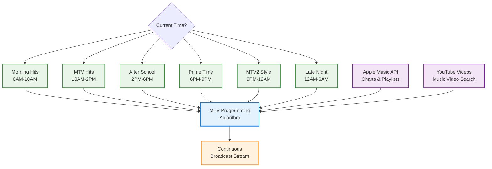

# MTV Broadcast Programming System

## Metadata
- **Name**: MTV Broadcast Programming System
- **Type**: Capability
- **System**: Entertainment Platform
- **Component**: Broadcast Algorithm
- **ID**: CAP-567900
- **Status**: Ready for Design
- **Approval**: Approved
- **Priority**: High
- **Analysis Review**: Required
- **Owner**: Product Team
- **Created Date**: 2025-09-21
- **Last Updated**: 2025-09-21
- **Version**: 1.0

## Technical Overview
### Purpose
Transform the MTV app into an authentic TV channel experience with time-based programming blocks, broadcast-style algorithm, and Apple Music integration. Users cannot control playback - they experience MTV as a true television broadcast with scheduled programming and automatic content curation.

## User Experience Vision
- **No User Control**: Like a real TV channel, users cannot skip, pause, or select videos
- **Time-Based Programming**: Different music styles at different times of day
- **Broadcast Continuity**: Seamless transitions with no user interaction required
- **Easy Access**: Wife can access via memorable domain name instead of IP address
- **Apple Music Integration**: Leverage existing subscription for music discovery

## Enablers
List of enablers that implement this capability:

| Enabler ID | Name | Description | Status | Approval | Priority |
|------------|------|-------------|--------|----------|----------|
| ENB-567901 | MTV Programming Algorithm | Time-based music programming with broadcast-style scheduling | Ready for Implementation | Approved | High |
| ENB-567902 | Apple Music API Integration | Integrate Apple Music API for music discovery and playlists | Ready for Implementation | Approved | High |
| ENB-567903 | Local Domain Name System | Replace IP access with memorable local domain | Ready for Implementation | Approved | Medium |
| ENB-567904 | Broadcast Control System | Remove user controls, implement broadcast-only experience | Ready for Implementation | Approved | High |

## MTV Programming Strategy

### Classic MTV Programming Blocks
Based on MTV's historical programming approach:

| Time Block | Programming Style | Music Focus | Target Audience |
|------------|------------------|-------------|-----------------|
| **Morning (6AM-10AM)** | "Wake Up MTV" | Pop hits, upbeat songs, dance music | Getting ready for work/school |
| **Midday (10AM-2PM)** | "MTV Hits" | Current top 40, mainstream pop/rock | General audience |
| **Afternoon (2PM-6PM)** | "After School" | Youth-oriented, pop punk, alternative | Teens/young adults |
| **Early Evening (6PM-9PM)** | "Prime Time Hits" | Popular music across genres | Family viewing |
| **Late Night (9PM-12AM)** | "MTV2 Style" | Alternative, indie, hip-hop | Young adults |
| **Overnight (12AM-6AM)** | "Late Night MTV" | Chill, ambient, slower tempo | Night owls |

### Broadcast Algorithm Design

#### Time-Based Content Selection
```javascript
// Example algorithm structure
function getMTVProgrammingBlock() {
  const hour = new Date().getHours();

  if (hour >= 6 && hour < 10) return 'morning_hits';
  if (hour >= 10 && hour < 14) return 'midday_mainstream';
  if (hour >= 14 && hour < 18) return 'afternoon_youth';
  if (hour >= 18 && hour < 21) return 'primetime_popular';
  if (hour >= 21 && hour < 24) return 'late_night_alternative';
  return 'overnight_chill';
}
```

#### Day-of-Week Variations
- **Weekdays**: Professional, work-friendly during business hours
- **Friday Evening**: Party hits, high-energy music
- **Saturday**: Mix of current hits and throwbacks
- **Sunday**: Relaxed, family-friendly programming

## Apple Music Integration Strategy

### Current Apple Music API Limitations
**Challenge**: Apple Music API does not provide music video access
**Solution**: Hybrid approach using Apple Music for discovery + YouTube for videos

### Proposed Integration Approach

#### Method 1: Apple Music → YouTube Bridge
1. **Use Apple Music API** to get trending songs and playlists
2. **Extract song metadata** (artist, track name, album)
3. **Search YouTube** for corresponding music videos
4. **Match and validate** video content against Apple Music data

#### Method 2: Apple Music Playlist Sync
1. **Access Apple Music playlists** your wife already follows
2. **Mirror those playlists** in the MTV app
3. **Find music videos** for songs in her playlists
4. **Create personalized programming blocks** based on her music taste

#### Method 3: Apple Music Charts Integration
1. **Pull Apple Music charts** (Top 100, trending, genre-specific)
2. **Use chart data** to inform MTV programming algorithm
3. **Prioritize videos** for songs currently popular on Apple Music
4. **Create time-blocks** based on Apple Music listening patterns

### Apple Music API Implementation
```javascript
// Example integration
async function getAppleMusicTrending() {
  const response = await fetch('https://api.music.apple.com/v1/catalog/us/charts', {
    headers: {
      'Authorization': `Bearer ${APPLE_MUSIC_TOKEN}`,
      'Music-User-Token': userToken
    }
  });

  const charts = await response.json();
  return charts.results.songs[0].data; // Top songs
}

async function findYouTubeVideoForSong(song) {
  const query = `${song.attributes.artistName} ${song.attributes.name} music video`;
  return await searchYouTube(query);
}
```

## Local Domain Name Solution

### Option 1: Windows Hosts File
**For Wife's Phone**: Modify router DNS or device hosts file
- **Domain**: `mtv.local` or `music.home`
- **Implementation**: Router admin panel DNS override
- **User Experience**: Wife types `mtv.local` instead of IP

### Option 2: mDNS (Bonjour/Avahi)
**Automatic Discovery**: Use mDNS for local network discovery
- **Domain**: `mtv.local` automatically resolves
- **Implementation**: Node.js mDNS broadcast
- **User Experience**: Works automatically on most devices

### Option 3: Local Network DNS
**Router Configuration**: Set up local DNS entry
- **Domain**: Custom domain like `ourmusic.tv`
- **Implementation**: Router DNS settings
- **User Experience**: Professional domain experience

### Recommended Implementation
```javascript
// mDNS implementation for automatic local domain
const mdns = require('mdns');

const ad = mdns.createAdvertisement(mdns.tcp('http'), 3001, {
  name: 'MTV Music Videos',
  txtRecord: {
    path: '/'
  }
});

ad.start();
// Now accessible at http://mtv.local:3001
```

## Broadcast Control System

### Remove User Controls
- **No Skip Button**: Users cannot advance videos
- **No Pause/Play**: Continuous broadcast experience
- **No Volume Control**: System volume only
- **No Playlist View**: Users see only current video info

### Broadcast Features
- **Current Programming Block Display**: Show "Now: Morning Hits" etc.
- **Next Block Preview**: "Coming Up: Afternoon Youth"
- **Time Display**: Optional clock showing current time
- **Program Guide**: Optional daily schedule view

### Exception Handling
- **Network Issues**: Graceful fallback to cached content
- **Content Gaps**: Smooth transitions between programming blocks
- **API Failures**: Maintain broadcast continuity with fallback content

## Dependencies
### Internal Upstream Dependency
| Capability ID | Name | Description |
|---------------|------|-------------|
| CAP-567800 | MTV UI/UX Experience Improvement | Clean interface foundation |

### External Upstream Dependencies
- Apple Music API for music discovery and charts
- YouTube Data API for music video content
- mDNS/Bonjour for local domain resolution
- Router/Network infrastructure for DNS

### External Downstream Impact
- Wife can access via memorable domain name
- Authentic MTV broadcast experience
- Integration with existing Apple Music subscription

## Technical Specifications

### Broadcast Programming Flow Diagram



## Development Plan

## Task 1: Approval Verification (MANDATORY)
**Purpose**: Ensure proper authorization before proceeding with any implementation tasks.

### Pre-Conditions Verification
| Condition | Required Value | Action if True | Action if False |
|-------|----------------|------------------|------------------|
| Capability Approval | "Approved" | Continue to next task | Stop all processing, Respond with "Capability not approved."  |

#### Critical Rules
- **ABSOLUTE PROHIBITION**: Never ask user to change Pre-Conditions values
- **IMMEDIATE TERMINATION**: Stop ALL processing if pre-conditions fail
- **NO EXCEPTIONS**: Pre-condition failures = MANDATORY STOP

### Exit Criteria Checklist
-[x] Both approval statuses verified (Capability Approval = "Approved")
-[x] Decision made (proceed)
-[x] Appropriate response provided

---

## Task 2: Design & Implementation

### Implementation Priority
1. **MTV Programming Algorithm** (Core broadcast experience)
2. **Local Domain Name System** (Wife-friendly access)
3. **Apple Music Integration** (Leverage existing subscription)
4. **Broadcast Control System** (Remove user controls)

### Success Criteria
- App behaves like a real TV channel with no user control
- Programming changes automatically based on time of day
- Wife can access via easy domain name (mtv.local)
- Content integrates with Apple Music subscription data
- Smooth broadcast experience with no interruptions

---

## Key Benefits

### For Wife
- **Easy Access**: `mtv.local` instead of remembering IP addresses
- **Familiar Content**: Based on her Apple Music listening habits
- **TV Experience**: No complex controls, just turn on and enjoy
- **Time-Appropriate**: Music matches the time of day

### For Authentic MTV Feel
- **True Broadcast**: No user control maintains TV channel authenticity
- **Programming Blocks**: Different vibes at different times
- **Professional Curation**: Algorithm-driven content selection
- **Continuous Experience**: Never stops, always something playing

This capability transforms the app from a "video player" into a true "MTV channel" that broadcasts continuously with professional programming.