# MTV UI/UX Experience Improvement

## Metadata
- **Name**: MTV UI/UX Experience Improvement
- **Type**: Capability
- **System**: Entertainment Platform
- **Component**: User Interface
- **ID**: CAP-567800
- **Status**: Ready for Design
- **Approval**: Approved
- **Priority**: High
- **Analysis Review**: Required
- **Owner**: Product Team
- **Created Date**: 2025-09-21
- **Last Updated**: 2025-09-21
- **Version**: 1.0

## Technical Overview
### Purpose
Transform the MTV music video app into an authentic MTV experience with real popular music, clean minimalist interface, and classic MTV-style presentation that automatically fades UI elements for immersive viewing.

## User Experience Problems Identified
1. **Demo videos instead of real popular music** - Users want current hits, not sample videos
2. **Cluttered interface with persistent overlays** - "More videos" and other UI elements distract from content
3. **Static "Now Playing" info** - Should fade after 3 seconds like real MTV
4. **Non-MTV aesthetic** - Interface should feel like classic MTV channel experience

## Enablers
List of enablers that implement this capability:

| Enabler ID | Name | Description | Status | Approval | Priority |
|------------|------|-------------|--------|----------|----------|
| ENB-567801 | Real Music Video Integration | Replace demo videos with current popular music via YouTube API | Ready for Implementation | Approved | High |
| ENB-567802 | Clean Minimalist Interface | Remove overlay clutter and implement clean MTV-style UI | Ready for Implementation | Approved | High |
| ENB-567803 | Auto-Fading Now Playing Display | Implement 3-second fade timer for Now Playing info | Ready for Implementation | Approved | Medium |
| ENB-567804 | Classic MTV Visual Theme | Apply authentic MTV channel aesthetic and branding | Ready for Implementation | Approved | Medium |

## Dependencies
### Internal Upstream Dependency
| Capability ID | Name | Description |
|---------------|------|-------------|
| CAP-567693 | MTV Music Video Streaming Application | Base application functionality |

### Internal Downstream Impact
| Capability ID | Name | Description |
|---------------|------|-------------|

### External Upstream Dependencies
- YouTube Data API v3 for real music video content
- Billboard Hot 100 API (optional) for current popular music tracking
- Spotify Web API (optional) for trending music identification

### External Downstream Impact
- Improved user engagement and authentic MTV experience
- Reduced visual distractions for immersive viewing

## Technical Specifications

### MTV Experience Design Principles
1. **Content First**: Video is the hero, UI supports but doesn't compete
2. **Minimal Interruption**: Information appears briefly then fades
3. **Authentic Feel**: Classic MTV channel aesthetic and timing
4. **Effortless Experience**: No user action required for core experience

### Current State vs Desired State

| Aspect | Current | Desired | Solution |
|--------|---------|---------|---------|
| **Content** | Demo/sample videos | Current popular music hits | YouTube API with music filters |
| **UI Persistence** | Always visible overlays | Auto-hiding interface (3s) | CSS transitions with timers |
| **Visual Style** | Generic web app | Classic MTV aesthetic | MTV color scheme, typography |
| **Information Display** | Static "Now Playing" | Fade in/out with song changes | React state + CSS animations |

### Capability Dependency Flow Diagram

```mermaid
flowchart TD
    %% Current Capability
    CAP567800["CAP-567800<br/>MTV UI/UX Improvement<br/>🎨"]

    %% Dependencies
    CAP567693["CAP-567693<br/>Base MTV App<br/>🎵"]

    %% External Services
    YOUTUBE["YouTube Data API<br/>📺"]
    BILLBOARD["Billboard Hot 100 API<br/>📊"]

    %% Dependencies Flow
    CAP567693 --> CAP567800
    YOUTUBE --> CAP567800
    BILLBOARD --> CAP567800

    %% Styling
    classDef current fill:#e3f2fd,stroke:#1976d2,stroke-width:3px
    classDef dependency fill:#e8f5e8,stroke:#388e3c,stroke-width:2px
    classDef external fill:#f3e5f5,stroke:#7b1fa2,stroke-width:2px

    class CAP567800 current
    class CAP567693 dependency
    class YOUTUBE,BILLBOARD external

    %% Service Grouping
    subgraph LOCAL ["MTV Application"]
        CAP567693
        CAP567800
    end

    subgraph EXTERNAL ["Music Data Sources"]
        YOUTUBE
        BILLBOARD
    end
```

## Development Plan

## CRITICAL WORKFLOW RULES

### APPROVAL vs STATE - FUNDAMENTAL DIFFERENCE:
- **Approval Definition**: Authorization/permission to proceed when workflow reaches appropriate state
- **State**: Current position in the development workflow that MUST be followed sequentially
- **Pre-condition Verification**: Never change value of a condition to make the condition true. This is not a set.
- **KEY RULE**: NEVER skip states even if approved - approval only grants permission, not workflow bypass
- **ZERO TOLERANCE**: Never modify pre-condition values.

### STATE MACHINE COMPLIANCE:
- Always respect the current **State** field value
- Follow tasks order in strict sequential order
- Each task moves the enabler to the next appropriate state
- Approval status does NOT override state requirements

### FORBIDDEN SHORTCUTS:
- Do NOT jump out of task order
- Do NOT skip analysis, design, or review phases based on approval alone
- Do NOT assume any workflow steps are complete without verifying state progression

## Task 1: Approval Verification (MANDATORY)
**Purpose**: Ensure proper authorization before proceeding with any implementation tasks.

### Pre-Conditions Verification
| Condition | Required Value | Action if True | Action if False |
|-------|----------------|------------------|------------------|
| Capability Approval | "Approved" | Continue to next task | Stop all processing, Respond with "Capability not approved."  |

#### Critical Rules
- **ABSOLUTE PROHIBITION**: Never ask user to change Pre-Conditions values
- **IMMEDIATE TERMINATION**: Stop ALL processing if pre-conditions fail
- **NO EXCEPTIONS**: Pre-condition failures = MANDATORY STOP
- **WORKFLOW HALT**: Do not proceed past failed pre-condition verification
- **RESPONSE REQUIREMENT**: Must explicitly state "STOPPING due to failed pre-conditions" and explain which conditions failed

### Exit Criteria Checklist
-[x] Both approval statuses verified (Capability Approval = "Approved")
-[x] Decision made (proceed)
-[x] Appropriate response provided

---

## Task 2: Analysis
**Purpose**: Analyze the current UI/UX and determine specific improvements needed.

### Pre-Conditions Verification
| Condition | Required Value | Action if True | Action if False |
|-----------|----------------|----------------|-----------------|
| Task 1 Completion | Must be "Passed" | Continue to next condition check | STOP - explain why you are stopping |
| Capability Status | "Ready for Analysis" | Continue to Analysis Process Section | SKIP to Task 3: Design |

Since the Capability Status is "Ready for Design" (not "Ready for Analysis"), we SKIP to Task 3: Design.

---

## Task 3: Design
**Purpose**: Create detailed UI/UX design specifications for the improved MTV experience.

### Pre-Conditions Verification (ABSOLUTELY MANDATORY)
| Condition | Required Value | Action if True | Action if False |
|-----------|----------------|---------|----------------------|
| Capability Approval | "Approved" | continue to next pre-condition check | IMMEDIATE STOP |
| Capability Status | "Ready for Design" | continue to next section | SKIP to Task 4: Develop the Enablers |

### Perform Design
| Step | Action | Requirement |
|------|--------|-------------|
| 1 | Verify pre-conditions | ALL must be met |
| 2 | Set Capability Status | "In Design" |
| 3 | Design real music integration system | YouTube API query optimization for popular music |
| 4 | Design clean interface with auto-hide behavior | CSS animations and React state management |
| 5 | Design MTV visual theme | Color schemes, typography, classic MTV aesthetics |
| 6 | Design fade timing system | 3-second fade logic for Now Playing display |

### MTV Interface Design Specifications

#### Music Content Strategy
- **Primary Source**: YouTube Data API with music category filter
- **Query Strategy**: "music video 2024", "popular music video", "top hits"
- **Filtering**: English language, high view count, music category
- **Refresh Rate**: Every 6 hours to keep content fresh

#### UI Auto-Hide Behavior
- **Now Playing Info**: Show for 3 seconds at song start, then fade out
- **Controls**: Show on hover/touch, hide after 3 seconds of inactivity
- **Network Info**: Minimize to small icon, expand on click
- **Video Progress**: Thin line at bottom, no overlay

#### Classic MTV Aesthetic
- **Colors**: MTV orange (#FF6600), white text, black backgrounds
- **Typography**: Bold, clean fonts reminiscent of MTV branding
- **Layout**: Full-screen video with minimal overlay elements
- **Transitions**: Smooth fades, no jarring animations

### Post-Condition Transition
| Step | Action |
|------|--------|
| 1 | Set Capability Status "Ready for Implementation"

---

## Task 4: Develop the Enablers
**Purpose**: Implement the improved MTV UI/UX experience.

### Implementation Priority
1. **ENB-567801**: Real Music Video Integration (Critical for authentic experience)
2. **ENB-567802**: Clean Minimalist Interface (Removes user complaints)
3. **ENB-567803**: Auto-Fading Now Playing Display (Core MTV feel)
4. **ENB-567804**: Classic MTV Visual Theme (Aesthetic improvement)

### Success Criteria
- Videos are real current popular music (not demo content)
- Interface is clean with no persistent overlays
- Now Playing info fades after exactly 3 seconds
- Overall feel matches classic MTV channel experience
- User can enjoy uninterrupted music video viewing

---

## Implementation Notes

### Quick Wins (Immediate Impact)
1. **Enable YouTube API**: Get real music videos immediately
2. **Remove "More Videos" overlay**: Clean interface instantly
3. **Add fade timer to Now Playing**: Authentic MTV behavior

### Technical Approach
1. **YouTube API Setup**: Query with music filters and popularity sorting
2. **CSS Transitions**: Smooth fade in/out animations
3. **React State Management**: Timer-based visibility control
4. **Responsive Design**: Ensure mobile experience remains excellent

This capability addresses all user feedback while maintaining the robust technical foundation already established.