# One-Time Setup System

## Metadata
- **Name**: One-Time Setup System
- **Type**: Enabler
- **ID**: ENB-001
- **Capability ID**: CAP-001 (Excel VBA Framework)
- **Status**: Ready for Implementation
- **Approval**: Approved
- **Priority**: Critical
- **Analysis Review**: Required
- **Code Review**: Not Required
- **Owner**: Engineering Team
- **Developer**: VBA Development Team
- **Created Date**: 2025-09-19
- **Last Updated**: 2025-09-19
- **Version**: 1.0

## Technical Overview
### Purpose
Provides automated setup function that creates all necessary worksheets, applies formatting, and establishes the user interface structure for the automotive resource modeling tool. This enabler transforms a blank Excel workbook into a fully functional resource modeling system with a single VBA function call.

## Functional Requirements

| ID | Name | Requirement | Priority | Status | Approval |
|----|------|-------------|----------|--------|----------|
| FR-001 | InitializeResourceModelingTool Function | Create main setup function that configures entire workbook | Must Have | Ready for Implementation | Approved |
| FR-002 | Worksheet Creation | Create all required worksheets with proper naming and structure | Must Have | Ready for Implementation | Approved |
| FR-003 | Header and Layout Formatting | Apply consistent formatting, headers, and layout across all sheets | Must Have | Ready for Implementation | Approved |
| FR-004 | Default Domain Configuration | Set up 7 default work domains with initial configuration | Must Have | Ready for Implementation | Approved |
| FR-005 | User Interface Elements | Create buttons, dropdowns, and navigation elements | Should Have | Ready for Implementation | Approved |
| FR-006 | Sample Data Population | Populate sheets with example data for user guidance | Should Have | Ready for Implementation | Approved |
| FR-007 | Setup Completion Confirmation | Provide user feedback when setup is complete | Should Have | Ready for Implementation | Approved |

## Non-Functional Requirements

| ID | Name | Type | Requirement | Priority | Status | Approval |
|----|------|------|-------------|----------|--------|----------|
| NFR-001 | Setup Performance | Performance | Complete setup in under 10 seconds | Must Have | Ready for Implementation | Approved |
| NFR-002 | Error Recovery | Reliability | Handle setup failures gracefully with cleanup | Must Have | Ready for Implementation | Approved |
| NFR-003 | Idempotent Operation | Reliability | Allow multiple setup calls without corruption | Should Have | Ready for Implementation | Approved |
| NFR-004 | Excel Compatibility | Portability | Work with Excel 2016 and later versions | Must Have | Ready for Implementation | Approved |
| NFR-005 | Memory Usage | Performance | Limit memory usage during setup to 50MB | Should Have | Ready for Implementation | Approved |

# Technical Specifications

## Enabler Dependency Flow Diagram

```mermaid
flowchart TD
    %% Current Enabler
    ENB001["ENB-001<br/>One-Time Setup System<br/>🚀"]

    %% Supporting Enablers (Same Capability)
    ENB002["ENB-002<br/>Domain Configuration Management<br/>⚙️"]
    ENB003["ENB-003<br/>Data Validation & Error Handling<br/>🛡️"]

    %% External Dependencies
    EXCEL["Microsoft Excel<br/>VBA Runtime<br/>📊"]
    WORKBOOK["Excel Workbook<br/>Object Model<br/>📁"]

    %% Dependent Enablers (Other Capabilities)
    ENB004["ENB-004<br/>Curve Shape Preservation<br/>📈"]
    ENB021["ENB-021<br/>Efficiency Configuration<br/>⚡"]

    %% Dependencies Flow
    EXCEL --> ENB001
    WORKBOOK --> ENB001
    ENB002 --> ENB001
    ENB003 --> ENB001

    ENB001 --> ENB004
    ENB001 --> ENB021

    %% Styling
    classDef current fill:#e3f2fd,stroke:#1976d2,stroke-width:3px
    classDef supporting fill:#e8f5e8,stroke:#388e3c,stroke-width:2px
    classDef external fill:#f3e5f5,stroke:#7b1fa2,stroke-width:2px
    classDef dependent fill:#fff3e0,stroke:#f57c00,stroke-width:2px

    class ENB001 current
    class ENB002,ENB003 supporting
    class EXCEL,WORKBOOK external
    class ENB004,ENB021 dependent

    %% Capability Grouping
    subgraph CAP001 ["CAP-001: Excel VBA Framework"]
        ENB001
        ENB002
        ENB003
    end

    subgraph EXTERNAL ["External Dependencies"]
        EXCEL
        WORKBOOK
    end

    subgraph DEPENDENT ["Dependent Capabilities"]
        ENB004
        ENB021
    end
```


## Worksheet Structure Design

### Required Worksheets
1. **Dashboard** - Main navigation and overview
2. **Configuration** - System configuration and settings
3. **Domains** - Work domain definitions and settings
4. **Platforms** - Platform definitions and characteristics
5. **Programs** - Vehicle program data and timelines
6. **Resource Curves** - Domain-specific resource curve templates
7. **Efficiency Curves** - Application efficiency configurations
8. **Calculations** - Resource calculation worksheets
9. **Reports** - Output reports and visualizations
10. **Data Validation** - Input validation rules and lookups

### Worksheet Layout Standards
```
Header Row Structure:
- Row 1: Main Title (Merged cells A1:J1)
- Row 2: Subtitle/Description (Merged cells A2:J2)
- Row 3: Empty (formatting spacer)
- Row 4: Column headers start here
- Row 5: Data rows start here

Formatting Standards:
- Header background: Blue (RGB: 54, 96, 146)
- Header text: White, Bold, Size 12
- Data rows: Alternating white/light gray
- Input cells: Light yellow background
- Calculated cells: Light blue background
- Locked cells: Gray background
```

## VBA Function Structure

### Main Setup Function
```vba
Public Sub InitializeResourceModelingTool()
    ' Main setup orchestration function
    Call CreateWorksheetStructure()
    Call ApplyFormattingAndHeaders()
    Call SetupDefaultDomains()
    Call CreateUserInterfaceElements()
    Call PopulateSampleData()
    Call ConfigureDataValidation()
    Call SetupCalculationFormulas()
    Call DisplaySetupComplete()
End Sub
```

### Supporting Functions
- `CreateWorksheetStructure()` - Create all required worksheets
- `ApplyFormattingAndHeaders()` - Apply consistent formatting
- `SetupDefaultDomains()` - Configure 7 default work domains
- `CreateUserInterfaceElements()` - Add buttons, dropdowns, navigation
- `PopulateSampleData()` - Add example data for guidance
- `ConfigureDataValidation()` - Set up input validation rules
- `SetupCalculationFormulas()` - Create calculation formulas
- `DisplaySetupComplete()` - Show completion message

## Default Domain Configuration

### 7 Default Work Domains
1. **Design** (Architecture Systems Engineering)
2. **Software Development** (SW management, L1/L2 testing)
3. **Verification & Validation** (L3/L4 testing)
4. **DevSecOps**
5. **OTA** (Over-The-Air updates)
6. **Release**
7. **Quality Assurance**

### Domain Properties
- Domain ID (auto-generated)
- Domain Name
- Description
- Default Resource Curve Template
- Color coding for visualizations
- Active/Inactive status

## User Interface Elements

### Navigation Buttons
- **Dashboard** - Return to main overview
- **Configure System** - Access configuration settings
- **Add Program** - Create new vehicle program
- **Generate Report** - Create resource allocation reports
- **Help** - Show user guidance

### Input Controls
- Platform dropdown lists
- Domain selection checkboxes
- Date pickers for Job 1 dates
- Number spinners for durations
- Percentage sliders for efficiency curves

## Sample Data Structure

### Example Platform Data
```
Platform A:
- Name: "Electrical Architecture Platform A"
- Type: "Full BEV Platform"
- Application Multiplier: 1.2
- Shared Work Percentage: 40%

Platform B:
- Name: "Hybrid Platform B"
- Type: "PHEV Platform"
- Application Multiplier: 1.0
- Shared Work Percentage: 30%
```

### Example Program Data
```
Program 1:
- Name: "Vehicle Model X"
- Platform: "Platform A"
- Job 1 Date: "2026-03-15"
- Duration: 36 months
- Application Sequence: 1 (first application)
```

## Error Handling Strategy

### Setup Validation Checks
1. **Excel Version Compatibility** - Verify Excel 2016+
2. **Workbook State** - Check if workbook is protected
3. **Memory Availability** - Ensure sufficient memory
4. **Worksheet Name Conflicts** - Check for existing sheet names
5. **VBA Permissions** - Verify macro execution permissions

### Recovery Procedures
- **Partial Setup Failure** - Clean up partial worksheets and restart
- **Permission Errors** - Provide clear instructions to user
- **Memory Errors** - Reduce sample data and retry
- **Naming Conflicts** - Append version numbers to worksheet names

## Performance Optimization

### Setup Efficiency Measures
- **Screen Updating Disabled** - Turn off during bulk operations
- **Calculation Mode Manual** - Prevent automatic recalculation
- **Event Processing Disabled** - Suspend worksheet events
- **Batch Formatting** - Apply formatting in bulk operations
- **Minimal Sample Data** - Include only essential examples

### Memory Management
- **Object Cleanup** - Properly dispose of Excel objects
- **Variable Scope** - Use local variables where possible
- **Array Processing** - Use arrays for bulk data operations
- **Progressive Creation** - Create worksheets incrementally

# Development Plan

## CRITICAL WORKFLOW RULES

### APPROVAL vs STATE - FUNDAMENTAL DIFFERENCE:
- **Approval Definition**: Authorization/permission to proceed when workflow reaches appropriate state
- **State**: Current position in the development workflow that MUST be followed sequentially
- **Pre-condition Verification**: Never change value of a condition to make the condition true. This is not a set.
- **KEY RULE**: NEVER skip states even if approved - approval only grants permission, not workflow bypass
- **ZERO TOLERANCE**: Never modify pre-condition values.

### STATE MACHINE COMPLIANCE:
- Always respect the current **State** field value
- Follow tasks order in strict sequential order
- Each task moves the enabler to the next appropriate state
- Approval status does NOT override state requirements

### FORBIDDEN SHORTCUTS:
- Do NOT jump out of task order
- Do NOT skip analysis, design, or review phases based on approval alone
- Do NOT assume any workflow steps are complete without verifying state progression

## Task 1: Approval Verification (MANDATORY)
**Purpose**: Ensure proper authorization before proceeding with any implementation tasks.

### Pre-Conditions Verification
| Condition | Required Value | Action if True | Action if False |
|-------|----------------|------------------|------------------|
| Parent Capability Approval | "Approved" | Continue to next condition check |1. Stop all processing 2. Respond with "Parent Capability is not approved. Both Parent Capability and Enabler status must be 'Approved' to proceed."  |
| Enabler Approval | "Approved" | Continue to next task | Stop all processing, Respond with "Enabler is not approved. Both Parent Capability and Enabler status must be 'Approved' to proceed." |

#### Critical Rules
- **ABSOLUTE PROHIBITION**: Never ask user to change Pre-Conditions values
- **IMMEDIATE TERMINATION**: Stop ALL processing if pre-conditions fail
- **NO EXCEPTIONS**: Pre-condition failures = MANDATORY STOP
- **WORKFLOW HALT**: Do not proceed past failed pre-condition verification
- **RESPONSE REQUIREMENT**: Must explicitly state "STOPPING due to failed pre-conditions" and explain which conditions failed

### Exit Criteria Checklist
-[ ] Both approval statuses verified
-[ ] Decision made (proceed/stop)
-[ ] Appropriate response provided

---

## Task 2: Analysis
**Purpose**: Analyze the current enabler and determine what new requirements or modifications need to be made.

### Pre-Conditions Verification
| Condition | Required Value | Action if True | Action if False |
|-----------|----------------|----------------|-----------------|
| Task 1 Completion | Must be "Passed" | Continue to next condition check | STOP - explain why you are stopping |
| Enabler Status | "Ready for Analysis" | Continue to Analysis Process Section | SKIP to Task 3: Design |

#### Critical Rules
- **ABSOLUTE PROHIBITION**: Never ask user to change Pre-Conditions values
- **IMMEDIATE TERMINATION**: Stop ALL processing if pre-conditions fail
- **NO EXCEPTIONS**: Pre-condition failures = MANDATORY STOP
- **WORKFLOW HALT**: Do not proceed past failed pre-condition verification
- **RESPONSE REQUIREMENT**: Must explicitly state "STOPPING due to failed pre-conditions" and explain which conditions failed

### Perform Analysis
| Step | Action | Result |
|------|--------|--------|
| 1 | Verify pre-conditions | ALL must be met |
| 2 | Set Enabler Status | "In Analysis" |
| 3 | Generate new requirements | Analyze the Enabler and create new requirements |
| 4 | Configure requirements | Apply Requirement Configuration rules below |

### Requirement Configuration Rules
| Enabler Analysis Review Setting | Requirement Approval | Requirement Status | Requirement Priority |
|------------------------|---------------------|-------------------|-------------------|
| "Required" | "Pending" | "Ready for Design" | "Must Have" or "Should Have" or "Could Have" or "Won't Have" |
| "Not Required" | "Approved" | "Ready for Design" | "Must Have" or "Should Have" or "Could Have" or "Won't Have" |

### Post-Condition Transition
| Step | Action |
|------|--------|
| 1 | Set Enabler Status "Ready for Design"

### Exit Criteria Checklist
- [ ] All new requirements added to Enabler
- [ ] All requirements have appropriate Approval and Status set following the Requirement Configuration Rules

### Critical Rules
- Do NOT modify existing requirements
- Create copies as new requirements if improvements needed
- ONLY explicitly obtained user approval can change Approval to "Approved"

---

## Task 3: Design
**Purpose**: Create a design based only on approved and ready to implement requirements by following the sections below.

### Pre-Conditions Verification (ABSOLUTELY MANDATORY)
| Condition | Required Value | Action if True | Action if False |
|-----------|----------------|---------|----------------------|
| Enabler Approval | "Approved" | continue to next pre-condition check | IMMEDIATE STOP |
| Enabler Status | "Ready for Design" | continue to next section | SKIP to Task 4: Implementation |

#### Critical Rules
- **ABSOLUTE PROHIBITION**: Never ask user to change Pre-Conditions values
- **IMMEDIATE TERMINATION**: Stop ALL processing if pre-conditions fail
- **NO EXCEPTIONS**: Pre-condition failures = MANDATORY STOP
- **WORKFLOW HALT**: Do not proceed past failed pre-condition verification
- **RESPONSE REQUIREMENT**: Must explicitly state "STOPPING due to failed pre-conditions" and explain which conditions failed

### Perform Design
| Step | Action | Requirement |
|------|--------|-------------|
| 1 | Verify pre-conditions | ALL must be met |
| 2 | Set Enabler Status | "In Design" |
| 3 | Display the requirements you are using in the design. Following the Requirements State Processing below and only Requirements in Approval = "Approved" | only Requirements in Approval = "Approved" |
| 4 | Do the design by updating the Technical Specification documenting and updating All applicable sections using only the Requirements outlined in the Requirements State Processing below and only Requirements in Approval = "Approved" | only Requirements in Approval = "Approved" |

### Requirements State Processing
| Requirement State | Action |
|------------------|--------|
| "In Draft" | Do NOT include in design |
| "Ready for Design" | Include in design |
| "Ready for Implementation" | Include in design |
| "Ready for Refactor" | Include in design |
| "Ready for Retirement" | Remove from design completely |

### Documentation Requirements
| Section | Content | If Not Applicable |
|---------|---------|-------------------|
| Technical Specifications | Main design | Required |
| Dependency Flow Diagrams | Flow diagrams | Mark "Not Applicable" if not applicable |
| API Technical Specifications | JSON structures, configs | Mark "Not Applicable" if not applicable |
| Data Models | Data structures | Mark "Not Applicable" if not applicable |
| Sequence Diagrams | Process flows | Mark "Not Applicable" if not applicable |
| Class Diagrams | Class structures | Mark "Not Applicable" if not applicable |
| Data Flow Diagrams | Data movement | Mark "Not Applicable" if not applicable |
| State Diagrams | State transitions | Mark "Not Applicable" if not applicable |

### Post-Condition Transition
| Step | Action |
|------|--------|
| 1 | Set Enabler Status "Ready for Implementation"
| 2 | Set Each Requirement in State  "Ready for Implementation"

### Absolute Prohibitions (ZERO TOLERANCE)
- 🚫 Never bypass for any reason whatsoever
- 🚫 Never write implementation code during this task
- 🚫 Never used unapproved or not ready to implement requirements in design

---

## Task 4: Implementation
**Purpose**: Execute requirement implementation only if approved.

### Pre-Conditions Verification (ABSOLUTELY MANDATORY)
| Condition | Required Value | Action if True | Action if False |
|-----------|----------------|---------|----------------------|
| Enabler Approval | "Approved" | continue to next pre-condition check | IMMEDIATE STOP |
| Enabler Status | "Ready for Implementation" | continue to next section | SKIP to Task 5: Refactor |

#### Critical Rules
- **ABSOLUTE PROHIBITION**: Never ask user to change Pre-Conditions values
- **IMMEDIATE TERMINATION**: Stop ALL processing if pre-conditions fail
- **NO EXCEPTIONS**: Pre-condition failures = MANDATORY STOP
- **WORKFLOW HALT**: Do not proceed past failed pre-condition verification
- **RESPONSE REQUIREMENT**: Must explicitly state "STOPPING due to failed pre-conditions" and explain which conditions failed

### Implement
| Step | Action | Requirement |
|------|--------|-------------|
| 1 | Implement each requirement following the requirement rules below | Requirement Appproval = "Approved" |

### Requirement Rules
| Requirement State | Action | Final Requirement Status |
|------------------|--------|--------------|
| Requirement Status = "Ready for Implementation" | Implement the new requirement | "Implemented" |

### Post-Condition Transition Checklist
| Step | Action |
|------|--------|
| 1 | Set Enabler Status "Implemented" |
| 2 | Update ALL Functional Requirements Status to "Implemented" |
| 3 | Update ALL Non-Functional Requirements Status to "Implemented" |
| 4 | Verify all requirements are marked "Implemented" |

### Exit Criteria Checklist
- [ ] Implementation completed for all approved requirements
  - [ ] ALL Functional Requirements Status = "Implemented"
  - [ ] ALL Non-Functional Requirements Status = "Implemented"
  - [ ] Enabler Status = "Implemented"

**CRITICAL REMINDER**: After implementing code, you MUST update the status of ALL requirements that were implemented. This is not optional - it's a mandatory part of the implementation task.

---

## Task 5: Refactor
**Purpose**: Refactor the design and code based on specification and requirement changes.

### Pre-Conditions Verification (ABSOLUTELY MANDATORY)
| Condition | Required Value | Action if True | Action if False |
|-----------|----------------|---------|----------------------|
| Enabler Approval | "Approved" | continue to next pre-condition check | IMMEDIATE STOP |
| Enabler Status | "Ready for Refactor" | continue to next section | SKIP to Task 6: Retire |

#### Critical Rules
- **ABSOLUTE PROHIBITION**: Never ask user to change Pre-Conditions values
- **IMMEDIATE TERMINATION**: Stop ALL processing if pre-conditions fail
- **NO EXCEPTIONS**: Pre-condition failures = MANDATORY STOP
- **WORKFLOW HALT**: Do not proceed past failed pre-condition verification
- **RESPONSE REQUIREMENT**: Must explicitly state "STOPPING due to failed pre-conditions" and explain which conditions failed

### Refactor Process
| Step | Action | Target State |
|------|--------|-------------|
| 1 | Verify pre-conditions | All must pass |
| 2 | Set Enabler State | "In Refactor" |
| 3 | Update **technical specifications** and code for all Requirements in Approval = "Approved" and State = "Ready for Refactor" | Requirement State = "Implemented" |
| 4 | Update **code** for all Requirements in Approval = "Approved" and State = "Ready for Refactor" | Requirement State = "Implemented" |
| 5 | Remove **technical specifications** for all Requirements in Approval = "Approved" and in State = "Ready for Retirement" |
| 6 | Remove **technical specifications** and code for all Requirements in Approval = "Approved" and in State = "Ready for Retirement" |
| 7 | Set Requirement State | "Retired" |

#### Critical Rules
- **DO NOT REMOVE REQUIREMENT FROM ENABLER**: Do not remove the requirement from the Enabler requirements list.

### Post-Condition Transition
| Step | Action |
|------|--------|
| 1 | Set Enabler Status "Implemented"

---

## Task 6: Retire
**Purpose**: Completely remove enabler from codebase.

### Pre-Conditions Verification (ABSOLUTELY MANDATORY)
| Condition | Required Value | Action if True | Action if False |
|-----------|----------------|---------|----------------------|
| Enabler Approval | "Approved" | continue to next pre-condition check | IMMEDIATE STOP |
| Enabler Status | "Ready for Retirement" | continue to next section | IMMEDIATE STOP |

#### Critical Rules
- **DO NOT REMOVE REQUIREMENT FROM ENABLER**: Do not remove the **Enabler** from the **Capability** Enablers list.
- **ABSOLUTE PROHIBITION**: Never ask user to change Pre-Conditions values
- **IMMEDIATE TERMINATION**: Stop ALL processing if pre-conditions fail
- **NO EXCEPTIONS**: Pre-condition failures = MANDATORY STOP
- **WORKFLOW HALT**: Do not proceed past failed pre-condition verification
- **RESPONSE REQUIREMENT**: Must explicitly state "STOPPING due to failed pre-conditions" and explain which conditions failed

### Retirement Process
| Step | Action | Result |
|------|--------|--------|
| 1 | Verify pre-conditions | All must pass |
| 2 | Set Enabler State | "In Retirement" |
| 3 | Remove Enabler from parent specifications | Clean parent capability |
| 4 | Remove all enabler code | Complete removal |
| 5 | Mark requirements | All set to "Retired" |

### Post-Condition Transition
| Step | Action |
|------|--------|
| 1 | Set Enabler Status "Retired"

### Exit Criteria Checklist
- [ ] All code removed from codebase
- [ ] Parent capability updated
- [ ] All requirements marked "Retired"
- [ ] Enabler State set to "Retired"

---

## Universal Rules

### Critical Prohibitions (Apply to All Tasks)
| Rule | Description | Consequence |
|------|-------------|-------------|
| Never modify pre-conditions | Pre-condition values must already be correct | IMMEDIATE TASK FAILURE |
| Zero tolerance for unapproved requirements | Never implement/design without approval | IMMEDIATE STOP |
| No bypassing for any reason | Never bypass for "testing", "demo", etc. | PERMANENT PROHIBITION |

### Response Format Requirements
| Task | Must Include |
|------|-------------|
| All | Pre-condition verification status |
| All | Clear proceed/stop decision |
| All | Explanation if stopping |
| Analysis | List of new requirements created |
| Design | List of design elements documented |
| Implementation | List of implemented requirements |

## Notes
This enabler serves as the foundation for the entire automotive resource modeling tool. The setup function must be robust, user-friendly, and provide clear feedback to users. All subsequent enablers depend on the proper initialization provided by this system.