# Resource Curve Engine

## Metadata
- **Name**: Resource Curve Engine
- **Type**: Capability
- **System**: Automotive Resource Modeling
- **Component**: Resource Calculation Engine
- **ID**: CAP-002
- **Status**: Ready for Implementation
- **Approval**: Approved
- **Priority**: Critical
- **Analysis Review**: Required
- **Owner**: Engineering Team
- **Created Date**: 2025-09-19
- **Last Updated**: 2025-09-19
- **Version**: 1.0

## Technical Overview
### Purpose
Provides pattern-preserving resource curve stretching and domain-specific resource allocation management. This capability enables the system to take domain-specific resource curves (e.g., 48-month curves) and stretch or compress them to fit actual vehicle program timelines (e.g., 35 months) while preserving the original curve shape, peaks, and valleys.

## Enablers
List of enablers that implement this capability:

| Enabler ID | Name | Description | Status | Approval | Priority |
|------------|------|-------------|--------|----------|----------|
| ENB-004 | Curve Shape Preservation Algorithms | Mathematical algorithms to maintain curve patterns during time compression/expansion | Ready for Implementation | Approved | Critical |
| ENB-005 | Timeline Compression/Expansion Logic | Core logic for stretching resource curves to fit program durations | Ready for Implementation | Approved | Critical |
| ENB-006 | Domain-Specific Curve Templates | Predefined resource curve templates for each work domain | Ready for Implementation | Approved | High |

## Dependencies
### Internal Upstream Dependency
| Capability ID | Name | Description |
|---------------|------|-------------|
| CAP-001 | Excel VBA Framework | Provides VBA infrastructure and error handling |

### Internal Downstream Impact
| Capability ID | Name | Description |
|---------------|------|-------------|
| CAP-003 | Program & Platform Modeling | Uses stretched curves for program resource calculations |
| CAP-004 | Calendarization & Resource Allocation | Uses stretched curves for timeline generation |
| CAP-007 | Application Efficiency Curves | Applies efficiency multipliers to stretched curves |

### External Upstream Dependencies
- Domain resource curve definitions from automotive OEM teams
- Historical resource allocation data for curve validation

### External Downstream Impact
- Vehicle program resource planning accuracy
- Platform development timeline optimization

## Technical Specifications

### Capability Dependency Flow Diagram

```mermaid
flowchart TD
    %% External Input
    CURVES["Domain Resource<br/>Curve Definitions<br/>📈"]
    HISTORY["Historical Resource<br/>Allocation Data<br/>📊"]

    %% Current Capability
    CAP002["CAP-002<br/>Resource Curve Engine<br/>🔧"]

    %% Upstream Dependencies
    CAP001["CAP-001<br/>Excel VBA Framework<br/>🏗️"]

    %% Downstream Dependencies
    CAP003["CAP-003<br/>Program & Platform Modeling<br/>🚗"]
    CAP004["CAP-004<br/>Calendarization & Resource Allocation<br/>📅"]
    CAP007["CAP-007<br/>Application Efficiency Curves<br/>⚡"]

    %% External Output
    OUTPUT1["Vehicle Program<br/>Resource Planning<br/>🎯"]
    OUTPUT2["Platform Development<br/>Timeline Optimization<br/>⏱️"]

    %% Dependencies Flow
    CURVES --> CAP002
    HISTORY --> CAP002
    CAP001 --> CAP002

    CAP002 --> CAP003
    CAP002 --> CAP004
    CAP002 --> CAP007

    CAP003 --> OUTPUT1
    CAP004 --> OUTPUT2
    CAP007 --> OUTPUT1

    %% Styling
    classDef current fill:#e3f2fd,stroke:#1976d2,stroke-width:3px
    classDef internal fill:#e8f5e8,stroke:#388e3c,stroke-width:2px
    classDef external fill:#f3e5f5,stroke:#7b1fa2,stroke-width:2px
    classDef input fill:#fff8e1,stroke:#ff8f00,stroke-width:2px
    classDef output fill:#f1f8e9,stroke:#689f38,stroke-width:2px

    class CAP002 current
    class CAP001,CAP003,CAP004,CAP007 internal
    class CURVES,HISTORY input
    class OUTPUT1,OUTPUT2 output

    %% Capability Grouping
    subgraph SYSTEM ["Automotive Resource Modeling System"]
        subgraph CORE ["Core Framework"]
            CAP001
            CAP002
        end
        subgraph FEATURES ["Feature Capabilities"]
            CAP003
            CAP004
            CAP007
        end
    end

    subgraph INPUTS ["External Inputs"]
        CURVES
        HISTORY
    end

    subgraph OUTPUTS ["External Outputs"]
        OUTPUT1
        OUTPUT2
    end
```

### Resource Curve Architecture
The Resource Curve Engine provides:

1. **Pattern Preservation**: Maintains the shape and characteristics of original resource curves during time adjustments
2. **Domain-Specific Templates**: Pre-configured curves for each work domain (Design, SW Dev, V&V, DevSecOps, OTA, Release, QA)
3. **Mathematical Stretching**: Algorithms that compress or expand timeline while preserving peak/valley ratios
4. **Validation Framework**: Ensures stretched curves maintain logical resource allocation patterns

### Domain Resource Curves
Default domains supported:
- **Design** (Architecture Systems Engineering)
- **Software Development** (includes SW management, L1/L2 testing)
- **Verification & Validation** (L3/L4 testing)
- **DevSecOps**
- **OTA** (Over-The-Air updates)
- **Release**
- **Quality Assurance**

### Curve Stretching Algorithm
1. **Identify Key Points**: Detect peaks, valleys, and inflection points in original curve
2. **Calculate Stretch Factor**: Determine ratio between target timeline and original curve duration
3. **Preserve Ratios**: Maintain relative timing of peaks and valleys
4. **Interpolate Values**: Calculate intermediate values while preserving curve shape
5. **Validate Output**: Ensure stretched curve maintains logical resource patterns

### Technical Requirements
- **Curve Accuracy**: Maintain 95% shape fidelity during stretching operations
- **Performance**: Process curve calculations for 30 programs in under 2 seconds
- **Validation**: Automatic detection of invalid curve configurations
- **Flexibility**: Support custom curve definitions beyond default templates

# Development Plan

## CRITICAL WORKFLOW RULES

### APPROVAL vs STATE - FUNDAMENTAL DIFFERENCE:
- **Approval Definition**: Authorization/permission to proceed when workflow reaches appropriate state
- **State**: Current position in the development workflow that MUST be followed sequentially
- **Pre-condition Verification**: Never change value of a condition to make the condition true. This is not a set.
- **KEY RULE**: NEVER skip states even if approved - approval only grants permission, not workflow bypass
- **ZERO TOLERANCE**: Never modify pre-condition values.

### STATE MACHINE COMPLIANCE:
- Always respect the current **State** field value
- Follow tasks order in strict sequential order
- Each task moves the enabler to the next appropriate state
- Approval status does NOT override state requirements

### FORBIDDEN SHORTCUTS:
- Do NOT jump out of task order
- Do NOT skip analysis, design, or review phases based on approval alone
- Do NOT assume any workflow steps are complete without verifying state progression

## Task 1: Approval Verification (MANDATORY)
**Purpose**: Ensure proper authorization before proceeding with any implementation tasks.

### Pre-Conditions Verification
| Condition | Required Value | Action if True | Action if False |
|-------|----------------|------------------|------------------|
| Capability Approval | "Approved" | Continue to next task | Stop all processing, Respond with "Capability not approved."  |

#### Critical Rules
- **ABSOLUTE PROHIBITION**: Never ask user to change Pre-Conditions values
- **IMMEDIATE TERMINATION**: Stop ALL processing if pre-conditions fail
- **NO EXCEPTIONS**: Pre-condition failures = MANDATORY STOP
- **WORKFLOW HALT**: Do not proceed past failed pre-condition verification
- **RESPONSE REQUIREMENT**: Must explicitly state "STOPPING due to failed pre-conditions" and explain which conditions failed

### Exit Criteria Checklist
-[ ] Both approval statuses verified
-[ ] Decision made (proceed/stop)
-[ ] Appropriate response provided

---

## Task 2: Analysis
**Purpose**: Analyze the current capability and determine what new enablers or modifications need to be made.

### Pre-Conditions Verification
| Condition | Required Value | Action if True | Action if False |
|-----------|----------------|----------------|-----------------|
| Task 1 Completion | Must be "Passed" | Continue to next condition check | STOP - explain why you are stopping |
| Capability Status | "Ready for Analysis" | Continue to Analysis Process Section | SKIP to Task 3: Design |

#### Critical Rules
- **ABSOLUTE PROHIBITION**: Never ask user to change Pre-Conditions values
- **IMMEDIATE TERMINATION**: Stop ALL processing if pre-conditions fail
- **NO EXCEPTIONS**: Pre-condition failures = MANDATORY STOP
- **WORKFLOW HALT**: Do not proceed past failed pre-condition verification
- **RESPONSE REQUIREMENT**: Must explicitly state "STOPPING due to failed pre-conditions" and explain which conditions failed

### Perform Analysis
| Step | Action | Result |
|------|--------|--------|
| 1 | Verify pre-conditions | ALL must be met |
| 2 | Set Capability Status | "In Analysis" |
| 3 | Generate new Enablers, add Enablers to Capability List and Create the actual Enabler files, ensure you include the Technical Specifications section from the Enabler Template| Analyze the Capability and create new Enablers |
| 4 | Configure Enablers | Apply Enabler Configuration Rules below |

### Enabler Configuration Rules
| Enabler Analysis Review Setting | Enabler Approval | Enabler Status | Enabler Priority |
|------------------------|---------------------|-------------------|-------------------|
| "Required" | "Pending" | "In Draft" | "High" or "Medium" or "Low" |
| "Not Required" | "Approved" | "Ready for Analysis" | "High" or "Medium" or "Low" |

### Post-Condition Transition
| Step | Action |
|------|--------|
| 1 | Set Enabler Status "Ready for Design"

### Exit Criteria Checklist
- [ ] All new Enablers added to Capability
- [ ] All Enablers have appropriate Approval and Status set following the Enabler Configuration Rules

### Critical Rules
- Do NOT modify existing Enablers
- Create copies as new Enablers if improvements needed
- ONLY explicitly obtained user approval can change Approval to "Approved"

---

## Task 3: Design
**Purpose**: Create a design based only on approved and ready to implement Enablers by following the sections below.

### Pre-Conditions Verification (ABSOLUTELY MANDATORY)
| Condition | Required Value | Action if True | Action if False |
|-----------|----------------|---------|----------------------|
| Capability Approval | "Approved" | continue to next pre-condition check | IMMEDIATE STOP |
| Capability Status | "Ready for Design" | continue to next section | SKIP to Task 4: Develop the Enablers |

#### Critical Rules
- **ABSOLUTE PROHIBITION**: Never ask user to change Pre-Conditions values
- **IMMEDIATE TERMINATION**: Stop ALL processing if pre-conditions fail
- **NO EXCEPTIONS**: Pre-condition failures = MANDATORY STOP
- **WORKFLOW HALT**: Do not proceed past failed pre-condition verification
- **RESPONSE REQUIREMENT**: Must explicitly state "STOPPING due to failed pre-conditions" and explain which conditions failed

### Perform Design
| Step | Action | Requirement |
|------|--------|-------------|
| 1 | Verify pre-conditions | ALL must be met |
| 2 | Set Capability Status | "In Design" |
| 3 | Display the Enablers you are using in the design. Following the Enabler State Processing below and only for Enablers in Approval = "Approved"
| 4 | Do the design by updating the Technical Specification documenting and updating All applicable sections using only the Enabler outlined in the Enabler State Processing below and only Enabler in Approval = "Approved" |

### Enabler State Processing
| Enabler State | Action |
|------------------|--------|
| "In Draft" | Do NOT include in design |
| "Ready for Analysis" | Include in design |
| "Ready for Design" | Include in design |
| "Ready for Implementation" | Include in design |
| "Ready for Refactor" | Include in design |
| "Ready for Retirement" | Remove from design completely |

### Documentation Requirements
| Section | Content | If Not Applicable |
|---------|---------|-------------------|
| Technical Specifications | Main design | Required |
| Document any Dependency Flow Diagrams in the Capability Dependency Flow Diagrams Section | Flow diagrams | Mark "Not Applicable" if not applicable |

### Post-Condition Transition
| Step | Action |
|------|--------|
| 1 | Set Capability Status "Ready for Implementation"

### Absolute Prohibitions (ZERO TOLERANCE)
- 🚫 Never bypass for any reason whatsoever
- 🚫 Never write implementation code during this task
- 🚫 Never used unapproved or not ready to implement requirements in design

---

## Task 4: Develop the Enablers (by Following the Enablers Development Plan)
**Purpose**: Develop the Enabler the by following the Enablers Development Plan very closely

### Pre-Conditions Verification (ABSOLUTELY MANDATORY)
| Condition | Required Value | Action if True | Action if False |
|-----------|----------------|---------|----------------------|
| Capability Approval | "Approved" | continue to next pre-condition check | IMMEDIATE STOP |
| Capability Status | "Ready for Implementation" | continue to next section | SKIP to Task 5: Refactor |

#### Critical Rules
- **ABSOLUTE PROHIBITION**: Never ask user to change Pre-Conditions values
- **IMMEDIATE TERMINATION**: Stop ALL processing if pre-conditions fail
- **NO EXCEPTIONS**: Pre-condition failures = MANDATORY STOP
- **WORKFLOW HALT**: Do not proceed past failed pre-condition verification
- **RESPONSE REQUIREMENT**: Must explicitly state "STOPPING due to failed pre-conditions" and explain which conditions failed

### Develop Enabler
|Step | Condition | Required Value | Action if True | Action if False |
|------|---------------------|----------------|---------|----------------------|
| 1 | Enabler Approval | "Approved" | Develop  Enabler following the Enabler's Development Plan | IMMEDIATE STOP |

### Post-Condition Transition
| Step | Action |
|------|--------|
| 1 | Set Enabler Status "Implemented"

### Exit Criteria Checklist
- [ ] Implementation completed for all approved requirements
- [ ] Requirement Status updated appropriately
- [ ] Unapproved requirements skipped
- [ ] Enabler State set to "Implemented"