# Video Content API Integration

## Metadata
- **Name**: Video Content API Integration
- **Type**: Enabler
- **ID**: ENB-567001
- **Capability ID**: CAP-567693 (Parent Capability)
- **Status**: Ready for Implementation
- **Approval**: Approved
- **Priority**: High
- **Analysis Review**: Not Required
- **Code Review**: Not Required
- **Owner**: Product Team
- **Developer**: AI Development Team
- **Created Date**: 2025-09-20
- **Last Updated**: 2025-09-20
- **Version**: 1.0

## Technical Overview
### Purpose
Integrate with YouTube Data API v3 to fetch and curate popular English-language music videos for continuous streaming in the MTV-style application.

## Functional Requirements

| ID | Name | Requirement | Priority | Status | Approval |
|----|------|-------------|----------|--------|----------|
| FR-001 | YouTube API Integration | Connect to YouTube Data API v3 to search for music videos | Must Have | Ready for Implementation | Approved |
| FR-002 | Popular Music Query | Query for trending music videos with high view counts | Must Have | Ready for Implementation | Approved |
| FR-003 | English Language Filter | Filter results to English-language music videos only | Should Have | Ready for Implementation | Approved |
| FR-004 | Video Metadata Extraction | Extract title, artist, duration, and thumbnail for each video | Must Have | Ready for Implementation | Approved |
| FR-005 | Playlist Generation | Create continuous playlist from fetched videos | Must Have | Ready for Implementation | Approved |

## Non-Functional Requirements

| ID | Name | Type | Requirement | Priority | Status | Approval |
|----|------|------|-------------|----------|--------|----------|
| NFR-001 | API Rate Limiting | Performance | Respect YouTube API rate limits (10,000 units/day) | Must Have | Ready for Implementation | Approved |
| NFR-002 | Response Time | Performance | API responses should complete within 2 seconds | Should Have | Ready for Implementation | Approved |
| NFR-003 | Error Handling | Reliability | Gracefully handle API failures and timeouts | Must Have | Ready for Implementation | Approved |
| NFR-004 | Caching Strategy | Performance | Cache popular video lists for 1 hour to reduce API calls | Should Have | Ready for Implementation | Approved |

# Technical Specifications

## API Technical Specifications

| API Type | Operation | Channel / Endpoint | Description | Request / Publish Payload | Response / Subscribe Data |
|----------|-----------|---------------------|-------------|----------------------------|----------------------------|
| **REST** | GET | `/youtube/v3/search` | Search for music videos | `q=music video, type=video, order=viewCount, regionCode=US` | Video list with metadata |
| REST | GET | `/youtube/v3/videos` | Get detailed video info | `id={videoIds}, part=snippet,statistics` | Detailed video data |
| REST | GET | `/api/v1/playlist` | Get current playlist | N/A | Current video playlist |
| REST | POST | `/api/v1/playlist/refresh` | Refresh playlist | N/A | Updated playlist |

## Enabler Dependency Flow Diagram

```mermaid
flowchart TD
    %% Current Enabler
    ENB567001["ENB-567001<br/>Video Content API"]

    %% External Services
    YOUTUBE["YouTube Data API v3<br/>📺"]
    CACHE["Cache Layer<br/>💾"]

    %% Internal Components
    ENB567002["ENB-567002<br/>Video Player Interface"]
    ENB567003["ENB-567003<br/>Music Curation"]

    %% Dependencies Flow
    YOUTUBE --> ENB567001
    ENB567001 --> CACHE
    ENB567001 --> ENB567002
    ENB567001 --> ENB567003

    %% Styling
    classDef current fill:#e3f2fd,stroke:#1976d2,stroke-width:2px
    classDef external fill:#f3e5f5,stroke:#7b1fa2,stroke-width:2px
    classDef internal fill:#e8f5e8,stroke:#388e3c,stroke-width:2px
    classDef cache fill:#fff3e0,stroke:#f57c00,stroke-width:2px

    class ENB567001 current
    class YOUTUBE external
    class ENB567002,ENB567003 internal
    class CACHE cache
```

### Data Models

### Class Diagrams

### Sequence Diagrams

### Dataflow Diagrams

## Dependencies
### Internal Dependencies
- Cache Manager: For storing video metadata and reducing API calls
- Configuration Service: For API keys and application settings

### External Dependencies
- YouTube Data API v3: Primary source for music video content
- YouTube Player API: For video embedding and playback

---

# Development Plan

## CRITICAL WORKFLOW RULES

### APPROVAL vs STATE - FUNDAMENTAL DIFFERENCE:
- **Approval Definition**: Authorization/permission to proceed when workflow reaches appropriate state
- **State**: Current position in the development workflow that MUST be followed sequentially
- **Pre-condition Verification**: Never change value of a condition to make the condition true. This is not a set.
- **KEY RULE**: NEVER skip states even if approved - approval only grants permission, not workflow bypass
- **ZERO TOLERANCE**: Never modify pre-condition values.

### STATE MACHINE COMPLIANCE:
- Always respect the current **State** field value
- Follow tasks order in strict sequential order
- Each task moves the enabler to the next appropriate state
- Approval status does NOT override state requirements

### FORBIDDEN SHORTCUTS:
- Do NOT jump out of task order
- Do NOT skip analysis, design, or review phases based on approval alone
- Do NOT assume any workflow steps are complete without verifying state progression

## Task 1: Approval Verification (MANDATORY)
**Purpose**: Ensure proper authorization before proceeding with any implementation tasks.

### Pre-Conditions Verification
| Condition | Required Value | Action if True | Action if False |
|-------|----------------|------------------|------------------|
| Parent Capability Approval | "Approved" | Continue to next condition check | 1. Stop all processing 2. Respond with "Parent Capability is not approved. Both Parent Capability and Enabler status must be 'Approved' to proceed." |
| Enabler Approval | "Approved" | Continue to next task | Stop all processing, Respond with "Enabler is not approved. Both Parent Capability and Enabler status must be 'Approved' to proceed." |

#### Critical Rules
- **ABSOLUTE PROHIBITION**: Never ask user to change Pre-Conditions values
- **IMMEDIATE TERMINATION**: Stop ALL processing if pre-conditions fail
- **NO EXCEPTIONS**: Pre-condition failures = MANDATORY STOP
- **WORKFLOW HALT**: Do not proceed past failed pre-condition verification
- **RESPONSE REQUIREMENT**: Must explicitly state "STOPPING due to failed pre-conditions" and explain which conditions failed

### Exit Criteria Checklist
-[x] Both approval statuses verified (Parent Capability: Approved, Enabler: Approved)
-[x] Decision made (proceed)
-[x] Appropriate response provided

---

## Task 2: Analysis
**Purpose**: Analyze the current enabler and determine what new requirements or modifications need to be made.

### Pre-Conditions Verification
| Condition | Required Value | Action if True | Action if False |
|-----------|----------------|----------------|-----------------|
| Task 1 Completion | Must be "Passed" | Continue to next condition check | STOP - explain why you are stopping |
| Enabler Status | "Ready for Analysis" | Continue to Analysis Process Section | SKIP to Task 3: Design |

Since the Enabler Status is "In Draft" (not "Ready for Analysis"), we SKIP to Task 3: Design.

---

## Task 3: Design
**Purpose**: Create a design based only on approved and ready to implement requirements by following the sections below.

### Pre-Conditions Verification (ABSOLUTELY MANDATORY)
| Condition | Required Value | Action if True | Action if False |
|-----------|----------------|---------|----------------------|
| Enabler Approval | "Approved" | continue to next pre-condition check | IMMEDIATE STOP |
| Enabler Status | "Ready for Design" | continue to next section | SKIP to Task 4: Implementation |

Since the Enabler Status is "In Draft" (not "Ready for Design"), we SKIP to Task 4: Implementation.

---

## Task 4: Implementation
**Purpose**: Execute requirement implementation only if approved.

### Pre-Conditions Verification (ABSOLUTELY MANDATORY)
| Condition | Required Value | Action if True | Action if False |
|-----------|----------------|---------|----------------------|
| Enabler Approval | "Approved" | continue to next pre-condition check | IMMEDIATE STOP |
| Enabler Status | "Ready for Implementation" | continue to next section | SKIP to Task 5: Refactor |

Since the Enabler Status is "In Draft" (not "Ready for Implementation"), we SKIP to Task 5: Refactor.

---

## Task 5: Refactor
**Purpose**: Refactor the design and code based on specification and requirement changes.

### Pre-Conditions Verification (ABSOLUTELY MANDATORY)
| Condition | Required Value | Action if True | Action if False |
|-----------|----------------|---------|----------------------|
| Enabler Approval | "Approved" | continue to next pre-condition check | IMMEDIATE STOP |
| Enabler Status | "Ready for Refactor" | continue to next section | SKIP to Task 6: Retire |

Since the Enabler Status is "In Draft" (not "Ready for Refactor"), we SKIP to Task 6: Retire.

---

## Task 6: Retire
**Purpose**: Completely remove enabler from codebase.

### Pre-Conditions Verification (ABSOLUTELY MANDATORY)
| Condition | Required Value | Action if True | Action if False |
|-----------|----------------|---------|----------------------|
| Enabler Approval | "Approved" | continue to next pre-condition check | IMMEDIATE STOP |
| Enabler Status | "Ready for Retirement" | continue to next section | IMMEDIATE STOP |

Since the Enabler Status is "In Draft" (not "Ready for Retirement"), we IMMEDIATE STOP.

## Notes
This enabler provides the foundation for fetching music video content from YouTube. All requirements are pre-approved and ready for implementation once the capability workflow progresses to the appropriate state.